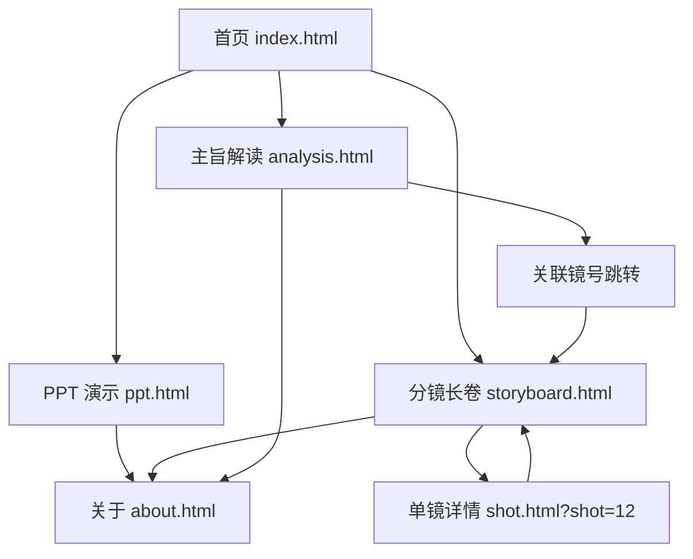

# 哥窑·PPT 与 HTML 展示站点 —— 产品需求文档 (PRD)

## 1. 产品概述

本项目以短片《哥窑》剧本为核心，输出两类内容：(1) 制作一份可用于提案/讲解的 PPT 演示文稿（HTML 形态，含翻页/讲者模式）；(2) 制作大量 HTML 页面，覆盖剧本中所有镜号、角色、主题、动作的视觉化展示，最终构成一部"可滚动的分镜长卷 + 可放映的演示稿"。

- 主要用途：影视/文化类提案、剧本分镜展示、主旨解读宣讲、传承文化教学
- 目标用户：导演/制片/编剧/投资人（看 PPT）、学生/爱好者（看分镜长卷）、评委/教师（看主旨解读）

## 2. 核心功能

### 2.1 角色（不分角色权限，仅区分浏览场景）
| 场景 | 入口 | 核心权限 |
|------|------|---------|
| 提案人 | PPT 演示模式 | 翻页、查看讲者备注、导出 |
| 观影者 | 分镜长卷 | 滚动浏览、点击放大单镜 |
| 解读者 | 主旨解读 | 切换 Slide、引用镜号跳读 |

### 2.2 功能模块
1. **首页（index.html）**：项目封面、目录导航、三个进入口（PPT / 分镜长卷 / 主旨解读）
2. **PPT 演示页（ppt.html）**：横向翻页演示文稿，含目录、四幕主题、人物、镜头范本、主旨升华、片尾
3. **分镜长卷（storyboard.html）**：按镜号顺序纵向铺开所有 36+ 镜号的可滚动页面
4. **单镜详情页（shot.html）**：根据 `?id=` 参数展示单镜的大图、台词、声音、时长
5. **主旨解读页（analysis.html）**：修正版 Slide 大纲 + 证据链 + 升华
6. **关于页（about.html）**：创作说明、人物关系图、参考文献

### 2.3 页面细节
| 页面名称 | 模块名称 | 功能描述 |
|---------|---------|---------|
| 首页 | Hero | 全屏水墨 + 项目名 + 三入口 |
| 首页 | 目录 | 三个卡片：演示 / 长卷 / 解读 |
| PPT 演示 | 顶部进度 | 当前/总数，章节标 |
| PPT 演示 | Slide 主体 | 标题/正文/角色对话/镜头引用 |
| PPT 演示 | 控制条 | 上一/下一/全屏/ESC 退出 |
| 分镜长卷 | 镜号卡 | 镜号、景别、画面、声音、时长 |
| 分镜长卷 | 幕标题 | 序幕/第一幕/第二幕/第三幕分隔 |
| 单镜详情 | 大图 | 提示词大图 + 文字描述 |
| 单镜详情 | 元信息 | 景别、声音、时长、所在幕 |
| 主旨解读 | Slide 切换 | 总纲/证据/升华/人物表 |
| 主旨解读 | 证据链 | 镜号→台词→角色 跳转 |
| 关于 | 人物关系图 | 兄弟二人传承关系 SVG |

## 3. 核心流程

用户进入首页 → 选择三种进入方式之一：
- 演示模式：进入 ppt.html，左右键/点击翻页，每页聚焦一个主题
- 长卷模式：进入 storyboard.html，滚动浏览所有镜号，点击单镜进入 shot.html
- 解读模式：进入 analysis.html，查看主旨 Slide 与镜号证据跳转

## 4. 用户界面设计

### 4.1 设计风格
- **主色调**：墨黑 #0e0e10、宣纸白 #f4ecd8、青瓷釉 #6b8e7f、窑火橙 #d96b27、朱印红 #b53028
- **辅色**：水墨灰 #4a4a4a、紫金土 #8a4a2c
- **字体**：
  - 标题：`Noto Serif SC`（思源宋体），古朴、有刻本感
  - 正文：`Noto Sans SC`（思源黑体），可读性高
  - 强调/英文：`Cormorant Garamond`，衬线、有古典文学感
- **按钮风格**：矩形、低圆角（2px）、带细描边、悬停时窑火橙发光
- **布局**：桌面优先，长卷/PPT 全屏 16:9，单镜详情支持移动端
- **图标风格**：极简线稿（青瓷纹、窑火、印章）

### 4.2 页面设计
| 页面 | 模块 | UI 元素 |
|------|------|---------|
| 首页 | Hero | 满屏水墨 + 印章落款 + 三入口按钮 |
| PPT 演示 | Slide | 16:9，左上角幕号，右下角页码，底部有讲者提示 |
| 分镜长卷 | 镜号卡 | 卡片化：左侧提示词缩略图，右侧文字信息 |
| 单镜详情 | 大图 | 8:5 比例图，底部台词、声音、时长条 |
| 主旨解读 | Slide | 大字标题 + 证据链列表 + 跳转按钮 |
| 关于 | 关系图 | SVG 兄弟二人节点 + 传承线 |

### 4.3 响应式
- 桌面优先：1440px 设计
- 平板自适应：1024px 以下长卷变为单列
- 移动端：单镜详情页可用，PPT 提示横屏

### 4.4 视觉场景指导
- 整体氛围：古朴、水墨、青瓷、窑火、印章
- 图像生成：使用 `text_to_image` 接口生成每一镜的缩略图与单镜大图
- 关键提示词元素：宋代青瓷、龙窑、兄弟、紫金土、金丝铁线、贡印
