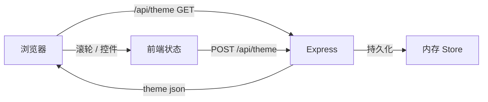

# 工业仙境 · 文字动画 v1.0  PRD

## 1. 产品概述

将原"工业仙境"文字动画升级为 **Node.js 企业级单页应用**：保留 4 色块场景 + 圆环反色核心设计，新增"鼠标滚轮调节"与"悬浮控件"两大交互能力，开放后端 API 实时下发主题参数。目标用户：品牌创意方、前端工程师、展厅运营。
- 价值：可参数化、可远程配置、可扩展的企业级视觉装置

## 2. 核心功能

### 2.1 功能模块
1. **主视觉界面**：4 色块场景 + 圆环反色（设计主体）
2. **悬浮控件**：右侧 / 底部浮动面板，调节字体、字号、动效速率、色板、圆环速度
3. **滚轮调节**：在主界面上滚动滚轮，调节"全局强度"（字号、旋转幅度、缩放、模糊度等）
4. **API 主题下发**：后端 `/api/theme` 端点返回当前主题参数；前端 fetch 后应用到 CSS 变量
5. **状态条**：底部系统条 + 角标，实时显示调节值

### 2.2 页面细节
| 页面 | 模块 | 功能描述 |
|------|------|----------|
| 主页 | 4 色块场景 | 工业橙 / 电气蓝 / 纸白 / 黑 — 圆环反色 |
| 主页 | 圆环舞台 | 4 圈同心环 + 中心黑底主体文字 |
| 主页 | 悬浮控件 | 5 个 slider + 颜色按钮 + 主题切换 |
| 主页 | 滚轮交互 | 上下滚动调节 "intensity"（0~1） |
| 主页 | 状态条 | 显示当前 intensity、主题、版本 |

### 2.3 后端 API
| 端点 | 方法 | 用途 |
|------|------|------|
| `/api/theme` | GET | 返回当前主题（色板 / 字号 / 圆环速度） |
| `/api/theme` | POST | 更新主题（落内存，可扩展 DB） |
| `/api/state` | GET | 返回全局状态（intensity / hue / mode） |
| `/api/health` | GET | 健康检查 |

## 3. 核心流程

1. 用户打开主页 → Express 提供 index.html + 静态资源
2. 前端 `fetch('/api/theme')` → 注入 CSS 变量
3. 鼠标滚轮 → 更新 `intensity` → 重渲染字号 / 旋转 / 缩放
4. 悬浮控件操作 → `POST /api/theme` 持久化 + 前端即时生效
5. 持续播放：圆环旋转 / 鼠标随行色块换色

## 4. 用户界面设计

### 4.1 设计风格
- 主色：黑 `#0a0a0c` / 纸白 `#f3f1ea` / 工业橙 `#ff5b1f` / 电气蓝 `#3aa9ff`
- 强调：霓虹绿 `#a8ff5b` / 琥珀 `#ffb547`（点缀）
- 字体：`Noto Sans SC 900` / `Archivo Black` / `Space Grotesk 700` / `Bebas Neue` / `JetBrains Mono`
- 控件：薄描边 + 圆角胶囊 + 高对比
- 整体：瑞士平面 + 工业实体色块

### 4.2 页面设计概览
| 页面 | 模块 | UI 元素 |
|------|------|----------|
| 主页 | 4 色块 | 左上橙 / 右上蓝 / 右下白 / 左下黑 — 圆环居左下中央 |
| 主页 | 圆环 | 4 圈 conic 渐变反色环 + 中心黑底 `工业仙境` |
| 主页 | 悬浮控件 | 右上抽屉：5 个 slider + 3 个主题按钮 |
| 主页 | 底部状态条 | 系统在线 / intensity / theme 名称 / 时间 |

### 4.3 响应式
- 桌面优先（≥1280px）：4 色块全屏 + 控件抽屉
- 平板（768~1279px）：色块仍 2×2，控件变窄
- 移动端：色块单列堆叠，控件折叠为底部抽屉

### 4.4 滚轮交互
- `wheel` 事件 → `intensity += deltaY * -0.001`
- intensity 影响：主标题字号 0.6~1.4 倍、圆环旋转速度 0.4~2 倍、3D 倾斜幅度 0.5~1.5 倍
- 顶部显示当前 intensity 数值提示
