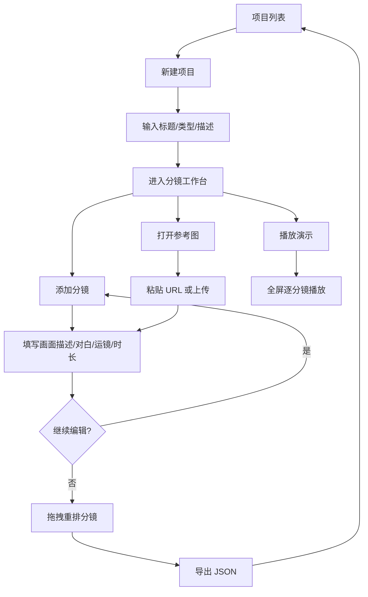

# 项目分镜师 - 产品需求文档（PRD）

## 1. 产品概述

**项目分镜师** 是一款面向影视、广告、动画与短视频创作者的分镜创作工具。创作者在「项目」维度下组织自己的「分镜」序列,每个分镜包含景别、运镜、时长、画面描述、对白与声音备注;通过拖拽重排、画板备注、JSON 导入导出等功能,完成从灵感到拍摄脚本的端到端流转。

- **核心问题**:让创作者在浏览器中快速搭建可视化的分镜序列,避免 Word / Excel 的低效与割裂。
- **目标用户**:独立短片导演、广告创意、动画师、小红书/抖音剧情号主理人。
- **市场价值**:为创作者提供一种「像编辑电影一样编辑分镜」的轻量化工作流。

## 2. 核心功能

### 2.1 用户角色
单机创作工具,无需登录。本地保存,跨刷新持久化。

### 2.2 功能模块
1. **项目列表页**:展示所有项目,可创建 / 打开 / 删除 / 复制 / 导入 / 导出
2. **分镜工作台**:左侧项目导航 + 中间分镜画布 + 右侧分镜详情面板
3. **分镜详情抽屉**:编辑单个分镜的所有字段(画面描述、对白、声音、景别、运镜、时长、参考图)
4. **设置 / 偏好**:主题切换、纸张纹理开关

### 2.3 页面细节
| 页面 | 模块 | 功能描述 |
|------|------|----------|
| 项目列表 | 顶部条 | 应用标题、搜索、主题切换、导入 JSON |
| 项目列表 | 项目卡片 | 显示标题、类型徽标、分镜数、最近修改时间 |
| 项目列表 | 空白状态 | 手绘速写风格的空状态插画 + 创建按钮 |
| 分镜工作台 | 左侧项目列表 | 收起时仅显示彩色项目色点;展开时显示完整项目名 |
| 分镜工作台 | 中部画布 | 竖排分镜卡片流,支持拖拽重排;每张卡片显示画面缩略、编号、景别徽标、描述摘要 |
| 分镜工作台 | 右侧详情面板 | 表单编辑单个分镜的所有字段 |
| 分镜工作台 | 顶部操作 | 项目标题、导出 JSON、添加分镜、播放/演示模式 |

## 3. 核心流程



## 4. 用户界面设计

### 4.1 设计风格
- **主色调**:纸质米白 `#F4EFE6` 为底,搭配深墨 `#1A1814`、深红 `#7A1F1F`、琥珀 `#B8741A`、靛蓝 `#1F2D5C`、墨绿 `#2F4A2D`。
- **字体**:标题使用 `Fraunces` 衬线体(可变字重),正文使用 `Manrope` 无衬线,数字使用 `JetBrains Mono`。
- **纸张纹理**:背景叠加 4% 不透明度的颗粒纹理,模拟胶片/速写纸质感。
- **布局**:采用「笔记本」隐喻——左侧为装订线、右侧留白;卡片有 1px 描边、轻微旋转 ±0.4° 增强手作感。
- **图标**:lucide-react 线性图标,1.25px 描边。
- **入场动画**:分镜卡片按编号递增 60ms 错位滑入;按钮悬浮 200ms 抬升 + 阴影变化。

### 4.2 页面设计概览
| 页面 | 模块 | UI 元素 |
|------|------|---------|
| 项目列表 | 标题 | Fraunces 64px 衬线粗体,带下划线笔触 |
| 项目列表 | 卡片 | 96px 高度,左侧 4px 项目色条,标题 + 类型徽标 + 描述预览 |
| 分镜工作台 | 画布 | 纸张材质背景,卡片间距 24px,1px 描边 `#1A1814` 30% |
| 分镜工作台 | 卡片 | 280px 宽,顶部 4:3 占位区(支持参考图),底部编号+景别+描述 |
| 分镜工作台 | 详情面板 | 右侧滑出,420px 宽,分组(画面 / 声音 / 元数据) |

### 4.3 响应式
- 桌面优先 (1280×800)
- 平板 (≥768px):分镜卡片变 2 列网格
- 移动端:详情面板转为底部抽屉,卡片单列

### 4.4 微交互
- 拖拽分镜时:目标位置显示 1px 虚线分隔,被拖动卡片 0.96 缩放、轻微倾斜
- 添加分镜:新卡片以 0.45s 弹性进入动画从右侧滑入
- 删除分镜:从底部淡出 + 列表自动重排

## 5. 数据结构与持久化

- localStorage key: `storyboarder-projects-v1`
- 数据结构:
  ```ts
  {
    version: 1,
    projects: Project[],
    activeProjectId: string | null,
    theme: 'cream' | 'midnight'
  }

  type Project = {
    id: string;
    title: string;
    type: 'short-film' | 'commercial' | 'animation' | 'doc' | 'social';
    description: string;
    color: string;
    panels: Panel[];
    createdAt: number;
    updatedAt: number;
  }

  type Panel = {
    id: string;
    index: number;
    shotType: 'ECU' | 'CU' | 'MCU' | 'MS' | 'MLS' | 'LS' | 'ELS';
    cameraMove: 'static' | 'pan' | 'tilt' | 'dolly' | 'track' | 'crane' | 'handheld';
    duration: number; // 秒
    description: string;
    dialogue: string;
    sound: string;
    imageUrl: string;
  }
  ```

## 6. 性能预算
- 1000 个分镜的滚动保持 60 FPS(虚拟列表)
- JSON 导出 < 100ms
- 文件大小:单条记录 < 50KB
