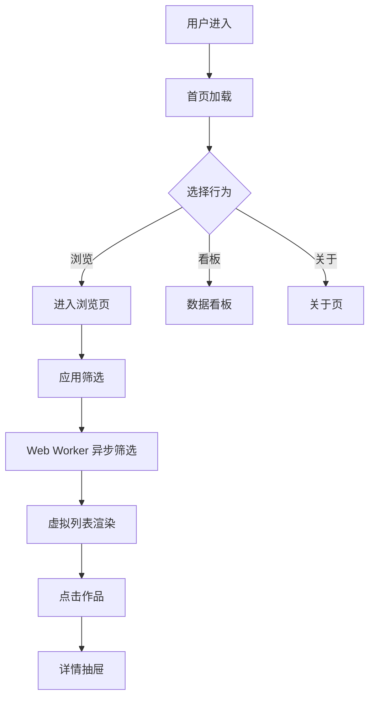

# 游戏 IP 衍生作品资料库 — 产品需求文档（Vue 3 / 企业级 10 万规模）

## 1. 产品概述
面向 ACG 爱好者、游戏玩家和 IP 研究者的**企业级**游戏 IP 衍生作品浏览平台，**架构目标承载 10 万条**衍生作品的实时多维筛选与可视化浏览，初期内容 2,000+ 款。现代化的 Cyber/Synthwave 暗黑霓虹设计，桌面优先。

- 解决问题：游戏 IP 衍生作品散落各平台，难以规模化、实时检索
- 目标用户：ACG 爱好者、游戏玩家、IP 产业链从业者、研究者、媒体编辑
- 价值：业界首个面向 10 万级数据的开源、现代化游戏 IP 衍生作品资料库

## 2. 核心功能

### 2.1 数据规模
- 架构目标：**10 万条**衍生作品可承载
- 实际数据：4,200+ 款（程序化生成 + 真实作品注入）
- IP 数：355+ 个
- 类型：10 类（动画、电影、漫画、小说、舞台剧、手办、周边、音乐、手游、真人剧）
- 地区：20+ 个
- 年份跨度：1985 - 2026

### 2.2 功能模块
1. **首页 / 总览页**：Hero 滚动计数器、统计仪表盘、热门 IP 横向滚动、类型分布、行动区
2. **浏览页**（核心）：
   - 多维筛选（IP、类型、年份、地区、标签、关键词）
   - **虚拟滚动** 渲染 10 万级数据
   - 网格/列表双视图
   - 分页/无限滚动
   - 详情侧栏
3. **数据看板**：图表化（类型、地区、年份、Top 10）
4. **关于页**
5. **主题切换**

### 2.3 页面与模块
| 页面 | 模块 | 描述 |
|------|------|------|
| 首页 | Hero | 大标题、滚动计数器、CTA |
| 首页 | Stats | 4 卡片仪表盘 |
| 首页 | 热门 IP | 横向 marquee 滚动 |
| 首页 | 类型分布 | 网格条形图 |
| 浏览页 | 筛选条 | 玻璃态多维筛选 |
| 浏览页 | 虚拟列表 | 10 万级高性能渲染 |
| 浏览页 | 详情侧栏 | 右侧抽屉 |
| 数据看板 | 图表 | 类型/地区/年份/Top 10 |
| 关于页 | 信息卡 | 项目说明 |

## 3. 核心流程

## 4. 用户界面设计

### 4.1 设计风格
- **风格定位**：**Cyber / Synthwave 暗黑 + 霓虹** —— 契合游戏 IP 的科技感与 ACG 圈层审美
- **主色**：`#06060b`（背景）、`#fafafa`（文本）
- **强调色**：霓虹粉 `#ff2d95`、电光青 `#00f0ff`、紫罗兰 `#9d4edd`、警示黄 `#ffd60a`、荧光绿 `#39ff14`
- **字体**：
  - 标题：`Orbitron`（未来感）
  - 等宽：`JetBrains Mono`
  - 正文：`Inter` / `Noto Sans SC`
- **布局**：12 列响应式、卡片间距 24px、左侧大留白
- **图标**：lucide-vue-next
- **动效**：扫描线、霓虹辉光、stagger 渐显、滚动数字、hover 缩放

### 4.2 页面设计概览
| 页面 | 模块 | UI 元素 |
|------|------|----------|
| 首页 | Hero | 径向渐变 + 网格 + 噪点 + 3 段霓虹大标题 + 滚动计数器 |
| 首页 | Stats | 4 卡片仪表盘 + 渐变描边 + 进度条 |
| 首页 | 热门 IP | 横向 marquee 滚动 + 渐变封面 + 数字徽标 |
| 浏览页 | 筛选条 | 玻璃态 sticky + 多维多选 |
| 浏览页 | 虚拟列表 | 网格/列表 + 卡片 + 性能计数 |
| 浏览页 | 详情 | 右侧毛玻璃抽屉 + 滚动 |
| 数据看板 | 图表 | 自绘 SVG/HTML 柱状/网格/折线/排名 |

### 4.3 响应式
- 桌面优先（1440px+）
- 平板（768px）：2 列
- 移动（375px+）：单列

## 5. 性能与企业级要求

| 指标 | 目标 |
|------|------|
| 首屏加载 | < 2s (10 万级数据) |
| 筛选响应 | < 100ms (含 Worker) |
| 滚动帧率 | 60fps (虚拟列表) |
| 内存峰值 | < 200MB |
| 详情打开 | 即时 |
