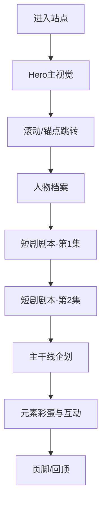

# PRD 产品需求文档

## 1. 产品概述

**项目名称**：《陈千语·真龙后裔》—— 终末地龙裔档案展示站

**项目定位**：单页式互动档案网站，以游戏《明日方舟：终末地》角色陈千语为内容主角，集中展示两集鬼畜短剧的剧本及全系列主干线企划，融合"赛博×和风×龙纹"视觉语言。

- **目标用户**：终末地玩家、鬼畜短剧创作者、二次元内容消费者
- **核心价值**：以高完成度的视觉与互动设计，把零散的短剧脚本整理为可被分享、可被阅读、可被收藏的角色IP展示页

## 2. 核心功能

### 2.1 用户角色
本项目为内容展示型单页站点，不涉及多用户系统，无需注册登录。

### 2.2 功能模块

1. **首屏Hero区**：角色主视觉 + 身份宣言 + 滚动锚点
2. **人物档案区**：角色属性卡、关系网、龙纹视觉
3. **短剧剧本区**：分集卡 + 时间轴 + 关键台词
4. **主干线企划区**：剧情弧展示 + 关键转折
5. **元素彩蛋区**：贯穿性叙事元素 + 系列Slogan
6. **页脚**：制作信息 + 滚动指示

### 2.3 页面详细说明

| 页面名称 | 模块名称 | 功能描述 |
|---------|---------|---------|
| Hero区 | 主视觉与宣言 | 全屏角色定位 + 滚动提示 + 龙尾呼吸动画 |
| Hero区 | 滚动锚点导航 | 顶部固定锚点列表，悬浮高亮当前章节 |
| 人物档案 | 属性卡 | 角色身份标签（真龙后裔 / 陈家后人 / 闯祸精） |
| 人物档案 | 关系网图 | 陈千语与佩丽卡、伊冯、管理员、先祖的关系连线 |
| 短剧剧本 | 第1集卡片 | 展示《终末地最大嫌疑人》剧本，含分镜时间轴 |
| 短剧剧本 | 第2集卡片 | 展示《啥子传奇之"咚咚咚"》剧本，含分镜时间轴 |
| 短剧剧本 | 关键台词 | 台词滚动展示 + 高亮显示核心金句 |
| 主干线企划 | 剧情弧 | 第一幕→第二幕→第三幕三段式时间线 |
| 主干线企划 | 关键转折 | 反转点高亮展示 |
| 元素彩蛋 | 系列Slogan | 双金句并排大字展示 |
| 元素彩蛋 | 隐藏彩蛋 | 龙尾鼠标跟随、点击触发鬼畜摇头 |

## 3. 核心流程

用户访问站点 → 看到首屏角色主视觉与"真龙后裔"宣言 → 向下滚动依次浏览人物档案、两集短剧剧本、主干线企划 → 在彩蛋区触发互动元素 → 滚动回顶部或点击锚点跳转

## 4. 用户界面设计

### 4.1 设计风格

- **主题气质**：赛博朋克 + 浮世绘龙纹 + 编辑型杂志排版
- **主色调**：
  - 背景主色：`#0a0a0f`（深空墨黑）
  - 龙鳞青蓝：`#00d4ff`（冷色龙息）
  - 龙血赤红：`#ff2d4a`（暖色龙焰）
  - 骨骼白：`#f5f1e8`（宣纸底色）
  - 金属灰：`#8a8a8a`（次级文字）
- **按钮/标签样式**：直角切角（clip-path），描边发光线，悬停时填充主色
- **字体方案**：
  - 中文标题：`ZCOOL KuaiLe` + `Noto Serif SC`（兼具端庄与萌感）
  - 英文/数字：`Bebas Neue`（高识别度展示字）
  - 日文风副标题：`Shippori Mincho`（搭配龙纹）
- **布局风格**：编辑杂志式不对称网格 + 大留白 + 巨型字号标题
- **图标/装饰**：SVG龙纹/鳞片图案 + 等宽代码风HUD

### 4.2 页面设计概览

| 页面名称 | 模块名称 | UI 元素 |
|---------|---------|---------|
| Hero区 | 主视觉 | 巨型陈千语二字水印 + 副标题竖排 + 滚动脉动指示器 |
| Hero区 | 锚点导航 | 顶部固定，6个章节锚点，激活态底部亮线 |
| 人物档案 | 属性卡 | 三栏式属性标签（每栏切角框 + 数字序号） |
| 人物档案 | 关系网 | SVG连线图，节点悬浮放大 |
| 短剧剧本 | 第1集卡片 | 左侧时间轴 + 右侧剧本块，错落排版 |
| 短剧剧本 | 第2集卡片 | 与第1集镜像布局，制造阅读节奏对比 |
| 短剧剧本 | 关键台词 | 滚动固定视差，引号超大号字体 |
| 主干线企划 | 剧情弧 | 三段式横向时间线，进入视口时线条绘制动画 |
| 主干线企划 | 关键转折 | 卡片翻转动画展示"反转前/反转后" |
| 元素彩蛋 | Slogan | 双金句并排，巨型楷体，背景龙鳞纹理 |
| 元素彩蛋 | 互动 | 龙尾鼠标跟随 + 鬼畜摇头彩蛋 |

### 4.3 响应式

桌面优先（1440px+），向下兼容平板（768px）和手机（375px）。
- 桌面：多栏编辑式布局
- 平板：双栏 + 增大字号
- 手机：单栏垂直流，巨型标题保持冲击感

### 4.4 动效与氛围设计

- **首屏入场**：陈千语二字水印从模糊到清晰 + 龙尾轨迹扫过 + 宣言文字逐字出现
- **滚动揭示**：每章标题进入视口时切角框从两侧合拢
- **时间轴绘制**：滚动到主干线时间线时 SVG 路径逐步绘制
- **氛围叠加**：全局噪点纹理 + 暗角 vignette + 龙鳞图案重复叠加
- **彩蛋交互**：连续点击 5 次 Hero 区标题，触发鬼畜摇头画面 + 魔性BGM提示

## 5. 内容资产

- 两集短剧剧本（用户提供的中文内容）
- 主干线企划文档（已生成）
- 角色姓名：陳千语（陈千语）、佩麗卡（佩丽卡）、伊馮（伊冯）
- 系列 Slogan：「終末地最大『關系戶』背鍋俠」「聽說是真龍後裔，其實就是個小可愛」
