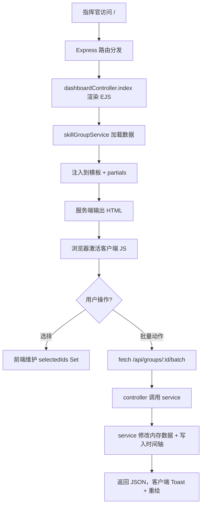

# 明日方舟风格 — 批量技能包组管理界面 PRD (Node.js 框架版)

## 1. 产品概述

「批量技能包组」是面向战术操作员/博士的中央调度面板，使用 **Node.js + Express + EJS** 服务端渲染框架（自研轻量模板框架）构建，模仿《明日方舟》终端的硬核工业 + 战术 HUD 风格。框架以"可复用 Partial + 控制器 + 服务层"为骨架，让运营方能够 5 分钟接入新业务。

- 主要用户：模拟训练中的指挥官 / 战术推演者 / 自动化脚本测试员
- 核心价值：在保持《明日方舟》原生视觉氛围的前提下，把"逐个点击"操作压缩为"一次多选 + 一次确认"的两步式工作流，并以**软件框架**形式沉淀模板与组件，方便后续扩展

## 2. 核心功能

### 2.1 用户角色
| 角色 | 进入方式 | 核心权限 |
|------|----------|----------|
| 指挥官 (Operator) | 默认登录 | 浏览、选择、编队、批量升级、导出配置 |
| 观察员 (Observer) | 通过 `?mode=observe` 进入 | 只读浏览，不可执行批量动作 |

### 2.2 功能模块
1. **顶部 HUD 状态栏** — 网络状态 / 操作员 ID / 同步率 / 时间轴
2. **左侧技能包组侧栏 (Group Roster)** — 7 个技能包组 (GROP A ~ GROP G)
3. **中央批量技能包矩阵 (Matrix)** — 6 列蜂窝网格 + 框选 / 反选 / 全选
4. **右侧批量操作面板 (Action Console)** — 批量升级 / 装配 / 锁定 / 释放
5. **底部时间轴 (Timeline)** — 事件流（HTTP 拉取 + 客户端订阅）
6. **详情浮层 (Inspector)** — 等级、词条、稀有度、消耗、APPLY TO ALL

### 2.3 页面与模块详情
| 页面 | 模块 | 功能描述 |
|------|------|----------|
| 主面板 | HUD 状态栏 | 顶部琥珀渐变线 + 操作员代号 + UTC 同步时钟 + 同步率条 |
| 主面板 | 技能包组侧栏 | 每组一行：组代号 / 容量条 / 激活环 |
| 主面板 | 技能包矩阵 | 30+ 技能包蜂窝卡片，可拖拽框选 |
| 主面板 | 批量操作面板 | BATCH UPGRADE / EQUIP / UNLOCK / LOCK |
| 主面板 | 时间轴 | 横向滚动胶囊 + 琥珀脉冲圆点 |
| 详情浮层 | Skill Inspector | 代号 / 等级 / 词条 / 描述 / APPLY TO ALL |

## 3. 核心流程

## 4. 用户界面设计

### 4.1 设计风格
- **主色**：`#0a0d12` 夜幕黑 / `#141a22` 金属板 / `#2a3441` 冷铁灰
- **强调色**：
  - `#ffb547` 琥珀警示（明日方舟标志色）
  - `#4dd0ff` 冷蓝辉光（HUD 与激活态）
  - `#ff4d5e` 危险红
  - `#7cffb2` 翠绿（成功）
- **字体**：Rajdhani（标题）/ Orbitron（数字）/ JetBrains Mono（数据）/ Noto Sans SC（正文）
- **按钮**：2px 冷蓝边框 + 琥珀填色，悬浮时边框外延 4px 辉光
- **布局**：左右分栏 (260px / 主区 / 320px) + 顶部 HUD (64px) + 底部时间轴 (100px)

### 4.2 动效
- 加载：六边形网格从中心向四周 60ms staggered 淡入
- 选中：卡片外环 200ms ease-out 辉光扩张
- 批量操作：HUD 同步率条增长 + Toast 顶部滑入
- 时间轴事件：胶囊入场 400ms 弹性回弹
- 持续氛围：背景细扫描线 8s 线性循环 + 角部噪点

## 5. 框架定位

本项目**不仅是一个 UI**，更是一个**可复用的 Node.js 模板框架**，关键能力：

- **Component 基类**：服务端组件，可挂载数据 / 模板 / 子组件
- **EJS Helper**：`<%= include('partial', data) %>` 风格 partial include
- **路由约定**：`app.use('/path', controller)` 即插即用
- **服务层抽象**：业务与路由解耦，方便接入数据库
- **多模板布局**：支持 layout 继承 (base.ejs + page.ejs)
