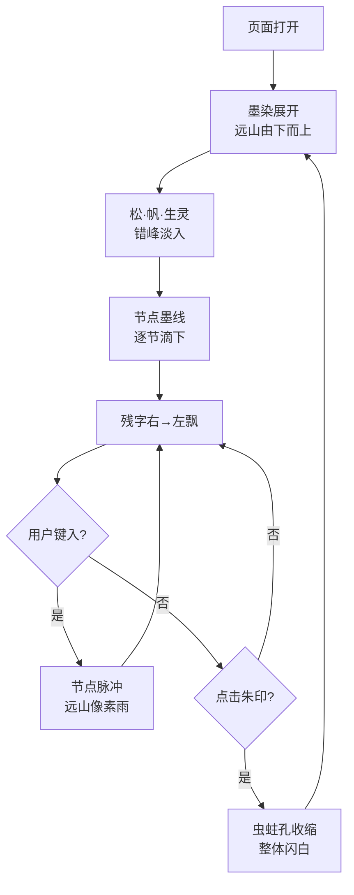

# 断卷残章 · 古画像素终端 — 产品需求文档

## 1. 产品概述

一幅被「数字虫蛀」侵蚀的宋代山水长卷：宣纸残破、墨韵断裂，几只像素化的小生灵在山水间踱步飞游。屏幕右侧悬浮着一个由「节点」与「墨线」连成的打字终端，访客每键入一字符，节点图谱即生长一次，远山的飞鸟会被「像素雨」重写一帧。

- **核心命题**：把"古画 / 断裂感 / 像素化 / 节点设计"四套本不相关的视觉语汇，融合成一种**"数字考古"**的现场感——既像在博物馆翻看残卷，又像在调试一台出土的旧终端。
- **目标用户**：设计/艺术从业者、对赛博东方美学感兴趣的极客、博物馆数字展览访客。
- **市场价值**：可作为数字艺术装置的开屏作品、个人作品集首页、品牌"数字非遗"项目的概念原型。

## 2. 核心功能

### 2.1 体验角色
无登录/多角色；属于一次性艺术装置型单页。

### 2.2 功能模块
1. **断卷主舞台**：承载古画的山、水、树、石、远帆，所有元素都被"撕裂 / 错位 / 像素抽帧"。
2. **像素生灵层**：鹤、鹿、鱼、雀、蛙五只像素生物在画中按轨迹游走，偶尔被"虫蛀孔"吸入消失。
3. **虫蛀孔场**：随机分布的黑色镂空圆，鼠标移过会被临时"修补"再破裂。
4. **右侧节点终端**：纵向"墨线"上挂载节点，节点之间用 SVG 折线相连，键入时整张图谱呼吸。
5. **断裂字幕层**：从右向左飘过被切碎的题字（"山外青山楼外楼 / 残红不染琉璃色 / ……"）。
6. **底栏残印**：仿"朱印"按钮，重置动画、切换昼夜（纸本 / 绢本）。

### 2.3 页面详情
| 页面 | 模块 | 描述 |
|------|------|------|
| 主舞台 | 远山 | 三段水墨山体，使用 CSS 多层径向渐变 + SVG 路径擦除，呈现残卷效果 |
| 主舞台 | 江面 | SVG 横向条带 + 像素化 SVG 滤镜，制造低分辨率波纹 |
| 主舞台 | 古松 | 像素网格拼出的松树，每帧抽 5% 像素点重置，制造"动态马赛克" |
| 像素生灵 | 飞鹤 | 16×16 像素 sprite，斜向上飞行，每 8 秒一帧循环 |
| 像素生灵 | 游鱼 | 8×8 像素 sprite，沿江面横向游动 |
| 像素生灵 | 鹿 / 雀 / 蛙 | 散布于不同高度，错峰呼吸 |
| 虫蛀孔 | 黑洞 | 5–9 个 SVG mask 黑洞，悬停 200ms 内"长出"宣纸纹理后破碎 |
| 节点终端 | 节点 | 6 个固定节点（题、引、墨、印、空、响），每输入一字符脉冲一次 |
| 节点终端 | 连线 | SVG 折线，相邻节点之间以贝塞尔墨线连接，输入时线宽变粗 |
| 节点终端 | 输入区 | 多行 `<textarea>`，每 60ms 打字一字符；超过屏幕高度时向上生长 |
| 断裂字幕 | 残字流 | `<canvas>` 横向滚字，每行在随机 y 处被"咬掉"几段 |
| 底栏 | 朱印按钮 | 圆形 SVG 印章，点击 360° 旋转 + 盖下时所有虫蛀孔同帧收缩 |

## 3. 核心流程

1. 用户进入页面 → 屏幕由黑转宣纸米色 → 远山从下往上"墨染"展开（约 1.6s）。
2. 古松、远帆按时间差淡入；像素生灵在 0.4s 抖动后归位。
3. 右侧终端墨线逐节"滴下"（每节 120ms 错峰），节点依次点亮。
4. 字幕层开始右→左滚动，文字被虫蛀孔"咬"得时断时续。
5. 用户在右下角输入框键入 → 节点终端墨线变粗 → 当前节点脉冲 → 远山某处产生一次"像素雨"（持续 320ms）。
6. 用户悬停虫蛀孔 → 孔被宣纸短暂封住 → 0.6s 后从中心再次爆裂。
7. 用户点击朱印 → 全体虫蛀孔同步收缩成圆点 → 屏幕闪一下米白 → 重新进入第 2 步。

## 4. 用户界面设计

### 4.1 设计风格
- **主色**（纸）：宣纸米 `#EFE4CC`、旧绢黄 `#D9C28A`、霉斑褐 `#6B4A2B`、墨色 `#1B1612`。
- **辅色**：朱砂红 `#A8341E`（用于印章/高亮）、像素三原色 `cyan #5BE7C4 / magenta #E84B82 / lime #D7F26B`（极少量，用于"数字虫蛀"的数字残影）。
- **字体**：
  - 题字 / 题款 → `"Ma Shan Zheng"`（马善政书法）+ `"ZCOOL XiaoWei"`（站酷小薇）作衬。
  - 终端代码 → `"VT323"`（谷歌复古终端字体）。
  - 像素生灵 → `"Press Start 2P"`。
- **按钮/控件**：朱印 = 圆形 SVG 印章；其它按钮 = 仿古印泥方框。
- **布局**：单页桌面优先。**左侧 70% 主舞台（古画残卷）** + **右侧 30% 节点终端 + 输入区**，底栏横向陈列朱印、昼夜切换、章节切换。
- **图标/插画**：所有插画全部用 SVG/Canvas 手绘，禁用 emoji。

### 4.2 页面设计概览
| 模块 | UI 元素 |
|------|---------|
| 远山 | 三层墨染山体 + SVG 撕裂遮罩（`feDisplacementMap`） + 顶部题字"断卷残章" |
| 江面 | 横向像素条带 + 6 条游鱼（其中 2 条带像素残影） |
| 古松 | 32×32 像素网格松树，鼠标悬停时叶片掉落 |
| 节点终端 | 6 节点竖列 + SVG 折线 + 右下输入框（带 `>` 提示符闪烁） |
| 虫蛀孔 | 7 个 SVG 圆孔 mask，边缘为不规则锯齿 |
| 底栏 | 3 枚朱印按钮 + 1 段竖排小字（"墨 / 印 / 音 / 缺"） |

### 4.3 响应式
- **桌面（≥1280px）**：左右 70/30 分栏。
- **平板（≥768px <1280px）**：左 60% / 右 40%，输入区自动换行。
- **手机（<768px）**：主舞台顶部 50vh，节点终端改为 3 列网格置于下方；虫蛀孔减为 3 个；输入框贴底，唤起原生键盘。

### 4.4 动效指引
- **首屏入场**：0–1600ms，墨染由下而上；1600–2400ms，松·帆·生灵错峰淡入。
- **节点脉冲**：键入即触发，使用 CSS `transform: scale(1.2)` + `box-shadow` 0→20px 0 40px 朱砂红。
- **像素雨**：键入瞬间，从对应节点位置向远山发射 12 颗 4×4 像素块，沿贝塞尔曲线飞行 320ms。
- **虫蛀孔呼吸**：每个孔缩放 0.95↔1.05，周期 4–7s 随机错相。
- **朱印盖下**：所有孔 220ms 收缩为圆点，屏幕一次 `#EFE4CC` 闪白。
- **原则**：所有动效只走 `transform` / `opacity` / SVG 滤镜，不触发 layout。
