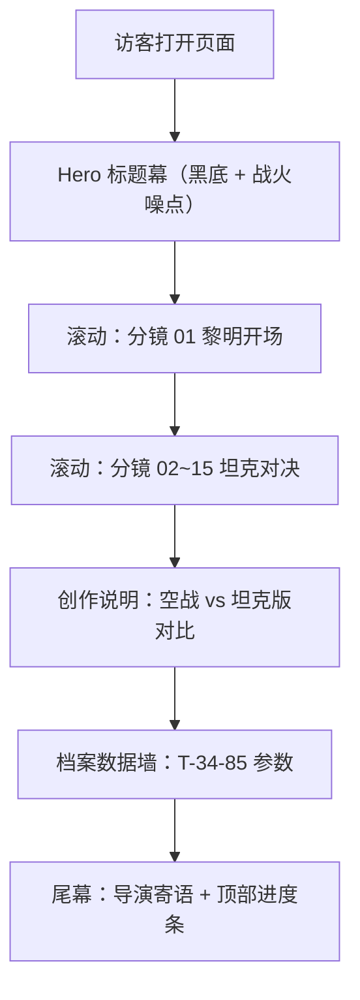

## 1. 产品概述

「钢铁的黎明 · 库尔斯克 T-34-85」是一份以二战库尔斯克会战为背景、围绕 T-34-85 坦克车组展开的**电影化分镜故事板**单页 Web 作品，将原本的纯文本分镜表升级为可滚动、可沉浸的"战争纪录片级"网页。

- 主要目的：以导演分镜 + 战争档案混合形式，重现 1944 年初 T-34-85 投入战场前夜的坦克对决，兼具历史科普与视觉叙事价值
- 目标用户：军事历史爱好者、《战争雷霆》玩家、分镜/影视爱好者、设计/前端爱好者
- 核心价值：把一份"分镜表"做成一件**可被收藏的网页作品**——影调、字体、节奏都遵循战争纪录片的视觉语法

## 2. 核心功能

### 2.1 角色与场景
| 角色 | 入口 | 核心权限 |
|------|------|----------|
| 访客 | 直接打开页面 | 滚动浏览所有分镜、查看创作说明、跳转资源链接 |

无登录、无后端，纯静态阅读型作品。

### 2.2 功能模块
1. **首屏 Hero（标题幕）**：黑底电影标题"钢铁的黎明"，副标题"STEEL DAWN · KURSK 1944"，开场白引言
2. **分镜正文（15 镜）**：每镜 = 镜号 / 景别 / 镜头运动 / 时长 / 画面 / 声音 / 备注，构成可滚动时间线
3. **创作说明区块**：表格化呈现"空战版 vs 坦克版"对比、历史校准、坦克参数
4. **档案/数据墙**：库尔斯克战役与 T-34-85 的硬数据（数量、口径、装甲厚度），做成"作战档案卡片"
5. **尾幕 + 滚动进度条**：固定顶部的"胶片刻度"，右下角"下一镜"快捷跳转

### 2.3 页面细节
| 页面 | 模块 | 特性 |
|------|------|------|
| 主页 | Hero 标题幕 | 黑底 + 大字 + 战火噪点 + 缓慢滚动的烟尘 |
| 主页 | 15 镜分镜 | 暗色调卡片，左侧大号镜号（钢板雕刻感），右侧文字分栏 |
| 主页 | 对比说明表 | 等宽风格 + 战场沙色背景 |
| 主页 | 档案数据墙 | 4 列卡片：主炮 / 动力 / 防护 / 数量 |
| 主页 | 滚动进度 | 顶部进度条 + 右侧分镜小目录 |

## 3. 核心流程

访客 → 进入黑屏标题幕 → 滚动开始"分镜 01：黎明" → 依次推进 15 个分镜 → 进入创作说明与档案 → 滚到尾幕"导演寄语"。

## 4. 用户界面设计

### 4.1 设计风格
- 主题：**战争纪录片 / 战地档案**——硬核、克制、电影感
- 主色：暗夜黑 `#0B0D0A`、沙土黄 `#C8B074`、橄榄绿 `#3D4A2E`、血迹红 `#8B2E1F`、羊皮纸米色 `#E8DCC0`
- 字体：标题使用 **Stencil / Military Stencil** 类等宽雕刻字体（如 `Special Elite` / `Black Ops One`），正文使用 **衬线+打字机** 组合（`IBM Plex Serif` + `Special Elite`）
- 按钮/链接：下划线 + 战时印章感，无圆角；hover 时变为血迹红
- 布局：左侧大镜号、右侧多列信息，模拟"分镜拍摄手稿"的不对称版式
- 元素：胶片齿孔、扫描噪点、烟尘粒子、烧焦边缘、金属拉丝

### 4.2 页面设计概览
| 页面 | 模块 | UI 元素 |
|------|------|---------|
| Hero | 标题幕 | 黑底 + STENCIL 大字 + 缓慢上升的烟尘 + 战火粒子 |
| 分镜 | 镜号 | 90px 雕刻感数字，钢板浮雕阴影 |
| 分镜 | 信息分栏 | 三栏：镜头运动 / 声音 / 备注，等宽小字 |
| 档案 | 数据卡 | 4 列卡片，金属边框 + 钢印式图标 |
| 全局 | 顶部进度条 | 4px 沙土黄进度条，模拟胶片刻度 |
| 全局 | 右侧分镜小目录 | 固定，点亮当前镜号 |

### 4.3 响应式
桌面优先（1280px+）。在窄屏下：镜号缩小到 60px，三栏信息合并为单列；胶片齿孔隐藏。

### 4.4 视觉氛围指引
- **环境**：黑场 + 烟尘 + 战火光斑（橙红）
- **配色**：黑 + 沙 + 锈 + 血迹（克制使用）
- **质感**：胶片颗粒 / 扫描线 / 烧焦边缘 / 钢板拉丝
- **配图**：使用占位 API（`trae-api-cn.mchost.guru/api/ide/v1/text_to_image`）生成 15 张分镜示意
- **字体配对**：标题 `Black Ops One` / `Special Elite`；正文 `IBM Plex Serif`；数据 `JetBrains Mono`
