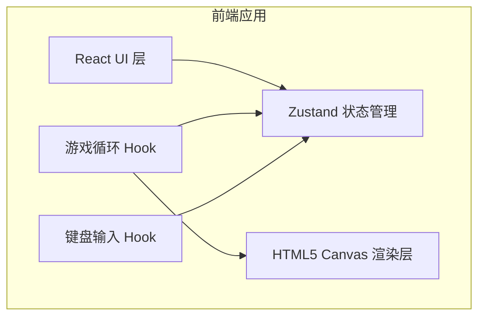

# 像素风机甲对战小游戏 - 技术架构文档

## 1. 架构设计



- 纯前端实现，无后端服务。
- 游戏逻辑与渲染在 `requestAnimationFrame` 循环中执行。
- React 负责页面布局与 HUD 显示，Canvas 负责游戏画面渲染。

## 2. 技术描述

- **前端框架**：React@18 + TypeScript
- **构建工具**：Vite
- **样式方案**：Tailwind CSS
- **状态管理**：Zustand
- **渲染方案**：HTML5 Canvas 2D Context
- **字体**：Google Fonts - Press Start 2P

## 3. 路由定义

| 路由 | 用途 |
|------|------|
| `/` | 对战主页面，包含完整游戏画布与控制说明 |

## 4. 数据模型

### 4.1 核心类型

```typescript
interface Mecha {
  id: 'red' | 'blue';
  x: number;
  y: number;
  vx: number;
  vy: number;
  hp: number;
  maxHp: number;
  facing: 1 | -1;
  state: 'idle' | 'run' | 'jump' | 'attack' | 'defend' | 'skill' | 'hurt' | 'ko';
  animTimer: number;
  cooldowns: Record<string, number>;
  combo: number;
}

interface Skill {
  key: string;
  name: string;
  damage: number;
  cooldown: number;
  duration: number;
  range: number;
  launch: (mecha: Mecha, target: Mecha) => void;
}
```

### 4.2 游戏状态

```typescript
interface GameState {
  red: Mecha;
  blue: Mecha;
  particles: Particle[];
  winner: 'red' | 'blue' | null;
  round: number;
}
```

## 5. 目录结构

```
/workspace
├── .trae/documents
├── public/
├── src/
│   ├── components/
│   │   └── BattleGame.tsx      # 游戏主组件
│   ├── hooks/
│   │   ├── useGameLoop.ts      # 游戏循环
│   │   └── useInput.ts         # 键盘输入
│   ├── store/
│   │   └── gameStore.ts        # Zustand 状态
│   ├── utils/
│   │   ├── constants.ts        # 常量与配置
│   │   ├── physics.ts          # 物理与碰撞
│   │   ├── skills.ts           # 技能定义
│   │   └── render.ts           # 像素绘制函数
│   ├── App.tsx
│   └── main.tsx
├── index.html
├── package.json
└── vite.config.ts
```

## 6. 关键实现要点

- Canvas 使用 `imageRendering: pixelated` 保持像素清晰。
- 物理系统包含重力、地面碰撞、水平移动摩擦。
- 攻击判定使用矩形碰撞盒；防御状态减少 70% 伤害并免疫击退。
- 技能冷却通过帧计数实现，UI 同步显示剩余冷却。
- 胜负判定在任一方 HP ≤ 0 时触发，暂停循环并显示结算面板。

