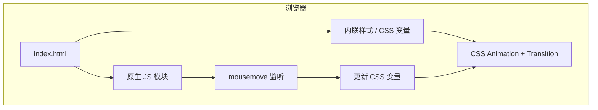

# 工业仙境 · 文字动画HTML 技术架构

## 1. 架构设计

极简单页结构：一个 `index.html` 包含全部结构、样式与脚本；不引入构建工具，便于直接预览。

## 2. 技术说明
- 前端：纯 HTML5 + CSS3（CSS 变量、perspective、transform、mix-blend-mode、filter）+ 原生 ES2020 JS
- 字体：Google Fonts（Noto Sans SC / Space Grotesk / JetBrains Mono）
- 构建工具：无需构建；使用 Python `http.server` 提供本地预览
- 资源：纯代码生成（无外部图片、模型、音频）

## 3. 路由定义
| 路由 | 用途 |
|------|------|
| / | 主页（Hero 立体文字 + 工业背景 + 鼠标交互） |

## 4. 关键实现点
1. **伪 3D**：多层标题 `position: absolute` + 不同 `translateZ` + 父级 `perspective: 1400px`
2. **鼠标随行变色**：监听 `mousemove`，计算归一化坐标，写入 CSS 变量 `--mx / --my`，文字 fill / glow 引用变量
3. **广角镜头**：`rotateX/rotateY = (mouseY-0.5)*8deg` 模拟镜头俯仰/偏航
4. **逐步完善**：将标题拆分为多个 ``，使用 `animation-delay` 阶梯延迟
5. **边缘光感**：`text-shadow` 多层叠加 + `-webkit-text-stroke` 描边

## 5. 性能与兼容
- 使用 CSS `transform` / `opacity` 触发 GPU 合成
- `prefers-reduced-motion` 关闭大幅动效
- 兼容 Chrome / Edge / Safari / Firefox 最新版本
