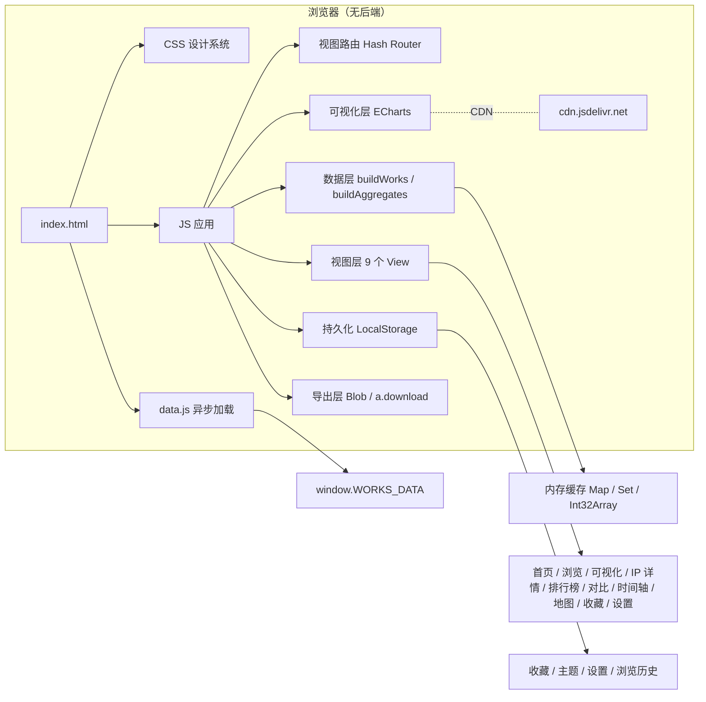
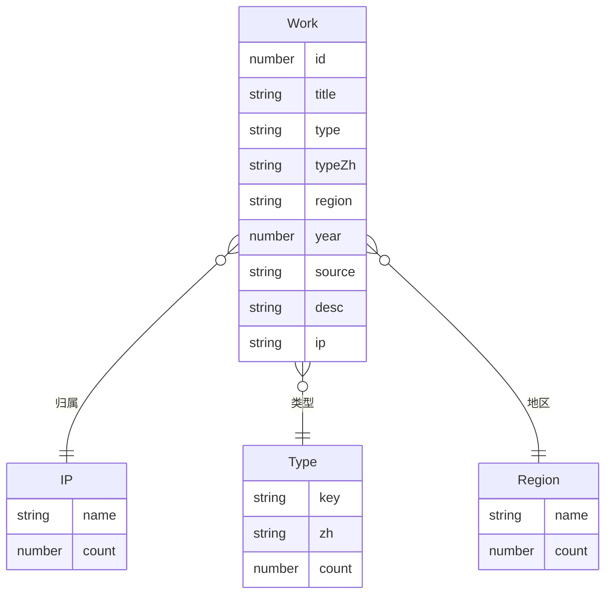

# GameIP Derivative Universe · 技术架构

## 1. 架构设计



## 2. 技术栈描述

- **前端框架**：原生 HTML + ES2020 JavaScript（保持单文件部署、零构建）
- **可视化**：ECharts 5.4.3（CDN，jsDelivr）
- **字体**：Google Fonts（Space Grotesk + Inter + JetBrains Mono）
- **图标**：Lucide Icons（CDN）
- **状态管理**：原生模块变量 + URL Hash 同步（无外部 store）
- **路由**：基于 `location.hash` 的轻量 Hash Router
- **持久化**：`localStorage`（收藏/主题/设置/历史）
- **后端**：无（保持纯前端，最大化可移植性）
- **数据库**：无（data.js 静态数据）
- **包管理**：无（N/A，单 HTML 部署）
- **构建工具**：无（N/A，HTML/CSS/JS 直接交付）

> 选型理由：用户已有 91MB data.js 在浏览器端运行；引入框架（React/Vue）只会增加构建链和首次加载开销。原架构已能稳定处理 200K 数据，保持纯前端是性能与可移植性的最优解。

## 3. 路由定义

| Hash 路径 | 视图 | 说明 |
|----------|------|------|
| `#/` | 首页 Dashboard | 9 入口 + 数据概览 + 今日精选 |
| `#/browse` | 浏览 | 筛选 + 网格 + 分页（保留原页面） |
| `#/visualize` | 可视化 | 6 图表 + 过滤（保留原页面） |
| `#/ip/:ipName` | IP 详情 | 单一 IP 衍生谱系与代表作品 |
| `#/rankings` | 排行榜 | IP/作品/作者/类型 4 维 |
| `#/compare` | 对比 | 多 IP 雷达图 |
| `#/timeline` | 时间轴 | 跨年度拖动时间线 |
| `#/map` | 地图 | 全球地区分布 |
| `#/collections` | 收藏 | LocalStorage 收藏列表 |
| `#/settings` | 设置 | 主题/密度/动画/导出 |

## 4. 视图 API 契约（内部模块接口）

```ts
// 数据层
buildWorks(): void                       // 从 RAW 构建 WORKS 数组
buildAggregates(): void                  // 构建 IP/类型/地区/年份/十年聚合
getFiltered(state): Work[]               // 通用筛选器
aggregate(filtered): AggResult           // 用于可视化的二次聚合

// 视图层（每个 view 都是 (mountEl: HTMLElement) => void）
renderHome(mountEl)
renderBrowse(mountEl)
renderVisualize(mountEl)
renderIPDetail(mountEl, ipName)
renderRankings(mountEl)
renderCompare(mountEl)
renderTimeline(mountEl)
renderMap(mountEl)
renderCollections(mountEl)
renderSettings(mountEl)

// 持久化
storage.get(key, fallback): any
storage.set(key, value): void
storage.remove(key): void

// 导出
exportCSV(rows, filename): void
exportPNG(chartInstance, filename): void
exportJSON(obj, filename): void
```

## 5. 数据模型

### 5.1 实体关系


### 5.2 数据来源
- `data.js` 内嵌数组 `[title, type, region, year, source, desc, ip]`
- 207,583 条记录
- 13 种 type，64 个 IP，9 个 region，38 年跨度
- 字段长度与命名已与视图层对齐，**无需后端 ETL**

## 6. 性能策略

- **首次加载**：三阶段加载屏（LOADING / PARSING / BUILDING）掩盖 JS 解析 + 数组构建
- **数据访问**：所有数据进入 `WORKS` 数组后用 for-loop 操作，避免 `.map`/`.filter` 回调开销
- **聚合缓存**：常用聚合（ipC / tC / rC / dC / yC）构建一次永久缓存
- **图表懒初始化**：每个 view 第一次进入才创建 ECharts 实例
- **虚拟滚动**：排行榜 Top 100 使用窗口化渲染
- **Web Worker（可选）**：当筛选 200K + 复杂条件时，下放到 Worker 避免卡顿
- **防抖**：搜索输入 200ms 防抖
- **requestAnimationFrame**：DOM 批量更新合并到下一帧

## 7. 文件结构

```
/workspace/
├── index.html              # 全部视图入口（单文件 SPA）
├── data.js                 # 207K 数据（外部脚本）
├── generate.py             # 种子数据 1（宝可梦/Mario 等）
├── generate2.py            # 种子数据 2（FGO/Fate 等）
├── generate3.py            # 种子数据 3（Minecraft/HK 等）
├── generate4.py            # 扩展生成器（同人/手办/章节等）
├── README.md               # 部署说明
└── .trae/
    └── documents/
        ├── PRD.md          # 本文档 PRD
        └── TECH.md         # 本文档
```

## 8. 部署

- 静态托管即可（GitHub Pages / Vercel / Netlify / 本地 `python3 -m http.server`）
- 无构建步骤
- 无环境变量
- 无服务端组件

## 9. 风险与缓解

| 风险 | 缓解 |
|------|------|
| data.js 91MB 首屏白屏 | 加载屏 + 进度文字 + 分段 setTimeout 让 UI 有节奏出现 |
| ECharts CDN 失败 | fallback 到内嵌 echarts.min.js（如体积允许） |
| 200K 筛选慢 | for-loop 替代 .filter + Web Worker 兜底 |
| LocalStorage 容量满 | 收藏压缩为 ID 列表（仅 ID，标题渲染时反查） |
| 单 HTML 体积膨胀 | 视图代码分块（每个 view < 5KB），总计目标 ≤ 200KB |

## 10. 范围限制

- ❌ 不引入 React/Vue（保持零构建）
- ❌ 不引入 Tailwind（保持 CSS 变量设计系统，单文件友好）
- ❌ 不引入后端 API（数据静态化）
- ❌ 不引入数据库（LocalStorage 即可）
