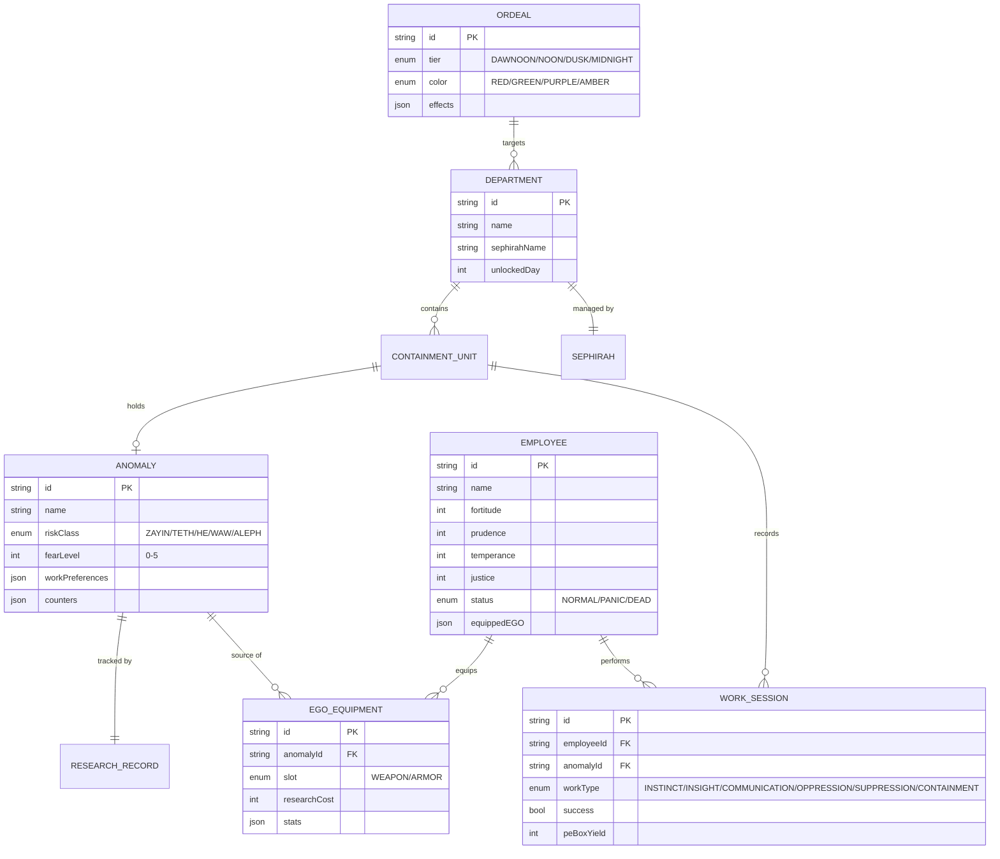

# 技术架构文档 - 脑叶公司 Web 版

## 1. 架构设计

本项目是纯前端 2D 像素风管理模拟游戏，无后端依赖，游戏状态完全保存在浏览器内存中（zustand store）。

```mermaid
flowchart TB
    subgraph 前端 (Vite + React 18 + TypeScript)
        A[App 根组件] --> B[路由 React Router]
        B --> C[主监控室页]
        B --> D[员工面板页]
        B --> E[E.G.O 工坊页]
        B --> F[异想体图鉴页]
        B --> G[剧情页]
        B --> H[结算页]

        C --> I[GameLoop Hook]
        C --> J[TimeManager]
        C --> K[EventDispatcher]

        I --> L[Zustand GameStore]
        J --> L
        K --> L

        L --> M[AnomalyLogic]
        L --> N[EmployeeLogic]
        L --> O[OrdealLogic]
        L --> P[EGOLogic]

        M --> Q[本地 JSON 数据]
        N --> Q
        O --> Q
        P --> Q

        C --> R[CanvasRenderer]
        R --> S[像素精灵图集]
    end

    subgraph 数据层
        T[localStorage 持久化]
        L <--> T
    end
```

## 2. 技术栈说明

- **构建工具**：Vite 5
- **框架**：React 18 + TypeScript
- **样式**：Tailwind CSS 3 + CSS Modules（像素风特殊处理）
- **状态管理**：Zustand
- **路由**：React Router DOM v6
- **音频**：Web Audio API（程序化生成）+ Howler.js（可选，用于采样回放）
- **画布渲染**：HTML5 Canvas 2D（用于异想体/员工 sprite 渲染）
- **图标**：Lucide React
- **字体**：
  - 标题：Orbitron（Google Fonts 替代 Norwester 风格）
  - 正文：JetBrains Mono（监控终端）
  - 剧情：Noto Serif SC
- **包管理**：pnpm（如可用）或 npm
- **数据存储**：JSON 本地文件 + 内存状态；localStorage 存档

## 3. 路由定义

| 路由 | 用途 |
|------|------|
| `/` | 主监控室（默认入口） |
| `/employees` | 员工面板（雷达图、拖拽分配） |
| `/workshop` | E.G.O 装备工坊 |
| `/codex` | 异想体图鉴 |
| `/story/:departmentId` | 部长剧情对白 |
| `/summary` | 通关 / 失败结算 |
| `/settings` | 音频 / 显示设置 |

## 4. 数据模型

### 4.1 数据模型定义



### 4.2 数据定义语言（DDL - JSON Schema 形式）

```typescript
// 异想体类型示例
type RiskClass = 'ZAYIN' | 'TETH' | 'HE' | 'WAW' | 'ALEPH';
type WorkType = 'INSTINCT' | 'INSIGHT' | 'COMMUNICATION' | 'OPPRESSION' | 'SUPPRESSION' | 'CONTAINMENT';

interface Anomaly {
  id: string;
  name: string;
  riskClass: RiskClass;
  fearLevel: 0 | 1 | 2 | 3 | 4 | 5;
  description: string; // 雾化文字，分段解锁
  preferredWork: WorkType[];
  workResults: Record<WorkType, 'PE_BOX' | 'BLACK' | 'WHITE_DAMAGE' | 'RED_DAMAGE' | 'BREAK'>;
  counters: {
    workCount: number;
    meltThreshold: number;
  };
  baseEnergyYield: number;
  baseResearchYield: number;
  unlockCost: number; // 解锁完整信息所需研究点
}
```

## 5. 核心模块说明

### 5.1 游戏循环（`useGameLoop`）
- `requestAnimationFrame` 驱动
- 时间步进：1 游戏日 = 60 秒（可调），1 黎明-午夜周期 = 15 秒
- 每 6 秒可执行一次工作

### 5.2 异想体逻辑（`anomalyLogic.ts`）
- 6 种工作类型对应员工 4 维属性的成功概率
- 工作结果：产出能源 / 吞噬能源 / 白色伤害 / 红色伤害 / 突破收容
- 逆卡巴拉熔毁：工作计数累积 → 倒计时 → 未工作则突破

### 5.3 员工逻辑（`employeeLogic.ts`）
- 4 维属性（勇气/谨慎/自律/正义）成长
- 恐慌状态：精神归零或恐惧等级超载时触发
- 恐慌行为：勇气 → 攻击同事；谨慎 → 自裁；自律 → 破坏收容；正义 → 乱跑

### 5.4 考验系统（`ordealLogic.ts`）
- 4 时段 × 4 颜色 = 16 种考验
- 红色黎明：走廊小丑、镇压减计数器
- 绿色/紫色/琥珀色：差异化机制
- 镇压奖励：能源百分比

### 5.5 E.G.O 装备（`egoLogic.ts`）
- 解锁异想体 → 消耗研究点 → 锻造
- 装备影响员工属性 + 视觉 sprite
- 副作用：部分武器不分敌我

## 6. 文件结构

```
/workspace
├── .trae/documents/
│   ├── PRD.md
│   └── TECH.md
├── public/
│   └── sprites/          # 像素精灵图集（占位）
├── src/
│   ├── components/       # 可复用组件
│   │   ├── canvas/       # Canvas 渲染器
│   │   ├── hud/          # 状态栏、事件流
│   │   └── modals/       # 弹窗
│   ├── pages/            # 路由页面
│   │   ├── ControlRoom.tsx
│   │   ├── Employees.tsx
│   │   ├── Workshop.tsx
│   │   ├── Codex.tsx
│   │   ├── Story.tsx
│   │   ├── Summary.tsx
│   │   └── Settings.tsx
│   ├── store/            # Zustand stores
│   │   ├── gameStore.ts
│   │   ├── anomalyStore.ts
│   │   └── employeeStore.ts
│   ├── logic/            # 纯函数游戏逻辑
│   │   ├── anomalyLogic.ts
│   │   ├── employeeLogic.ts
│   │   ├── ordealLogic.ts
│   │   └── egoLogic.ts
│   ├── data/             # 静态数据
│   │   ├── anomalies.json
│   │   ├── employees.json
│   │   └── ordeals.json
│   ├── audio/            # 音频模块
│   │   └── audioEngine.ts
│   ├── utils/            # 工具函数
│   ├── hooks/            # 自定义 hooks
│   ├── App.tsx
│   ├── main.tsx
│   └── index.css
├── index.html
├── package.json
├── tailwind.config.js
├── postcss.config.js
├── tsconfig.json
└── vite.config.ts
```

## 7. 性能与可访问性

- **帧率目标**：60 FPS（Canvas 渲染）
- **内存预算**：精灵图集 < 5MB
- **可访问性**：键盘快捷键（1-6 触发工作类型、Space 暂停、Esc 设置）
- **存档**：localStorage 自动保存（每 30 秒 + 关键事件后）

## 8. 启动与开发

```bash
# 安装依赖
pnpm install  # 或 npm install

# 启动开发服务器
pnpm dev

# 构建生产版本
pnpm build

# 类型检查
pnpm typecheck
```
