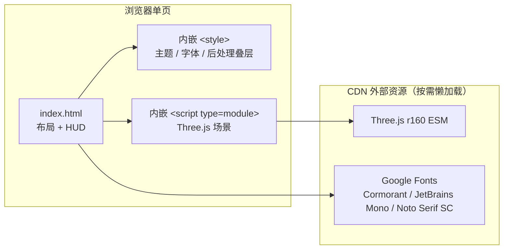

# 技术架构：数学天穹 · 朔行

## 1. 架构设计

采用 **单文件 HTML + Three.js (ESM CDN)** 方案，零构建步骤、零依赖安装。



## 2. 技术说明

- **前端框架**：无框架（vanilla ES2020+，Three.js 即可）
- **3D 库**：Three.js r160（ESM importmap 加载，addons: OrbitControls, EffectComposer, UnrealBloomPass, RenderPass, ShaderPass）
- **后处理**：UnrealBloom + 自写 ShaderPass（颗粒/色差/暗角）
- **样式**：原生 CSS（CSS Variables 管主题色）
- **包管理**：无（无构建工具）
- **初始化**：用户直接打开 `index.html` 或用 `python -m http.server` 预览
- **后端**：无
- **数据库**：无

## 3. 路由定义
无（单页）。

## 4. 文件结构

```
/workspace
├── index.html              # 主单页（HTML + CSS + JS 全部内嵌）
├── .trae/documents/PRD.md
└── .trae/documents/TECH.md
```

## 5. 关键模块设计

### 5.1 场景对象清单
| 对象 | 实现方式 | 关键参数 |
|------|----------|----------|
| 数学天球仪 | SphereGeometry(800) + ShaderMaterial（程序化黎曼起伏 + 数学符号噪声） | radius 800, segments 64 |
| 黎曼山脉 | 多面 Mesh（自定义几何：z = sin(x)*cos(y) + 黎曼 z^2 偏移）紫金渐变 | 64×64 plane, displacement |
| 斐波那契螺旋银河 | BufferGeometry + Points（50000 粒子沿黄金螺旋排布） | 50000 points, additive blending |
| 晶体平原 | PlaneGeometry(2000) + 自定义 Shader（fbm 噪声 + 折射） | size 2000×2000 |
| 公式石碑 | BoxGeometry(20, 80, 5) + CanvasTexture（手写数学符号） | 倾倒 45° |
| 晶体苔藓 | 粒子贴附石碑表面 + 半透明 | 500 particles |
| 校服学生 朔 | CapsuleGeometry(0.15) + 头 Sphere(0.08) 简化人形 | scale ≈ 0.25, 蓝白校服色 |
| 整体雾 | THREE.FogExp2 紫金雾 | density 0.0035 |

### 5.2 相机运镜
- t∈[0, 1]（normalized 0~8s）：
  - pos.y = lerp(800, 1.6, easeInOutCubic(t))
  - lookAt 固定天球仪中心
- t∈[1, 2]（normalized 8~15s）：
  - pos = 朔身后 3 米 + 手持 noise (sin(t*8)*0.05, cos(t*6)*0.05)
  - lookAt = 朔的位置 + 偏移

### 5.3 后处理链
RenderPass → UnrealBloomPass → ShaderPass(颗粒+色差+暗角)

### 5.4 HUD 交互
- 播放/暂停：单个 `<button>` 切换 requestAnimationFrame 标志
- 时间轴：自定义 `<div>` 进度条，pointer 事件
- 氛围开关：3 个 `<input type=checkbox">` 控制 uniform 值

## 6. 性能预算
- 三角面总数 < 200k
- 粒子总数 < 80k
- 纹理全部程序化 / CanvasTexture，零图片下载
- DPR 上限 1.5（避免 4K 屏爆显存）

## 7. 测试与验证
- 直接 `python3 -m http.server 8000` 打开 `http://localhost:8000/`
- 视觉验证清单：
  - [ ] 天球仪呈紫金色，黎曼起伏明显
  - [ ] 银河粒子随相机下沉产生视差
  - [ ] 朔在画面中占比 < 1/50
  - [ ] 0–8s 镜头平滑下沉，无跳跃
  - [ ] 8s 后开始手持微晃
  - [ ] HUD 信息可读、字体不溢出
  - [ ] 控制台无报错
