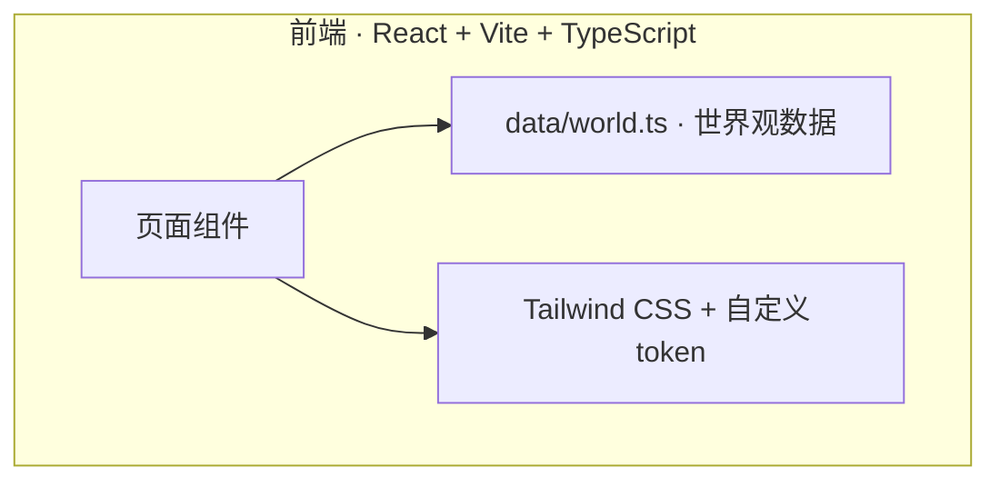
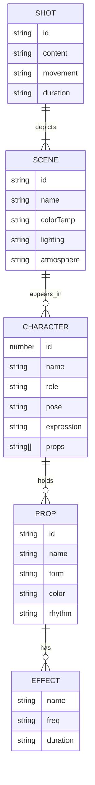

# 技术架构 · 建木→长安 影视世界观展示页

## 1. 架构设计
本期为纯前端单页应用，无后端、无数据库、无外部服务。所有内容直接硬编码在 `src/data/world.ts` 中（基于《世界观设定卡.md》）。



## 2. 技术选型
- **前端**：React@18 + TypeScript + Vite
- **样式**：Tailwind CSS@3（自定义设计 token：冷紫/暖金/青铜/蓝）
- **状态管理**：本期为静态展示，无需 zustand
- **路由**：本期为单页，无需 react-router
- **图标**：lucide-react
- **后端**：无
- **数据库**：无
- **初始化工具**：vite-init
- **包管理器**：npm（环境未提供 pnpm）
- **模板**：`react-ts`

## 3. 路由定义
本期无路由，使用单页结构（Home 组件包含所有 section）。

| 路径 | 用途 |
|---|---|
| / | Home 主页（Hero + 7 个 section） |

## 4. API 定义
无后端，无 API。

## 5. 服务端架构
无后端。

## 6. 数据模型
### 6.1 数据模型定义
数据从《世界观设定卡.md》直接结构化为 TypeScript 常量，按区块分文件：



### 6.2 数据来源
- 主源：`/workspace/世界观设定卡.md`
- 注入点：`src/data/world.ts`
- 字段：characters / scenes / props / vfx / audio / shots / deliverables / qualityBar

## 7. 目录结构
```
/workspace
├── .trae/documents/
│   ├── PRD.md
│   └── TECH.md
├── index.html
├── package.json
├── tailwind.config.js
├── postcss.config.js
├── tsconfig.json
├── vite.config.ts
└── src/
    ├── main.tsx
    ├── App.tsx
    ├── index.css            # Tailwind + 设计 token
    ├── data/
    │   └── world.ts         # 世界观数据
    ├── components/
    │   ├── Hero.tsx
    │   ├── CharacterCards.tsx
    │   ├── SceneTimeline.tsx
    │   ├── PropsAndVFX.tsx
    │   ├── AudioDesign.tsx
    │   ├── ProductionTable.tsx
    │   └── Footer.tsx
    └── lib/
        └── ornaments.tsx    # 青铜回纹 SVG 组件
```

## 8. 性能与可访问性
- 图片/SVG 全部内联，无外链
- 字体使用系统衬线 + Google Fonts 子集，避免大体积下载
- 所有交互元素满足 44×44px 触控目标
- 颜色对比度 ≥ AA 级
- 滚动动画使用 `IntersectionObserver` + CSS transition，不阻塞主线程
