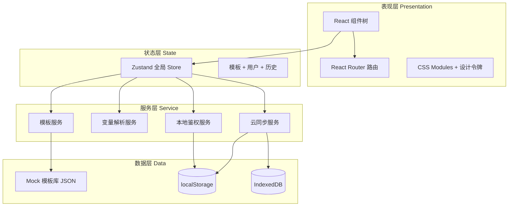
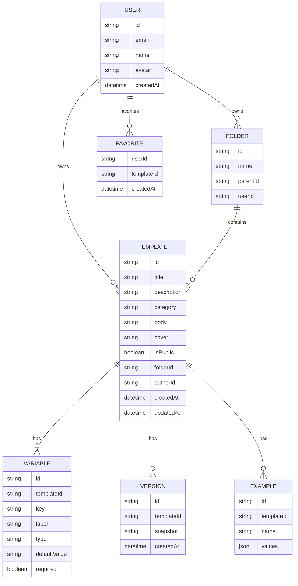

# 剧幕 · PromptStage 技术架构文档

## 1. 架构设计

本项目采用**纯前端单页应用**架构。所有"云服务"能力由前端结合浏览器存储（localStorage / IndexedDB）模拟，并在 UI 层呈现为"云端同步"体验，无需后端即可演示完整产品流程。模板市场使用内置 mock 数据。



## 2. 技术描述

- **构建工具**：Vite 5（极速 HMR，原生 ESM）
- **前端框架**：React 18 + TypeScript 5
- **样式方案**：CSS Modules + CSS 变量（设计令牌），不使用 Tailwind 以最大化视觉独特性
- **路由**：React Router v6
- **状态管理**：Zustand 4（轻量、TS 友好）
- **动画**：Framer Motion 11（入场动效、卡片交互）
- **图标**：lucide-react（细线条 1.5px 一致性）
- **代码高亮**：prismjs 仅用于变量插槽演示
- **后端**：无（全部前端 mock）
- **数据库**：无后端 DB；模板市场用内置 JSON，云端用 localStorage
- **字体加载**：Google Fonts（Fraunces、Geist、JetBrains Mono）
- **包管理**：pnpm

## 3. 路由定义

| 路由 | 用途 |
|------|------|
| `/` | 首页 / 工作室入口 |
| `/gallery` | 模板展厅 |
| `/gallery/:id` | 模板详情 |
| `/workshop/:id` | 变量工坊（填变量、生成最终提示词） |
| `/editor` | 新建空白模板 |
| `/editor/:id` | 编辑已有模板 |
| `/library` | 我的剧库（私有模板管理） |
| `/library/folder/:id` | 文件夹详情 |
| `/login` | 登录 / 注册（演示用本地账户） |

## 4. API 定义（前端内部 service 层）

```ts
// 模板服务 TemplateService
interface Template {
  id: string;
  title: string;
  description: string;
  category: 'short-video' | 'ad' | 'livestream' | 'novel' | 'storyboard';
  tags: string[];
  author: { id: string; name: string; avatar: string };
  cover: string;
  body: string;                 // 含 {{变量}} 的剧本内容
  variables: Variable[];
  examples: { name: string; values: Record<string, string> }[];
  versions: { id: string; createdAt: string; snapshot: string }[];
  stats: { uses: number; favorites: number };
  isPublic: boolean;
  folderId?: string;
  createdAt: string;
  updatedAt: string;
}

interface Variable {
  key: string;                 // 与 {{key}} 对应
  label: string;
  type: 'text' | 'textarea' | 'enum' | 'number' | 'slider';
  defaultValue?: string;
  options?: string[];          // enum 用
  required: boolean;
  hint?: string;
}

interface TemplateService {
  list(filter?: TemplateFilter): Promise<Template[]>;
  get(id: string): Promise<Template | null>;
  create(input: TemplateInput): Promise<Template>;
  update(id: string, input: Partial<TemplateInput>): Promise<Template>;
  remove(id: string): Promise<void>;
  fork(id: string): Promise<Template>;
}

// 变量解析服务 VariableService
interface VariableService {
  parse(body: string): Variable[];                          // 从 body 抽取 {{xxx}}
  extractKeys(body: string): string[];                       // 提取所有变量键
  render(body: string, values: Record<string, string>): string; // 渲染最终提示词
  estimateTokens(text: string): number;                      // 估算 token 数
}

// 云同步服务 StorageService
interface StorageService {
  saveDraft(template: Partial<Template>): void;             // 草稿自动保存
  loadDraft(id: string): Partial<Template> | null;
  syncToCloud(template: Template): Promise<void>;           // 模拟云同步
  loadFromCloud(): Promise<Template[]>;
  exportAll(): string;                                      // 导出全部 JSON
  importAll(json: string): void;                            // 导入恢复
}

// 鉴权服务 AuthService
interface AuthService {
  login(email: string, password: string): Promise<User>;
  register(email: string, password: string, name: string): Promise<User>;
  logout(): void;
  current(): User | null;
  isGuest(): boolean;
}
```

## 5. 服务端架构

无后端。所有"云服务"行为在前端用 `setTimeout(..., 400)` 模拟网络延迟 + localStorage 持久化，让用户感知到"云端保存"的体验。模板市场数据从 `/src/data/templates.seed.ts` 加载。

## 6. 数据模型

### 6.1 数据模型定义



### 6.2 数据定义语言（伪 DDL，用于初始化种子数据）

```ts
// 初始用户
User: [
  { id: 'u_demo', email: 'demo@promptstage.app', name: '剧幕演示账号', avatar: '' }
]

// 初始文件夹
Folder: [
  { id: 'f_default', name: '我的剧库', parentId: null, userId: 'u_demo' },
  { id: 'f_short',   name: '短视频脚本', parentId: 'f_default', userId: 'u_demo' },
  { id: 'f_ad',      name: '品牌广告',   parentId: 'f_default', userId: 'u_demo' }
]

// 初始模板（市场内置 12+ 个，分布到 5 大类）
Template: [
  { id: 't_001', category: 'short-video', title: '抖音爆款带货 30 秒口播', isPublic: true, ... },
  { id: 't_002', category: 'ad',          title: '小红书种草笔记四段式',    isPublic: true, ... },
  { id: 't_003', category: 'livestream',  title: '直播间暖场互动脚本',      isPublic: true, ... },
  { id: 't_004', category: 'novel',       title: '短篇小说开篇钩子模板',    isPublic: true, ... },
  { id: 't_005', category: 'storyboard',  title: '分镜脚本九宫格模板',      isPublic: true, ... },
  // ... 共 12 个种子模板
]
```

种子模板将在 `/src/data/templates.seed.ts` 中以 TypeScript 字面量形式提供，每个模板至少含 3 个变量、2 个使用示例、完整的剧本正文。
