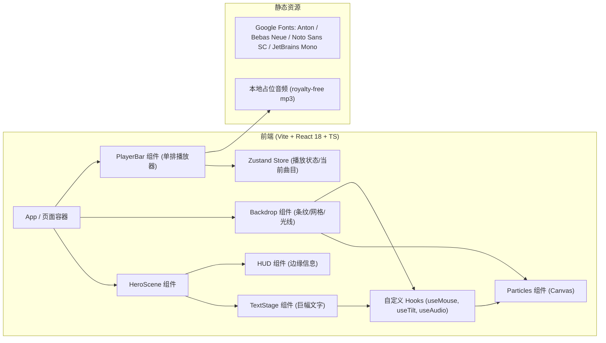
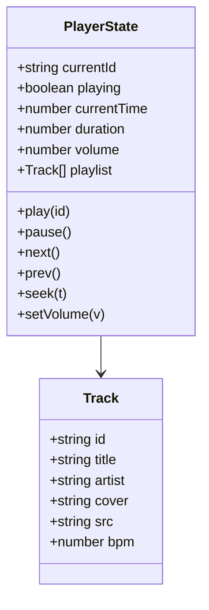

# 工业陷阱 · 文字动画界面 - 技术架构文档

## 1. 架构设计



> 本项目为纯前端作品，**不涉及后端服务**，所有音频/字体/曲目元数据为本地资源或公开 CDN。

## 2. 技术栈说明
- **构建工具**：Vite 5
- **框架**：React 18 + TypeScript
- **样式**：Tailwind CSS 3 + 原生 CSS（处理复杂动画/3D 变换）
- **状态管理**：Zustand（播放器与曲目）
- **图标**：lucide-react
- **音频**：HTMLAudioElement 原生 API（不引入第三方播放器库，减少体积）
- **动画**：CSS 动画 + requestAnimationFrame（粒子循环）+ Web Audio API（简易可视化）

## 3. 路由定义
单页应用，无路由。

| 路由 | 用途 |
|------|------|
| `/` | 唯一的"工业陷阱"主视觉界面 |

## 4. API 定义
无后端 API。曲目元数据以静态 JSON 形式存放于 `src/data/tracks.ts`：

```ts
export interface Track {
  id: string;
  title: string;       // 标题
  artist: string;      // 艺人
  cover: string;       // 封面（base64 / CDN）
  src: string;         // 音频地址
  bpm: number;         // 节奏
}
```

## 5. 目录结构
```
.
├── .trae/documents
│   ├── PRD.md
│   └── TECH.md
├── index.html
├── package.json
├── tsconfig.json
├── vite.config.ts
├── tailwind.config.js
├── postcss.config.js
├── src
│   ├── main.tsx
│   ├── App.tsx
│   ├── index.css
│   ├── components
│   │   ├── Backdrop.tsx
│   │   ├── GridLayer.tsx
│   │   ├── StripeLayer.tsx
│   │   ├── LightRays.tsx
│   │   ├── Particles.tsx
│   │   ├── TextStage.tsx
│   │   ├── HUD.tsx
│   │   ├── PlayerBar.tsx
│   │   └── Visualizer.tsx
│   ├── hooks
│   │   ├── useMouse.ts
│   │   ├── useTilt.ts
│   │   └── useAudio.ts
│   ├── store
│   │   └── playerStore.ts
│   ├── data
│   │   └── tracks.ts
│   └── utils
│       └── cn.ts
└── public
    └── audio
        └── (占位音频)
```

## 6. 数据模型

### 6.1 播放器状态


### 6.2 关键设计决策
1. **伪 3D**：使用 CSS `transform: perspective() rotateX() rotateY() translateZ()` 多层堆叠，文字使用 `text-shadow` 多层偏移制造"金属厚度"。
2. **鼠标随行色变**：通过 `mix-blend-mode: difference` + 径向渐变蒙版 + CSS 变量驱动 `currentColor`，实现鼠标附近文字变色。
3. **广角镜头感**：背景层用 `perspective(800px) rotateX(60deg)` 形成地平线网格 + `transform-origin: bottom` 形成"地面"。
4. **粒子**：Canvas 2D，每帧更新位置+拖尾+触底反弹；粒子数量根据视口宽度自适应。
5. **光线**：CSS `conic-gradient` + `filter: blur(40px)`，加 `mix-blend-mode: screen` 形成体积光。
6. **播放器**：底部固定栏，毛玻璃背景，单行布局（封面 + 标题/艺人 + 进度 + 控制 + 音量 + 菜单）。
7. **音乐来源**：使用 Pixabay / FreePD 等免版权资源；若环境无网络则保留本地占位文件并禁用播放（不影响视觉）。

## 7. 性能与质量
- 启用 `will-change` / `transform: translateZ(0)` 提升合成层
- Canvas 粒子使用 `devicePixelRatio` 自适应
- 监听 `prefers-reduced-motion`，对动画做降级
- 通过 `requestIdleCallback` 预热字体

## 8. 浏览器兼容
- Chrome / Edge / Safari / Firefox 最新两个大版本
- 移动端：iOS 15+ Safari、Android Chrome 90+
