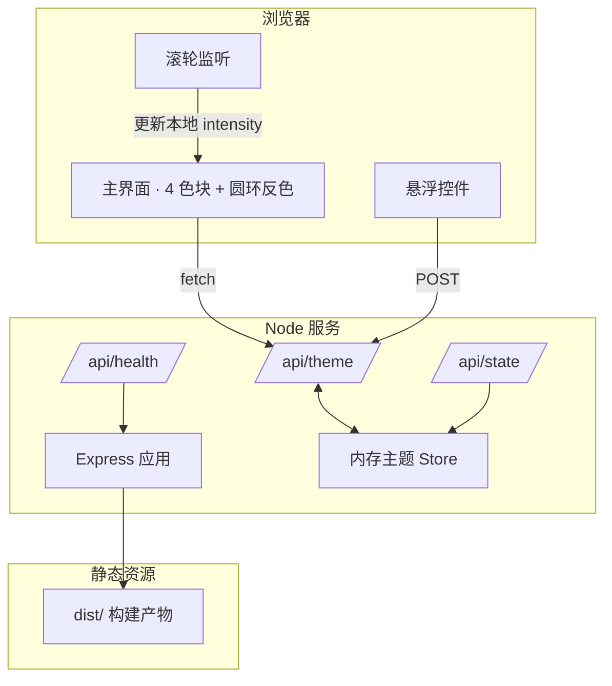

# 工业仙境 · 文字动画 v1.0  技术架构

## 1. 架构设计

前后端分离的企业级 Node.js 单页应用。前端构建产物由 Express 静态托管，主题状态通过 REST API 实时同步。



## 2. 技术说明
- **后端**：Node.js 20+ / Express 4（ESM，TypeScript）
- **前端构建**：Vite 5 + 原生 TypeScript（不引入 React/Vue，保持页面极致轻量、符合"只存在一个界面主体"要求）
- **HTTP 客户端**：原生 `fetch`
- **状态管理**：纯 DOM + 内存 JS 对象（无外部 store，匹配单页主体）
- **持久化**：内存 `Map`（可平滑切换到 SQLite / PostgreSQL）
- **包管理**：pnpm

## 3. 项目结构
```
/workspace
├── api/                       # 后端
│   ├── server.ts              # Express 入口
│   ├── routes/
│   │   ├── theme.ts           # /api/theme GET/POST
│   │   ├── state.ts           # /api/state GET
│   │   └── health.ts          # /api/health GET
│   └── store/
│       └── themeStore.ts      # 内存主题
├── src/                       # 前端源码
│   ├── main.ts                # 入口（迁移原 index.html 设计）
│   ├── style.css              # 全部样式（4 色块 + 圆环 + 控件）
│   ├── controls.ts            # 悬浮控件
│   ├── wheel.ts               # 滚轮调节
│   └── api.ts                 # fetch 封装
├── public/                    # 静态资源
├── index.html                 # Vite 入口
├── vite.config.ts             # Vite 配置（含 dev proxy）
├── tsconfig.json
├── package.json
└── .trae/documents/           # PRD / TECH
```

## 4. 路由定义（后端）
| 路由 | 方法 | 用途 |
|------|------|------|
| `/` | GET | 返回 `dist/index.html`（生产）/ Vite dev（开发） |
| `/api/health` | GET | `{ ok: true, uptime, version }` |
| `/api/theme` | GET | 返回当前主题 JSON（默认 4 色 + 字号 + 圆环速度） |
| `/api/theme` | POST | 接收部分主题字段，更新并返回新主题 |
| `/api/state` | GET | 返回 `intensity` / `mode` / `lastWheelAt` |

## 5. 数据模型
```ts
type Theme = {
  id: string;                // 'default' | 'noir' | 'sunset'
  palette: {
    ink: string; paper: string; rust: string; volt: string; lime: string;
  };
  font: { titleSize: number; weight: number; family: string };
  ring: { speed: number; thickness: number };
  panel: { gridCols: string; gridRows: string };
};

type AppState = {
  intensity: number;         // 0~1，滚轮调节
  mode: 'live' | 'paused';
  lastWheelAt: number;
};
```

## 6. 开发与运行
- 安装：`pnpm install`
- 开发（前后端并行）：`pnpm dev`（Vite + tsx watch server）
- 构建：`pnpm build`（输出 `dist/`）
- 启动生产：`pnpm start`（Express 服务 `dist/` + API）
- 默认端口：5173（dev）/ 8787（API 单独）或 3000（生产单端口）

## 7. 关键交互实现
- **滚轮**：`window.addEventListener('wheel', e => intensity = clamp(intensity - e.deltaY*0.001, 0, 1))`，写入 `document.documentElement.style.setProperty('--intensity', x)`，所有依赖强度的 CSS（字号 / 旋转 / 模糊）通过 `calc(var(--intensity) * ...)` 计算
- **悬浮控件**：右下抽屉 `.controls` 折叠按钮，展开 5 个 `<input type=range>` + 3 个主题按钮，change 事件 → `POST /api/theme` + 立即应用 CSS
- **API 下发**：`fetch('/api/theme')` 返回的 palette 写入 `:root` CSS 变量，4 色块自动重染
- **圆环反色**：保留原 `conic-gradient` + `mask-composite: exclude` 实现
