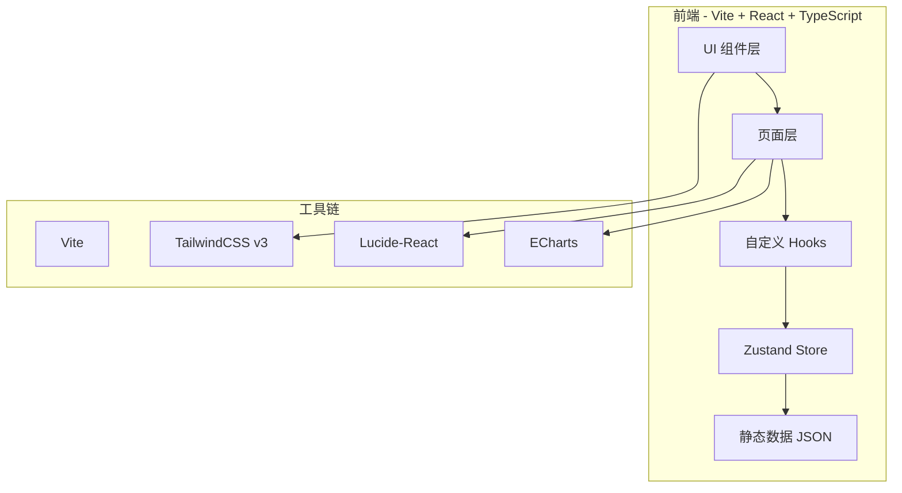

# 游戏IP衍生作品资料库 — 技术架构文档

## 1. 架构设计



**决策**：纯前端单页应用（SPA），无后端。数据以 JSON 静态内嵌 / 文件方式随构建产物分发。

## 2. 技术选型
- **前端框架**：React 18 + TypeScript + Vite
- **样式方案**：TailwindCSS v3 + 自定义 CSS 变量（霓虹主题）
- **状态管理**：Zustand（搜索词、筛选条件、主题）
- **图标**：lucide-react
- **图表**：ECharts for React（数据看板）
- **路由**：react-router-dom
- **字体**：Orbitron / Inter / Noto Sans SC（Google Fonts CDN）

## 3. 路由定义
| 路由 | 用途 |
|------|------|
| `/` | 首页（Hero、统计、热门 IP） |
| `/browse` | 浏览页（筛选 + 列表 + 详情） |
| `/dashboard` | 数据看板（图表） |
| `/about` | 关于页（数据来源、说明） |

## 4. 数据结构

```ts
interface DerivativeWork {
  id: string;             // 唯一 ID
  title: string;          // 衍生作品名
  ip: string;             // 原游戏 IP
  type: WorkType;         // 衍生类型
  year: number;           // 发行年份
  region: string;         // 地区
  platform: string;       // 载体（TV、剧场、漫画、Novel...）
  tags: string[];         // 标签
  popularity: number;     // 热度 0-100
  description: string;    // 简介
  cover: string;          // 封面（占位图 / 渐变色块）
}

type WorkType =
  | 'anime'      // 动画
  | 'manga'      // 漫画
  | 'movie'      // 电影
  | 'tv'         // 电视剧
  | 'novel'      // 小说
  | 'stage'      // 舞台剧
  | 'figure'     // 手办 / 模型
  | 'goods'      // 周边商品
  | 'ost'        // 音乐
  | 'mobile';    // 手游
```

## 5. 数据规模
- 总条目数 **≥ 2000**
- 覆盖 IP 数 **≥ 200**（涵盖日美中欧主流游戏 IP）
- 类型覆盖 **10** 类
- 年份覆盖 **1985-2026**
- 地区：**Japan / USA / China / Korea / Europe / Global**

## 6. 数据生成策略
采用程序化生成 + 真实 IP 锚点混合策略：
1. **真实 IP 池**：从主流游戏 IP 中精选 200+（如 宝可梦、马里奥、最终幻想、勇者斗恶龙、原神、王者荣耀、生化危机、刺客信条、艾尔登法环、塞尔达传说、女神异闻录、洛克人、怪物猎人、街头霸王、铁拳、我的世界、CS、LOL、DOTA、星际争霸、魔兽、暗黑破坏神、守望先锋、炉石传说、原神、崩坏、明日方舟、少女前线、FGO、碧蓝航线、阴阳师、剑网三、逆水寒、仙剑、轩辕剑、古剑奇谭、鬼泣、合金装备、生化危机、寂静岭、刺客信条、波斯王子、巫师、赛博朋克、上古卷轴、辐射、毁灭战士、Doom、超级马里奥、俄罗斯方块、动物森友会、火焰纹章、异度之刃、猎天使魔女、合金装备、魂系列、只狼、黑暗之魂、血源诅咒、拳皇、饿狼传说、侍魂、忍者龙剑传、毁灭公爵、半条命、传送门、DOTA、LOL、CSGO、彩虹六号、刺客信条、孤岛惊魂、看门狗、细胞分裂、波斯王子、侠盗猎车手、巫师、赛博朋克 2077、赛马娘、碧蓝档案、第五人格、和平精英、刺激战场、原神、王者荣耀、英雄联盟、DNF、CF、QQ飞车、跑跑卡丁车、冒险岛、地下城与勇士、梦幻西游、大话西游、阴阳师、崩坏学园、崩坏3、崩坏：星穹铁道、原神、绝区零、鸣潮、尘白禁区、少女前线、明日方舟、碧蓝档案、蔚蓝档案、Project Moon 脑叶公司、废墟图书馆、边狱公司、异世界舅舅、哥布林杀手、Overlord、刀剑神域、加速世界、Re:Zero、...）
2. **衍生作品生成**：对每个 IP 程序化生成 5-15 个不同类型、不同年份的衍生作品
3. **真实作品注入**：对头部 IP 注入真实存在的衍生作品名（动画名、电影名）
4. **填充逻辑**：用 IP 名 + 类型模板（"X 动画版"、"X 漫画"）生成占位条目，确保数据丰富度
5. **质量控制**：通过 ID 去重、字段完整性校验确保数据质量

## 7. 性能策略
- **虚拟滚动**：列表超过 200 项时启用（react-window）
- **数据分片**：JSON 拆分加载
- **图片懒加载**：原生 `loading="lazy"`
- **Memoization**：useMemo 缓存筛选结果
- **Debounce**：搜索输入 300ms 防抖

## 8. 文件结构
```
src/
  components/         # 复用组件
    Navbar.tsx
    Hero.tsx
    StatsDashboard.tsx
    FilterBar.tsx
    WorkCard.tsx
    WorkDetailDrawer.tsx
    HotIPCarousel.tsx
  pages/              # 页面
    Home.tsx
    Browse.tsx
    Dashboard.tsx
    About.tsx
  hooks/              # 自定义 Hooks
    useFilter.ts
    useTheme.ts
  store/              # Zustand
    useAppStore.ts
  data/               # 静态数据
    works.ts          # 2000+ 衍生作品
    ips.ts            # 200+ 游戏 IP
    types.ts
  utils/              # 工具
    filter.ts
    format.ts
  App.tsx
  main.tsx
  index.css
```
