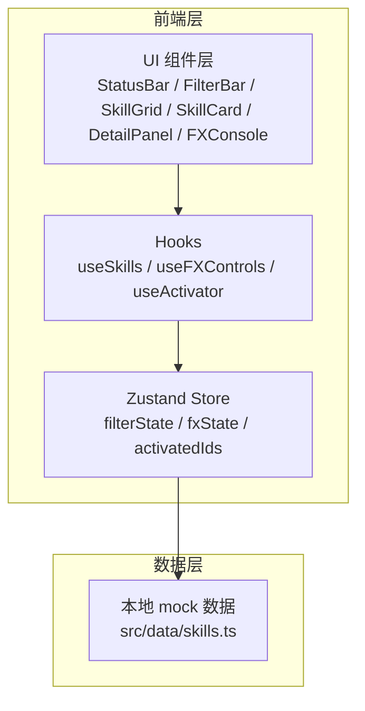

# 明日方舟风格批量技能包组 - 技术架构

## 1. 架构设计



## 2. 技术描述
- **前端框架**：React@18 + TypeScript
- **构建工具**：Vite@5
- **样式方案**：TailwindCSS@3 + 原生 CSS（用于复杂 clip-path 与 keyframes 动画）
- **状态管理**：Zustand
- **图标**：lucide-react
- **字体**：Google Fonts（Orbitron / Rajdhani / Noto Sans SC / JetBrains Mono）
- **后端**：无（纯前端，使用本地 mock 数据）

## 3. 路由定义
单页应用，使用 hash 路由承载"职业"与"选中技能"。
| 路由 | 用途 |
|-----|------|
| `/#/class/:className` | 切换职业筛选 |
| `/#/skill/:skillId` | 打开技能详情面板 |

## 4. API 定义
无后端 API。所有数据来自 `src/data/skills.ts`，类型定义如下：

```ts
type Rarity = 4 | 5 | 6;
type ClassName = 'Vanguard' | 'Guard' | 'Defender' | 'Sniper' | 'Caster' | 'Medic' | 'Supporter' | 'Specialist';

interface Skill {
  id: string;
  name: string;          // 技能名（中文）
  nameEn: string;        // 技能名（英文/代号）
  operator: string;      // 干员名
  rarity: Rarity;
  className: ClassName;
  spCost: number;        // SP 上限
  spType: 'auto' | 'offensive' | 'defensive' | 'support';
  duration: string;      // 持续时间描述
  cooldown: string;      // 冷却描述
  description: string;   // 技能描述
  trigger: string;       // 触发条件
  tags: string[];        // 标签，如"爆发""控制"
  iconSeed: number;      // 用于生成 SVG 几何图标
  color: string;         // 强调色（与职业色对齐）
}
```

## 5. 状态管理

```ts
interface FXState {
  glowIntensity: number;     // 0.2 - 1.5
  scanlineSpeed: number;     // 0 - 2
  particleDensity: number;   // 0 - 60
  particlesEnabled: boolean;
  scanlineEnabled: boolean;
  set: (patch: Partial<FXState>) => void;
  reset: () => void;
}

interface UIState {
  classFilter: ClassName | 'All';
  selectedSkillId: string | null;
  activatedIds: Set<string>;
  batchActivating: boolean;
  setFilter: (c: UIState['classFilter']) => void;
  selectSkill: (id: string | null) => void;
  activate: (id: string) => void;
  batchActivate: () => Promise<void>;
  resetAll: () => void;
}
```

## 6. 关键组件

| 组件 | 路径 | 职责 |
|-----|------|------|
| `App.tsx` | `src/App.tsx` | 顶层布局，挂载路由状态 |
| `StatusBar` | `src/components/StatusBar.tsx` | 标题、统计、批量按钮 |
| `FilterBar` | `src/components/FilterBar.tsx` | 8 个职业标签 |
| `SkillGrid` | `src/components/SkillGrid.tsx` | 响应式网格容器 |
| `SkillCard` | `src/components/SkillCard.tsx` | 卡片 UI + 入场动画 |
| `SkillIcon` | `src/components/SkillIcon.tsx` | 几何 SVG 图标（按 iconSeed 生成） |
| `SPBar` | `src/components/SPBar.tsx` | 充能条 |
| `DetailPanel` | `src/components/DetailPanel.tsx` | 详情抽屉 + 光效环绕 |
| `FXConsole` | `src/components/FXConsole.tsx` | 光效控制台 |
| `HexBackground` | `src/components/HexBackground.tsx` | 六边形网格 + 扫描线 |
| `ParticleField` | `src/components/ParticleField.tsx` | 背景粒子 |

## 7. 视觉/动效实现要点
- 直角切角：`clip-path: polygon(0 8px, 8px 0, 100% 0, 100% calc(100% - 8px), calc(100% - 8px) 100%, 0 100%);`
- 卡片悬停外发光：`box-shadow: 0 0 0 1px #5EE3FF, 0 0 24px rgba(94,227,255,.35);`
- 扫描线：CSS `@keyframes scan { from { transform: translateY(-100%); } to { transform: translateY(100%); } }`
- 激活辉光：径向 `radial-gradient(circle, rgba(94,227,255,.7), transparent 60%)` + 旋转 + scale 动画
- 充能条：`width` 从 0 过渡到 100%，使用 `transition: width 1.2s cubic-bezier(.2,.7,.2,1);`
- 入场：每张卡片 `animation: rise .6s ease both;` + 内联 `animation-delay: ${index*60}ms;`

## 8. 数据规模
mock 数据包含 24 个技能，覆盖 8 个职业（每职业 3 条），便于展示完整 4 列 × 多行网格。
