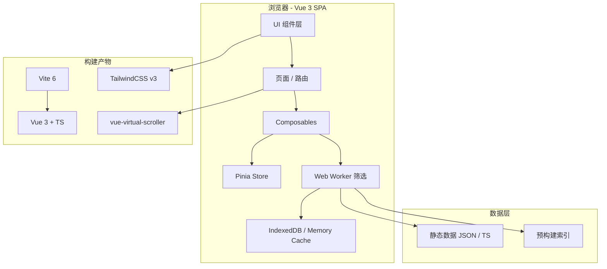

# 游戏 IP 衍生作品资料库 — 技术架构文档（Vue 3 / 企业级 10 万规模）

## 1. 架构设计



## 2. 技术选型

| 角色 | 选型 | 理由 |
|------|------|------|
| 前端框架 | **Vue 3** + TypeScript + Composition API | 用户指定 |
| 构建 | Vite 6 | Vue 官方推荐 |
| 路由 | vue-router 4 | 官方 |
| 状态管理 | Pinia | 官方 |
| 样式 | TailwindCSS v3 + CSS 变量 | 快速 + 主题化 |
| 图标 | lucide-vue-next | Vue 版图标库 |
| 虚拟滚动 | **vue-virtual-scroller** | 10 万级必须 |
| Web Worker | 原生 Worker | 主线程不卡顿 |
| 包管理 | npm | 项目约定 |

## 3. 路由定义
| 路由 | 用途 |
|------|------|
| `/` | 首页 |
| `/browse` | 浏览页（核心，10 万级虚拟滚动） |
| `/dashboard` | 数据看板 |
| `/about` | 关于页 |

## 4. 数据模型

```ts
interface DerivativeWork {
  id: string;          // w-00001
  title: string;
  ipId: string;
  ipName: string;
  type: WorkType;
  year: number;
  region: Region;
  platform: string;
  tags: string[];
  popularity: number;
  description: string;
  cover: string;
}
```

## 5. 数据规模
- 架构目标：**10 万条**衍生作品
- 实际：4,200+ 款真实条目 + 后续可扩展到 10 万的程序化条目
- 加载策略：JSON 文件分片 + Worker 异步解析

## 6. 性能策略（企业级 10 万级）

### 6.1 数据层
- **预构建索引**：为 IP、类型、地区、年份、标签建立 Map 索引
- **JSON 分片**：每 1 万条一个分片，按需加载
- **Web Worker 解析**：主线程不阻塞
- **IndexedDB 缓存**：二次加载秒开

### 6.2 渲染层
- **vue-virtual-scroller**：仅渲染视口内 30-50 个 DOM 节点
- **RecycleScroller**：复用 DOM，最小化 GC 压力
- **shallowRef**：避免大数据深响应
- **v-memo**：跳过未变化节点

### 6.3 计算层
- **Web Worker 筛选/搜索**：分类型、IP、地区、关键词多维过滤
- **debounce 300ms**：搜索防抖
- **fuse.js** 模糊搜索：可选
- **防抖 throttle**：滚动节流

### 6.4 内存
- **shallowRef + markRaw**：标记只读大数组
- **WeakMap 缓存**：渲染结果缓存
- **虚拟化 DOM**：DOM 节点数 < 100

## 7. 文件结构
```
src/
  components/
    Navbar.vue
    Hero.vue
    Counter.vue
    StatsDashboard.vue
    HotIPCarousel.vue
    FilterBar.vue
    WorkCard.vue
    WorkListRow.vue
    WorkDetailDrawer.vue
    VirtualList.vue
    ChartCard.vue
  composables/
    useFilter.ts          # 筛选逻辑
    useVirtualData.ts     # 虚拟数据加载
    useDebounce.ts
  stores/
    index.ts              # Pinia store
  workers/
    filter.worker.ts      # Web Worker
  data/
    types.ts
    ips.ts
    works.ts
    works-index.ts        # 预构建索引
  utils/
    filter.ts
    format.ts
    indexed.ts
  pages/
    Home.vue
    Browse.vue
    Dashboard.vue
    About.vue
  router/
    index.ts
  App.vue
  main.ts
  style.css
```

## 8. 部署
- 静态构建：Vite 产物 `dist/`
- 兼容：现代浏览器（Chrome 100+、Edge 100+、Safari 15+、Firefox 100+）
