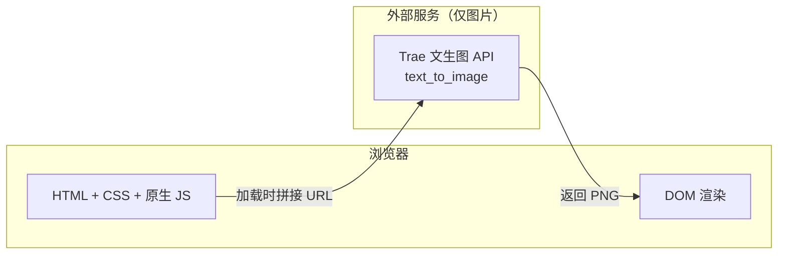

# 技术架构文档 — 分镜脚本展示页

## 1. 架构设计
纯静态单页应用，无后端，无数据库。配图通过 URL 拼接调用 Trae 内置文生图接口（`https://trae-api-cn.mchost.guru/api/ide/v1/text_to_image`）按需生成。



## 2. 技术选型说明
- **前端框架**：纯 HTML + 原生 ES2020 JS + CSS3，**不引入 React/Vue**。原因：单页、静态、无路由、无状态，单文件 ~400 行即可，无需打包工具。
- **样式方案**：原生 CSS + CSS 变量 + `clamp()` 流式排版；不引入 Tailwind，以避免与艺术化排版冲突。
- **字体加载**：Google Fonts 远程加载 `Cinzel`（标题）、`Noto Serif SC`（中文正文）、`JetBrains Mono`（时间码）。
- **图标**：内联 SVG（`lucide` 风格），不引外部库。
- **图片生成**：`https://trae-api-cn.mchost.guru/api/ide/v1/text_to_image?prompt=...&image_size=landscape_16_9`，`prompt` 经 `encodeURIComponent` 转码；每个分镜取其 `aiPrompt` 字段。
- **构建工具**：无（直接以 `index.html` 运行）。
- **本地预览**：`python3 -m http.server 8000`。

## 3. 路由定义
单路由（`/`），无客户端路由：

| 路由 | 用途 |
|------|------|
| / | 主页：Hero + 分镜表 + 时间轴侧栏 |

## 4. API 定义
无业务后端 API。仅消费 Trae 文生图接口，调用规范参见 `web-dev` 规范：

```
GET https://trae-api-cn.mchost.guru/api/ide/v1/text_to_image
    ?prompt={URLEncoded 英文提示词}
    &image_size=landscape_16_9 | square_hd
```

## 5. 服务器架构图
无后端，跳过。

## 6. 数据模型
无数据库。分镜数据硬编码在 `app.js` 的 `STORYBOARD` 数组中，每条记录结构如下：

```ts
interface Shot {
  id: number;            // 镜号 01, 02
  timecode: string;      // "0:00-0:08"
  duration: string;      // "0:08"
  shotSize: string;      // "极大全景→全景"
  camera: string;        // "置换差沉降"
  visual: string;        // 视觉描述
  dialogue: string;      // 台词/独白
  sfx: string;           // 音效
  aiPrompt: string;      // 英文 AI 提示词
  imageSize: string;     // landscape_16_9 / square_hd
}

interface GalleryItem {
  title: string;         // 中文标题
  meta: string;          // 英文小标签
  prompt: string;        // 英文 AI 提示词
  size: "landscape_16_9" | "square_hd";
}

interface SoundLayer {
  name: string;          // 中文层名
  tag: string;           // 英文声学标签
  desc: string;          // 中文描述
  seed: number;          // 波形种子
}
```

数据来源：用户原始 `user_input` 提供的两段分镜原文（**不做字段改动**）；其余概念图、声音层为根据分镜氛围衍生出的设定集。
