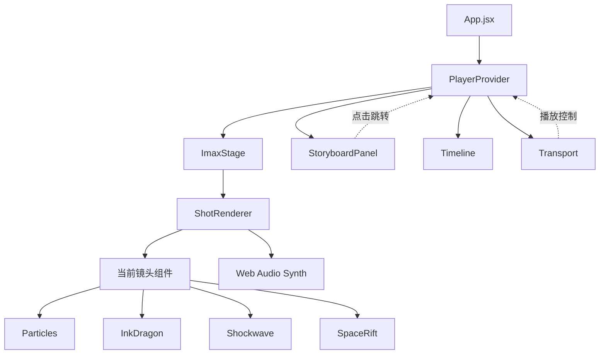

# 技术架构文档 — 大荧幕·觉醒

## 1. 技术栈

| 层 | 选型 | 理由 |
|---|------|------|
| 框架 | React 18 + Vite | 启动快、组件化、桌面端性能优 |
| 语言 | JavaScript (ES2022) + JSX | 无TS配置成本，开箱即用 |
| 样式 | 原生 CSS + CSS Variables | 主题可定制度高，零依赖 |
| 动效 | Framer Motion (motion) | 镜头切换、运镜关键帧 |
| 渲染 | Canvas 2D + CSS 3D | 粒子/水墨/IMAX效果 |
| 音频 | Web Audio API | 程序化合成音效，无需外部资源 |
| 状态 | useState + useReducer + Context | 镜头索引、播放状态、音效节点 |

> 桌面优先，无路由，无后端，单页应用。

---

## 2. 目录结构

```
/workspace
├── index.html
├── package.json
├── vite.config.js
├── public/
│   └── (静态资源)
├── src/
│   ├── main.jsx                # React 入口
│   ├── App.jsx                 # 顶层布局
│   ├── styles/
│   │   ├── global.css          # 全局变量、重置
│   │   └── stage.css           # IMAX画幅与黑边
│   ├── data/
│   │   └── storyboard.js       # 6幕18镜分镜数据
│   ├── context/
│   │   └── PlayerContext.jsx   # 播放/镜头/时间码
│   ├── audio/
│   │   └── synth.js            # Web Audio 程序化音效
│   ├── components/
│   │   ├── ImaxStage.jsx       # IMAX画幅主舞台
│   │   ├── ShotRenderer.jsx    # 镜头渲染分发
│   │   ├── StoryboardPanel.jsx # 右侧分镜卡片表
│   │   ├── Timeline.jsx        # 底部时间轴
│   │   ├── Transport.jsx       # 播放/暂停/进度
│   │   └── effects/
│   │       ├── Particles.jsx   # 粒子系统(Canvas)
│   │       ├── InkDragon.jsx   # 水墨金龙(SVG)
│   │       ├── Shockwave.jsx   # 冲击波扩散
│   │       ├── SpaceRift.jsx   # 空间裂隙
│   │       ├── Desert.jsx      # 荒芜大地
│   │       ├── Meteor.jsx      # 行星坠落
│   │       └── Beast.jsx       # 太空巨兽剪影
│   └── shots/
│       ├── Shot01_Desert.jsx
│       ├── Shot02_Farmer.jsx
│       ├── Shot03_Eye.jsx
│       ├── Shot04_Ruins.jsx
│       ├── Shot05_Confront.jsx
│       ├── Shot06_Incant.jsx
│       ├── Shot07_Meteor.jsx
│       ├── Shot08_Knight.jsx
│       ├── Shot09_Face.jsx
│       ├── Shot10_Push.jsx
│       ├── Shot11_Wave.jsx
│       ├── Shot12_FirstHit.jsx
│       ├── Shot13_Cosmos.jsx
│       ├── Shot14_Tear.jsx
│       ├── Shot15_Dragon.jsx
│       ├── Shot16_Aftermath.jsx
│       ├── Shot17_Wink.jsx
│       └── Shot18_Black.jsx
```

---

## 3. 数据模型

### 3.1 镜头 (Shot)
```js
{
  id: 'S01',
  act: 1,                       // 第几幕
  no: 1,                        // 镜号
  shotSize: '大全景',             // 景别
  movement: '地面仰拍→急速拉升',   // 运镜
  duration: 4000,               // 时长 ms
  description: '荒芜大地...',
  fx: 'IMAX渲染，粒子模糊',
  audio: '低频嗡鸣',
  render: 'DesertShot',         // 对应渲染组件名
  camera: {                     // 镜头动画参数
    startScale: 1.0,
    endScale: 0.4,
    startY: 30,
    endY: 0,
    rotate: 0
  }
}
```

### 3.2 音效节点 (AudioNode)
```js
{
  shotId: 'S01',
  t: 0,                         // 相对时间 ms
  type: 'rumble',               // rumble/bell/whoosh/ding
  params: { freq: 40, decay: 2 }
}
```

### 3.3 播放状态
```js
{
  currentShotIndex: 0,
  isPlaying: false,
  shotProgress: 0,              // 0~1 当前镜头进度
  globalTime: 0                 // 全局时间码 ms
}
```

---

## 4. 关键流程

### 4.1 播放主循环
```
TICK (16ms)
  → 更新 globalTime
  → 计算 currentShotIndex = findShotByTime(globalTime)
  → 计算 shotProgress = (globalTime - shotStart) / shotDuration
  → 触发 ShotRenderer 重渲染
  → 触发音效节点 (Web Audio scheduling)
  → Timeline 高亮
  → requestAnimationFrame
```

### 4.2 运镜实现
每个镜头组件接收 `progress (0~1)`，使用 Framer Motion 关键帧：
- `scale`: 起始 → 结束
- `rotateX/Y/Z`: 视角
- `x/y`: 摇移
- `filter`: blur / contrast

### 4.3 视觉特效
| 效果 | 实现 |
|------|------|
| 粒子模糊 | Canvas 2D 随机分布，requestAnimationFrame |
| 水墨线条 | SVG path + stroke-dashoffset 动画 |
| 空间褶皱 | CSS 3D Transform + perspective |
| 冲击波 | 圆形 div + scale 关键帧 + opacity 衰减 |
| 行星坠落 | Canvas 拖尾 + 火光径向渐变 |
| 巨兽剪影 | SVG path，逆光剪影 |
| 水墨金龙 | SVG path 路径动画 |

### 4.4 音效程序化合成
- `rumble` (低频嗡鸣): OscillatorNode sine 30-60Hz + LowpassFilter + GainNode
- `bell` (编钟): 多频率 sine 叠加 + 指数衰减
- `whoosh` (拳风): 白噪音 + bandpass 扫频
- `ding` (清脆): 高频 sine + reverb

---

## 5. 关键架构图



---

## 6. 性能与渲染策略
- 镜头切换淡入淡出 200ms，避免跳变
- Canvas 在镜头切换时按需创建/销毁
- 音效节点使用 AudioContext.currentTime 精确调度
- 启用 `prefers-reduced-motion` 降级

---

## 7. 启动方式
```bash
npm install
npm run dev
# 访问 http://localhost:5173
```

---

## 8. 风险与对策
| 风险 | 对策 |
|------|------|
| Canvas 性能 | 粒子上限 300，按需渲染 |
| 音频自动播放被拦截 | 首次用户交互后 resume AudioContext |
| 字体加载延迟 | font-display: swap，回退衬线 |
