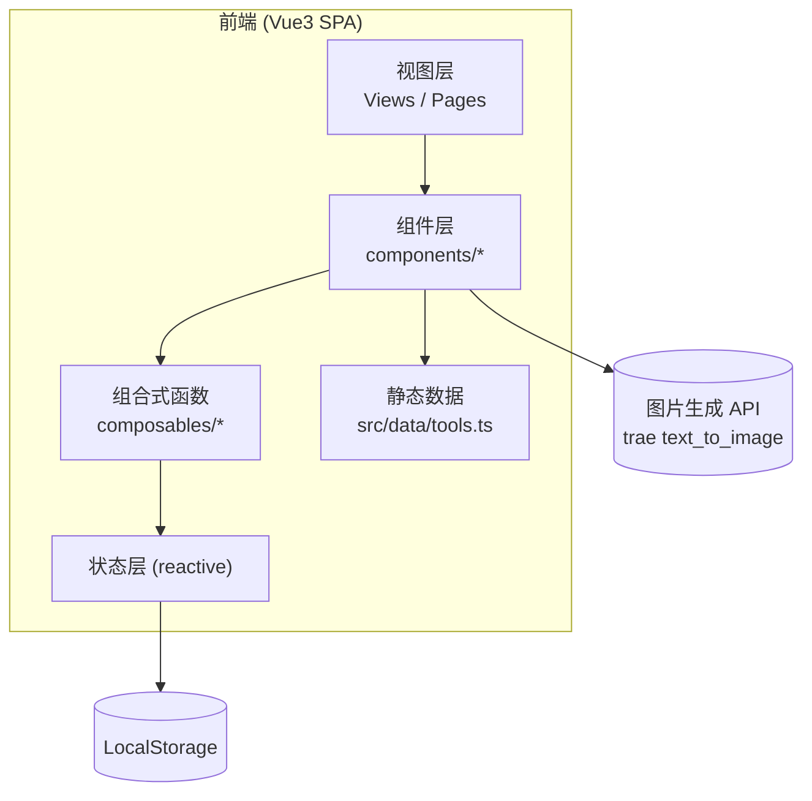

# AI工具宇宙 · 技术架构文档

## 1. 架构设计



- 纯前端项目，无后端。
- 工具数据以 TS 模块形式内嵌，便于一次性打包。
- 图片采用实时生成 URL（运行时拼接 prompt），按需懒加载。

## 2. 技术描述

- 前端框架：Vue 3.4 + `<script setup lang="ts">`
- 构建工具：Vite 5
- 样式方案：Tailwind CSS 3 + PostCSS + CSS Variables (主题)
- 路由：Vue Router 4（首页 / 收藏页）
- 状态管理：原生 `reactive` + `computed`（轻量，工具数据/筛选/搜索/收藏均在 `composables/useTools.ts` 内）
- 图标：`lucide-vue-next`
- 字体：Google Fonts 远程引入 `Fraunces` / `Bricolage Grotesque` / `JetBrains Mono` / `Inter`
- 包管理：pnpm

## 3. 路由定义

| 路由 | 用途 |
|-----|------|
| `/` | 首页 / 杂志封面 + 工具网格 + 抽屉详情 |
| `/favorites` | 收藏页（共用首页组件，传入只读数据源） |

## 4. API 定义

无后端 API。仅依赖图片生成 GET 请求：

```
GET https://trae-api-cn.mchost.guru/api/ide/v1/text_to_image
  ?prompt={URL 编码后的 prompt}
  &image_size={square|portrait_4_3|landscape_4_3|...}
```

- 失败时回退使用 Picsum 占位图。

## 5. 数据模型

### 5.1 工具数据结构

```ts
interface AITool {
  id: string                  // 短哈希
  name: string                // 工具名
  tagline: string             // 一句话定位
  description: string         // 2-3 句简介
  category: ToolCategory      // 所属类目
  tags: string[]              // 标签
  url: string                 // 官方网站
  hot?: boolean               // 是否"本期主推"
  promptKeywords: string      // 用于生成图片的英文关键词
  size: 'square' | 'portrait' | 'landscape' | 'tall'  // 卡片跨列规则
  vendor?: string             // 厂商
}

type ToolCategory =
  | 'all' | 'chat' | 'image' | 'code' | 'office' | 'video'
  | 'audio' | '3d' | 'design' | 'search' | 'translate'
  | 'voice' | 'education' | 'medical' | 'legal' | 'finance'
  | 'marketing' | 'data' | 'robotics' | 'automation' | 'agent' | 'open-source'
```

### 5.2 目录结构

```
src/
  components/
    AppHeader.vue
    CategoryNav.vue
    SearchBar.vue
    ToolCard.vue
    ToolGrid.vue
    ToolDetail.vue
    StatBlock.vue
    ThemeSwitcher.vue
  composables/
    useTools.ts
    useTheme.ts
    useImage.ts
  data/
    tools.ts
    categories.ts
  pages/
    HomePage.vue
    FavoritesPage.vue
  styles/
    main.css
  App.vue
  main.ts
  router.ts
```

## 6. 性能与可访问性

- 图片懒加载 (`loading="lazy"`)。
- 列表使用 IntersectionObserver 滚动渐显。
- 主题切换通过 `data-theme` 属性 + CSS 变量，避免样式重建。
- 所有可点击元素使用 `<button>` 或 `role="button"`，提供键盘可达。
- 抽屉打开时锁定背景滚动并支持 ESC 关闭。
