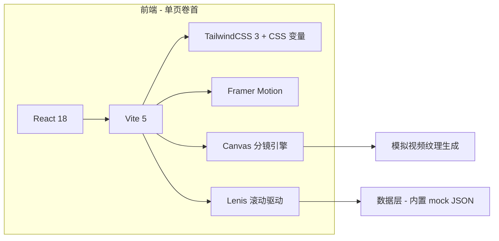
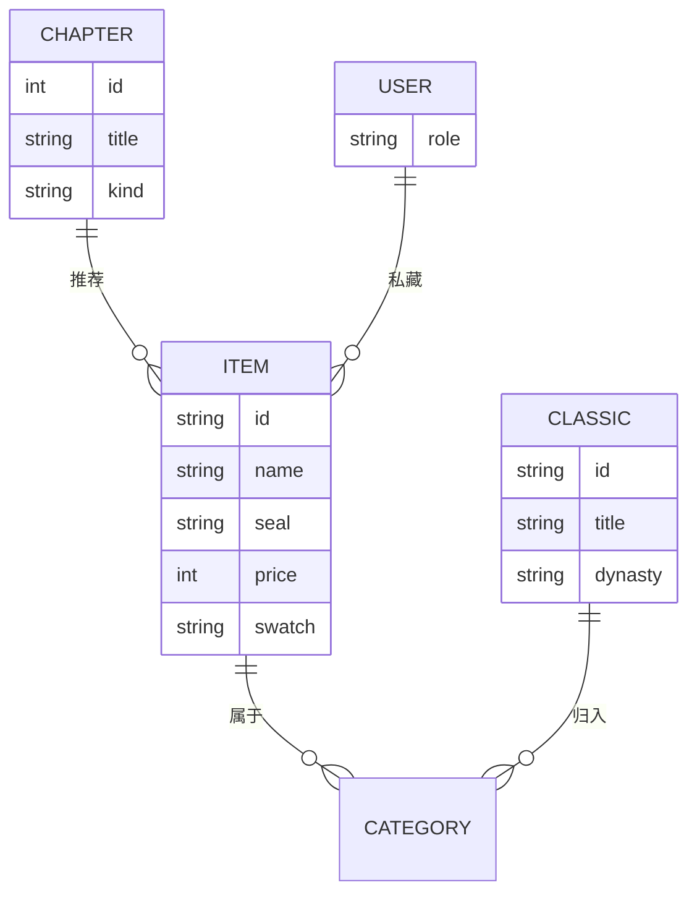

# HRNMLJ · 技术架构文档

## 1. 架构设计


## 2. 技术选型
- **前端框架**：React@18 + Vite@5（更细的 HMR、构建快）。
- **样式系统**：TailwindCSS@3 + CSS 变量（自定义东方色卡 / 字体栈 / 阴影）。
- **动效**：Framer Motion（章节入场 / 商品卡悬停 / 卷轴进度）。
- **滚动**：Lenis（丝滑长卷滚动，配合 4 段分镜自动续播）。
- **分镜渲染**：原生 Canvas 2D + 滤镜（`feTurbulence`/`feDisplacementMap` 模拟烟尘/血迹飞溅），结合 CSS keyframes 模拟镜头摇晃。
- **图标/印章**：内联 SVG + 路径动画。
- **状态**：轻量 Zustand（或 React useState）保存"卷主/私藏"。
- **数据**：本地 `mock/items.ts` 模拟商品、典籍、章节文案；不引入后端。
- **国际化**：默认中文（古风文案）。

## 3. 路由定义
单页应用，所有交互以"卷"为单位，URL 同步章节。

| 路由 | 用途 |
|------|------|
| `/` | 卷首（默认） |
| `/scroll/1` | 章节 1 - 卷一·孤烟直 |
| `/scroll/2` | 章节 2 - 卷二·烟尘起 |
| `/scroll/3` | 章节 3 - 卷三·刀光乱 |
| `/scroll/4` | 章节 4 - 卷四·万马奔腾 |
| `/catalog` | 江湖目录（锚点） |
| `/cabinet` | 雅物柜（锚点） |
| `/library` | 典藏阁（锚点） |
| `/seal` | 卷末寄语（锚点） |

## 4. API 定义
无后端，所有数据来自 `src/data/*.ts` 静态文件。

```ts
export interface Item {
  id: string;
  category: 'ink' | 'paper' | 'brush' | 'inkstone' | 'tea' | 'incense' | 'classic' | 'curio';
  name: string;       // 例：青鸾墨锭
  seal: string;       // 印章字
  price: number;      // 铜钱
  story: string;      // 故事文案
  swatch: string;     // 主色（CSS 颜色）
}

export interface ScrollChapter {
  id: number;
  title: string;      // 卷一·孤烟直
  subtitle: string;
  kind: 'lonely' | 'dust' | 'blade' | 'thunder';
  durationMs: number; // 15000
  bgCaption: string[] // 字幕条目
}
```

## 5. 目录结构
```
/workspace
  ├─ index.html
  ├─ package.json
  ├─ vite.config.ts
  ├─ tailwind.config.js
  ├─ postcss.config.js
  ├─ tsconfig.json
  └─ src
     ├─ main.tsx
     ├─ App.tsx
     ├─ styles/
     │   └─ globals.css       // 字体、变量、宣纸纹理
     ├─ components/
     │   ├─ ScrollContainer.tsx
     │   ├─ ChapterTitle.tsx
     │   ├─ SideScroll.tsx     // 右侧卷轴
     │   ├─ HeroOpening.tsx
     │   ├─ JianghuDirectory.tsx
     │   ├─ Cabinet.tsx
     │   ├─ Library.tsx
     │   ├─ SealNote.tsx
     │   └─ chapters/
     │      ├─ LonelySmoke.tsx
     │      ├─ DustRising.tsx
     │      ├─ BladeChaos.tsx
     │      └─ ThunderHoof.tsx
     ├─ hooks/
     │   ├─ useLenis.ts
     │   └─ useScrollProgress.ts
     ├─ data/
     │   ├─ items.ts
     │   ├─ classics.ts
     │   └─ chapters.ts
     └─ lib/
        ├─ ink.ts        // 墨色工具
        └─ svg.ts        // 印章/卷轴 SVG
```

## 6. 数据模型


## 7. 性能 & 体验
- 视频层用 Canvas 生成，不下载大文件，体积小、首屏 < 1.5s。
- 章节视频用 `requestAnimationFrame` 驱动，避免频繁 reflow。
- 滚动使用 Lenis，节流 16ms。
- 关键素材预加载：所有 SVG 内联，字体使用本地 woff2 备援 + 远程 Google Fonts 自托管缓存。

## 8. 风险与回退
- 部分老旧浏览器无 `backdrop-filter` → 退化为半透明黑。
- Canvas 渲染降级：使用静态分层 PNG/SVG 备用背景。
- 长卷滚动卡顿：关掉 Lenis 改为原生滚动。
