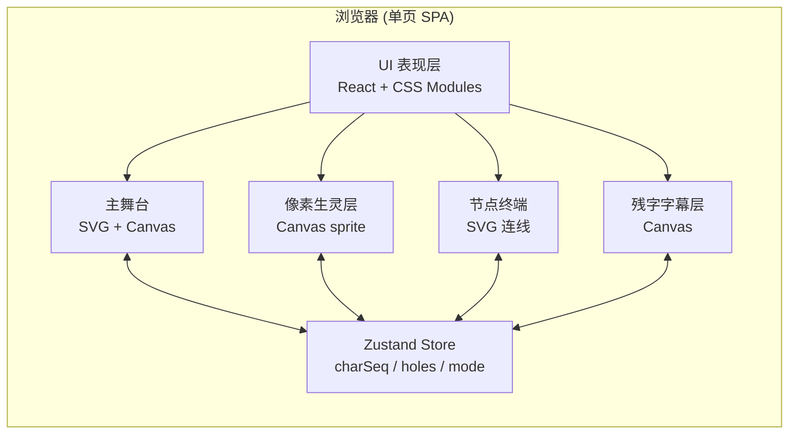

# 断卷残章 — 技术架构文档

## 1. 架构设计



无后端：所有数据（题字、节点文案、随机种子）前端静态注入；所有动效 100% 在浏览器内完成。

## 2. 技术栈

- **构建工具**：Vite 5
- **前端框架**：React 18 + TypeScript
- **样式**：原生 CSS（CSS 变量 + 关键帧动画），**不引入 Tailwind**（项目视觉需要厚重、定制感强）
- **状态管理**：Zustand 4（仅 1 个 store：动画节拍、键入字符序列、昼夜模式）
- **路由**：无（单页）
- **字体**：通过 Google Fonts CDN 拉取 `Ma Shan Zheng` / `ZCOOL XiaoWei` / `VT323` / `Press Start 2P`
- **图标**：自绘 SVG，不引 lucide-react
- **测试**：本项目为艺术装置型 demo，**不写自动化测试**，用 `npm run dev` + 浏览器目视验证
- **代码规范**：ES2020 + TS 严格模式

## 3. 目录结构

```
/workspace
├── index.html
├── package.json
├── vite.config.ts
├── tsconfig.json
└── src
    ├── main.tsx
    ├── App.tsx
    ├── styles
    │   ├── reset.css
    │   └── tokens.css         // 颜色 / 字号 / 缓动 CSS 变量
    ├── store
    │   └── useAtelier.ts      // Zustand
    ├── components
    │   ├── BrokenScroll.tsx   // 主舞台（远山+江面+古松+虫蛀孔）
    │   ├── PixelBeasts.tsx    // 像素生灵（5 只）
    │   ├── NodeTerminal.tsx   // 节点终端（节点+连线+输入）
    │   ├── GlitchCaption.tsx  // 残字字幕
    │   ├── SealBar.tsx        // 底栏朱印
    │   └── PaperTexture.tsx   // 宣纸纹理背景
    ├── pixels
    │   └── sprites.ts         // 5 套像素 sprite（string[][]）
    └── utils
        ├── rng.ts             // 种子化随机
        └── inkPath.ts         // SVG 墨线贝塞尔生成
```

## 4. 关键实现要点

### 4.1 古画断裂
- **远山** 用 3 层径向渐变 div + SVG `feTurbulence` + `feDisplacementMap` 制造撕裂错位。
- **江面** 用 Canvas 每帧重绘 6 条 `image-rendering: pixelated` 的横向条带。
- **古松** 用 32×32 像素网格，鼠标悬停时随机抽 5% 像素点用 `setTimeout` 错位重置。

### 4.2 像素化显示
- 所有图层统一 `image-rendering: pixelated` + 父级 `transform: scale()` 缩到目标尺寸。
- 用 CSS 变量 `--pix: 8` 控制单个像素的逻辑尺寸（桌面 8px / 平板 6px / 手机 4px）。

### 4.3 像素生灵
- `sprites.ts` 导出 5 套 8~16 格的二维字符串（`'.' = 透明`，`'#' = 墨色`，`'r' = 朱砂`）。
- `PixelBeasts.tsx` 用 `<canvas>` 一次绘制所有 sprite，每帧用 `requestAnimationFrame` 推进轨迹。
- 轨迹用预生成的贝塞尔采样数组（避免每帧随机消耗）。

### 4.4 节点终端
- 6 个节点固定纵向坐标，SVG 折线连相邻节点（用 `path d="M ... C ..."` 贝塞尔）。
- 监听 `<textarea>` 的 `onInput`，每次新增字符 → 向 store 推入 `{t, char}` → 所有节点脉冲一次 → 主舞台产生像素雨。
- 像素雨：12 颗 4×4 像素块沿 SVG 路径飞 320ms。

### 4.5 虫蛀孔
- 用 `<mask>` 切出 7 个不规则圆孔，孔边缘用 `feTurbulence baseFrequency=0.05` 抖动。
- 悬停时把对应孔的 `transform-origin` 设为圆心，220ms 内 `transform: scale(0)` 模拟"被封"再展开。
- 朱印触发：store 内 `sealed=true`，所有孔同步 `scale(0)` 一次，240ms 后恢复。

### 4.6 性能约束
- 主舞台 Canvas + 字幕 Canvas 分两个独立 rAF 循环，避免互相阻塞。
- 节点终端 SVG 节点数固定（6 + 5 连线 = 11 元素），更新只改 `stroke-width` 与 `filter`。
- 全程禁用 reflow（不读 `offsetHeight` 等会触发 layout 的属性）。

## 5. 路由 / API

无路由、无后端 API。所有静态文案写在 `src/data/inscriptions.ts` 中。

## 6. 数据模型（最小）

```ts
type Mode = 'paper' | 'silk';
type Store = {
  mode: Mode;
  chars: { t: number; ch: string }[];
  pulseAt: number;     // 最近一次脉冲时间戳
  sealed: boolean;
  pushChar: (ch: string) => void;
  seal: () => void;
  switchMode: () => void;
};
```

## 7. 启动

```bash
pnpm install     # 或 npm install
pnpm dev         # 启动 Vite，默认 http://localhost:5173
```
