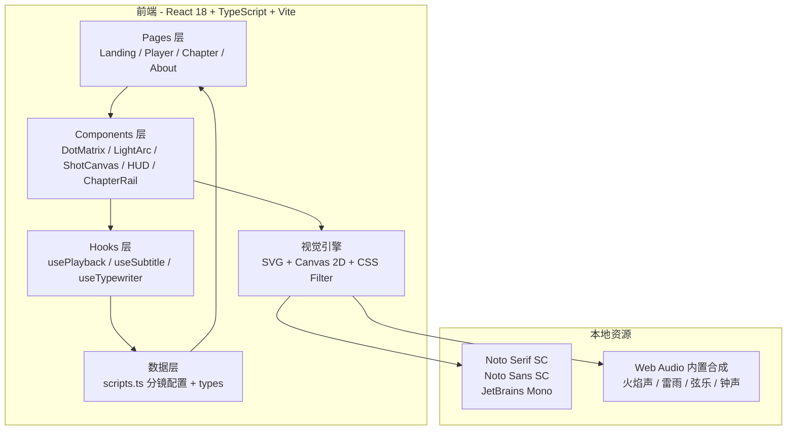
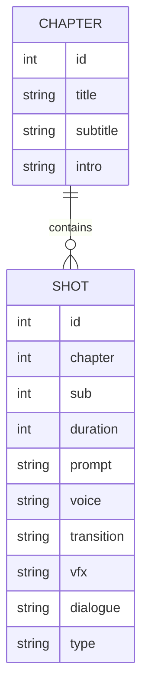

# 技术架构文档：哥窑开片 · 分镜视觉化

## 1. 架构设计



## 2. 技术说明

- **前端框架**：React 18 + TypeScript + Vite 5
- **样式系统**：Tailwind CSS 3 + CSS Variables（主题色：玄青、霁青、窑红、金线、素纸）
- **字体**：Google Fonts ─ Noto Serif SC / Noto Sans SC / JetBrains Mono
- **状态管理**：Zustand（管理 `currentShotIndex` / `isPlaying` / `volume` / `subtitles` / `showPrompt`）
- **路由**：React Router v6
  - `/` 首页
  - `/player` 播放页（支持 `?start=18` 跳转）
  - `/chapter` 章节页
  - `/about` 关于页
- **动效**：Framer Motion（页面级切换）+ CSS 关键帧（点阵、光弧、字幕）
- **音频**：Web Audio API 程序化合成（火焰噪声 + 雨声白噪 + 钟声振荡器 + 弦乐锯齿波）
- **可视化**：SVG（光弧）+ Canvas 2D（点阵裂纹）+ CSS Filter（暗角、噪点）
- **后端**：无（纯前端 Demo）

## 3. 路由定义

| 路由 | 用途 |
|------|------|
| `/` | 首页：Hero + 章节卡片 + 自动播放 |
| `/player` | 播放页：16:9 画布 + 章节 HUD + 转场 |
| `/chapter` | 章节页：8 段 + 致敬段选择 |
| `/about` | 关于页：创作笔记 + 视觉母题说明 |
| `/player?start=19` | 播放页带起始镜号 |

## 4. API 定义

无后端 API。分镜数据全部内联在 `src/data/scripts.ts` 中，结构如下：

```ts
type Shot = {
  id: number;
  chapter: number;     // 1..9 (9=致敬)
  sub: number;
  duration: number;    // ms
  prompt: string;      // AIGC 英文提示词
  voice: string;       // 声音 / 对白
  transition: string;  // 转场
  vfx: string;         // 视觉效果
  dialogue?: string;   // 可选对白
  type: 'black' | 'wide' | 'medium' | 'closeup' | 'macro' | 'flashback' | 'split';
};

type Chapter = {
  id: number;
  title: string;       // 火·初生
  subtitle: string;    // 9 镜 / 27 秒
  intro: string;       // 段落引言
  shots: Shot[];
};
```

## 5. 服务器架构图

无后端。

## 6. 数据模型

### 6.1 数据模型定义



### 6.2 数据定义

`src/data/scripts.ts` 导出 9 个 Chapter 对象（8 段 + 致敬 1 段），合计 74 Shot。所有数据硬编码在 TypeScript 文件中，TypeScript 类型即数据契约。

## 7. 关键技术点

1. **点阵动画**：用 Canvas 2D 渲染 60×34 网格的灰阶圆点，密度由当前镜的 `prompt` 关键词（fire / crack / snow / sea）动态映射
2. **光弧动画**：用 SVG path + stroke-dasharray + filter 模糊做"窑火掠过"效果
3. **时间轴**：单 RAF 循环驱动 `currentShotIndex`，使用 `useEffect` 监听 shot 切换触发转场类名
4. **字幕打字机**：使用 `useTypewriter` hook，按字符 setTimeout 推进，光标闪烁
5. **声音合成**：用 `AudioContext` 创建 buffer source 节点，加 gain 包络，模拟火焰噪声与雨声
6. **响应式**：用 `aspect-ratio: 16/9` 的容器 + 内部 canvas 缩放，断点用 Tailwind `md:` `lg:`

## 8. 项目结构

```
src/
  components/
    visual/
      DotMatrix.tsx       点阵画布
      LightArc.tsx        光弧
      CrackleField.tsx    裂纹场
      FlameSilhouette.tsx 火焰剪影
    player/
      ShotCanvas.tsx      单镜画布
      PlayerHUD.tsx       顶部段名 / 底部镜号
      SubtitleLine.tsx    字幕行
      Transition.tsx      转场蒙层
    layout/
      ChapterRail.tsx     章节抽屉
      Cursor.tsx          自定义光标
  pages/
    LandingPage.tsx
    PlayerPage.tsx
    ChapterPage.tsx
    AboutPage.tsx
  hooks/
    usePlayback.ts        主时间轴
    useTypewriter.ts      打字机
    useAudio.ts           程序化音频
  data/
    scripts.ts            74 镜配置
    chapters.ts           9 段汇总
  store/
    usePlayerStore.ts     zustand
  utils/
    color.ts              主题色
    random.ts             seedrandom
  App.tsx
  main.tsx
  index.css
```
