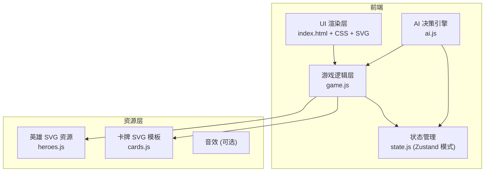
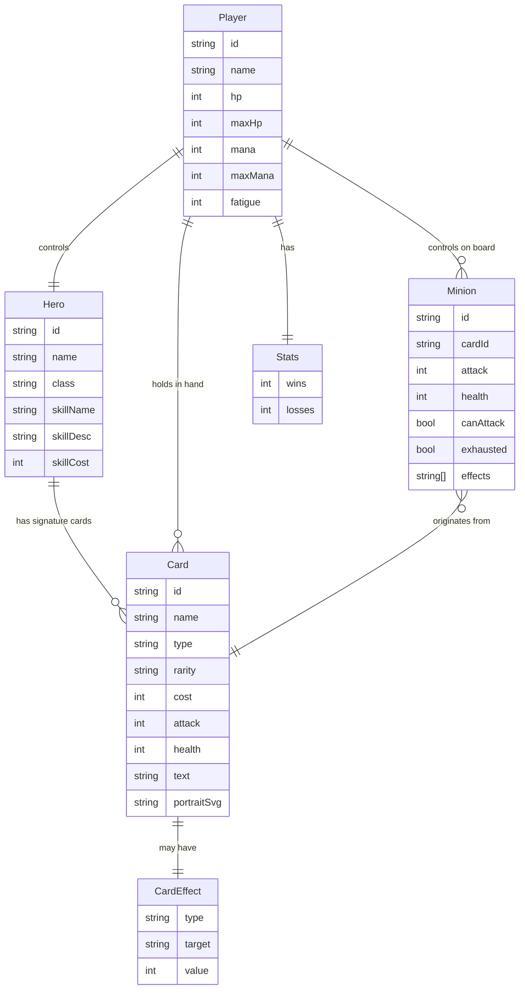

# 暗影编年史 - 技术架构文档

## 1. 架构设计



## 2. 技术说明

- **前端**:原生 HTML5 + CSS3 + ES6 JavaScript（纯静态单文件 + 模块拆分）
- **构建工具**:Vite（仅用于开发服务器与热更新，产物为静态资源）
- **渲染**:全 SVG 绘制卡牌 / 英雄 / 棋盘 / 特效，无外部图片依赖
- **状态管理**:轻量级发布订阅 Store（类 Zustand 模式），无第三方依赖
- **后端**:无（纯前端 AI 对战）
- **数据**:卡牌库、英雄数据、技能数据以 JS 对象内嵌定义

## 3. 路由定义

| 路由 | 用途 |
|------|------|
| `/` | 入口 → 主菜单 |
| `#menu` | 主菜单（职业选择） |
| `#battle` | 战斗场景 |

## 4. API 定义

无后端 API，所有逻辑在前端完成。

## 5. 服务器架构图

无后端服务器。

## 6. 数据模型

### 6.1 数据模型定义



### 6.2 数据定义语言

**内嵌卡牌库（示例 8 张）**

```javascript
// 圣骑士专属
{ id:'p1', name:'白银之手新兵', type:'minion', cost:1, attack:1, health:1, text:'', portrait:'soldier' }
{ id:'p2', name:'圣光审判', type:'spell', cost:4, text:'对敌方英雄造成 5 点伤害', portrait:'holy' }
{ id:'p3', name:'提里奥·弗丁', type:'minion', cost:8, attack:6, health:6, text:'圣盾', portrait:'paladin' }

// 术士专属
{ id:'w1', name:'虚空行者', type:'minion', cost:1, attack:1, health:3, text:'', portrait:'voidwalker' }
{ id:'w2', name:'生命虹吸', type:'spell', cost:3, text:'对一个随从造成 2 点伤害，为你的英雄回复 4 点生命', portrait:'drain' }
{ id:'w3', name:'末日守卫', type:'minion', cost:7, attack:7, health:7, text:'战吼：你的英雄受到 2 点伤害', portrait:'doomguard' }

// 中立
{ id:'n1', name:'霜狼步兵', type:'minion', cost:2, attack:2, health:2, text:'', portrait:'wolf' }
{ id:'n2', name:'奥术智慧', type:'spell', cost:3, text:'抽两张牌', portrait:'arcane' }
```

**英雄技能（4 个职业）**

| 职业 | 技能名 | 费用 | 效果 |
|------|--------|------|------|
| 圣骑士 | 援军 | 2 | 召唤一个 1/1 的白银之手新兵 |
| 术士 | 生命分流 | 2 | 受到 2 点伤害，抽一张牌 |
| 德鲁伊 | 变形 | 1 | 本回合获得 +1 攻击 |
| 法师 | 火焰冲击 | 2 | 对任意角色造成 1 点伤害 |
