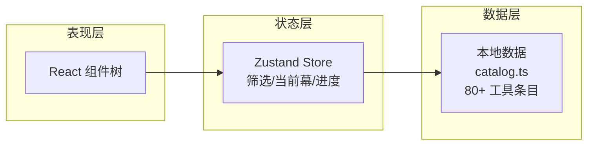
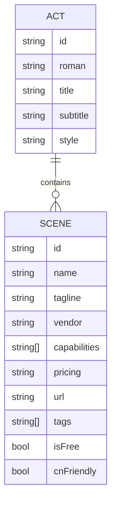

# AI 工具剧本 · 技术架构文档

## 1. 架构设计



- 纯前端单页应用，不引入后端
- 数据以 TypeScript 模块形式静态聚合在 `src/data/catalog.ts`
- 状态层使用 zustand 维护当前幕、筛选条件、滚动进度

## 2. 技术选型

- 前端：React 18 + TypeScript + Vite
- 样式：TailwindCSS 3 + CSS 变量（自定义剧本质感）
- 路由：单页锚点（不引入 react-router），保持剧本线性
- 状态：zustand（轻量筛选/进度）
- 图标：lucide-react
- 包管理：npm

## 3. 路由 / 锚点定义

| 锚点 | 用途 |
|------|------|
| #cover | 封面 |
| #prologue | 序章 |
| #act-word | 第一幕：文字 |
| #act-image | 第二幕：图像 |
| #act-motion | 第三幕：动态影像 |
| #act-sound | 第四幕：声场 |
| #act-code | 第五幕：代码 |
| #act-space | 第六幕：空间 |
| #act-copilot | 第七幕：副驾 |
| #act-agents | 第八幕：探员 |
| #fin | 终幕 |

## 4. 模块化结构

```
src/
  components/
    Cover.tsx          # 封面
    TableOfContents.tsx# 目录
    ActHeader.tsx      # 幕头
    Scene.tsx          # 单个工具场
    SceneGrid.tsx      # 场次网格容器
    Prologue.tsx       # 序章
    Credits.tsx        # 终幕
    FilmStrip.tsx      # 顶部进度条
    SideRail.tsx       # 左侧场记编号
    FilterBar.tsx      # 筛选
    Decoration.tsx     # 场记板/卷边等装饰
    Noise.tsx          # 羊皮纸噪点
  data/
    catalog.ts         # 80+ 工具数据
  store/
    useScriptStore.ts  # zustand
  utils/
    cn.ts              # className 合并
  App.tsx
  main.tsx
  index.css
```

每个组件文件控制在 200 行以内。`Scene.tsx` 接收单一工具数据 props，幂等可复用。

## 5. 数据模型

### 5.1 模型定义



### 5.2 数据定义

`src/data/catalog.ts` 导出：
- `ACTS: Act[]`：8 幕定义
- `TOOLS: Tool[]`：≥ 80 个工具条目，按 `actId` 归类

工具条目字段示例：
```ts
interface Tool {
  id: string;            // 唯一编号，如 "WORD-001"
  actId: string;         // 所属幕
  name: string;          // 工具名
  vendor: string;        // 厂牌
  tagline: string;       // 口号（剧本对白）
  description: string;   // 体例说明
  capabilities: string[];// 能力清单
  pricing: string;       // 价格模型
  url: string;           // 官方链接
  tags: string[];        // 风格标签
  isFree: boolean;       // 是否有免费层
  cnFriendly: boolean;   // 是否对中文友好
}
```

## 6. 性能与无障碍

- 字体：使用 Google Fonts 的 display=swap，避免阻塞渲染
- 噪点纹理：纯 CSS 生成（SVG data URI），避免大图
- 关键交互可键盘聚焦；锚点跳转保持原生行为
- 仅桌面端做完整装饰，移动端降级为单列 + 简化动画
