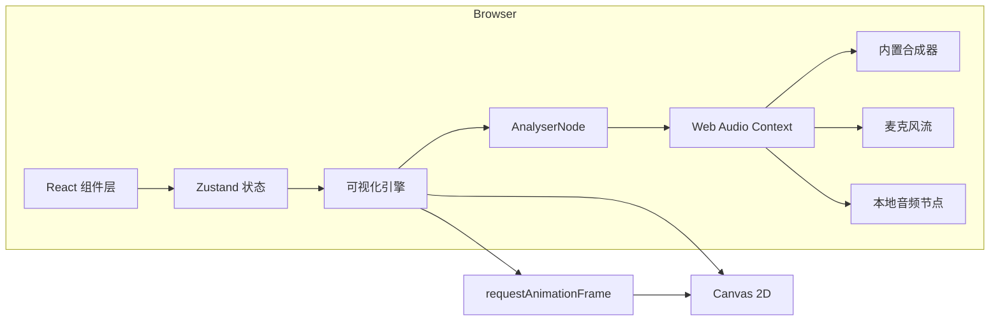
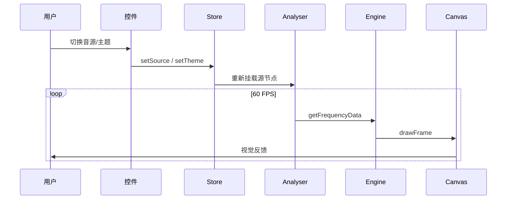

# 音乐粒子场（Pulse Particles）技术架构文档

## 1. 架构设计

本项目为纯前端单页应用，运行时全部在浏览器内完成音频采集、信号分析与 Canvas 2D 渲染。



## 2. 技术描述

- 前端：React@18 + TypeScript + Vite + TailwindCSS@3
- 状态管理：Zustand（轻量、无样板）
- 渲染：HTML5 Canvas 2D（不引入 WebGL，保持 2D 简洁与兼容性）
- 音频：原生 Web Audio API（AnalyserNode + OscillatorNode + MediaStreamAudioSourceNode + AudioBufferSourceNode）
- 工具：lucide-react（图标）、clsx（className 合并）
- 后端：无
- 数据库：无

## 3. 路由定义

| 路由 | 用途 |
|------|------|
| / | 唯一路由：主舞台 + 控制台 + HUD |

## 4. 核心模块设计

### 4.1 音频源（audio）
- `SynthSource`：通过 OscillatorNode + LFO 合成一个低频鼓点 + 中频贝斯 + 高频噪声混合的"电子脉冲"，让用户在未授权麦克风时也能看到完整可视化。
- `MicSource`：`navigator.mediaDevices.getUserMedia({ audio: true })` → MediaStreamSource。
- `FileSource`：通过 `<input type=file>` 读取 ArrayBuffer → AudioContext.decodeAudioData → AudioBufferSourceNode。

### 4.2 分析器（analyser）
- 单例 AnalyserNode，fftSize = 1024，smoothingTimeConstant = 0.78。
- 暴露 `getFrequencyData()` / `getTimeDomainData()` / `getRMS()` / `detectBPM()`。
- 节拍检测：使用能量增量法 + 自相关补偿，给出 0~1 归一化 beat 强度。

### 4.3 可视化引擎（engine）
- 单例 RAF 循环，每帧执行：
  1. 读取频谱 / 时域 / RMS
  2. 更新粒子位置（基于 Perlin/三角噪声场 + 频段分组力）
  3. 绘制背景网格 → 频谱柱 → 波形带 → 粒子 → 辉光圈
  4. 输出帧率到 HUD
- 粒子池 800 个，按低/中/高频段绑定不同基色，关闭时回收 GC。

### 4.4 视觉主题（themes）
- 6 套色板常量：aurora、cyan、lava、mono、neon、midnight。
- 通过 Zustand 切换，引擎读取后更新加法混合色。

## 5. 关键数据流



## 6. 性能预算

- 粒子数：≤ 800
- 帧率目标：≥ 50 FPS（1280×800）
- 主线程 CPU 占用：< 60%
- 首屏渲染：< 1.5s（合成器立即发声，无需等待外部资源）

## 7. 项目结构

```
src/
  audio/
    synthSource.ts
    micSource.ts
    fileSource.ts
    analyser.ts
  engine/
    particles.ts
    spectrum.ts
    waveform.ts
    glow.ts
    grid.ts
    engine.ts
    noise.ts
  components/
    Stage.tsx
    ControlPanel.tsx
    HUD.tsx
    SourceSwitcher.tsx
    ThemePicker.tsx
    Slider.tsx
  store/
    useStore.ts
  themes/
    themes.ts
  pages/
    Home.tsx
  App.tsx
  main.tsx
  index.css
```
