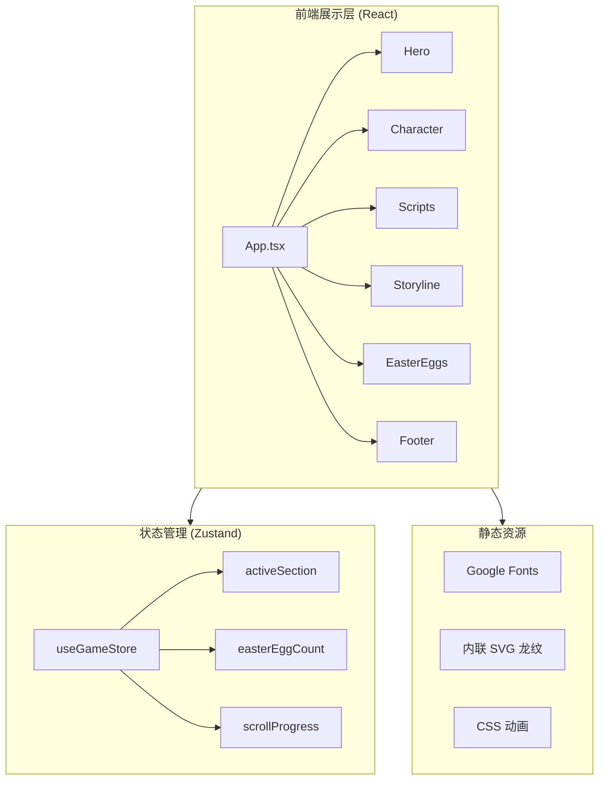
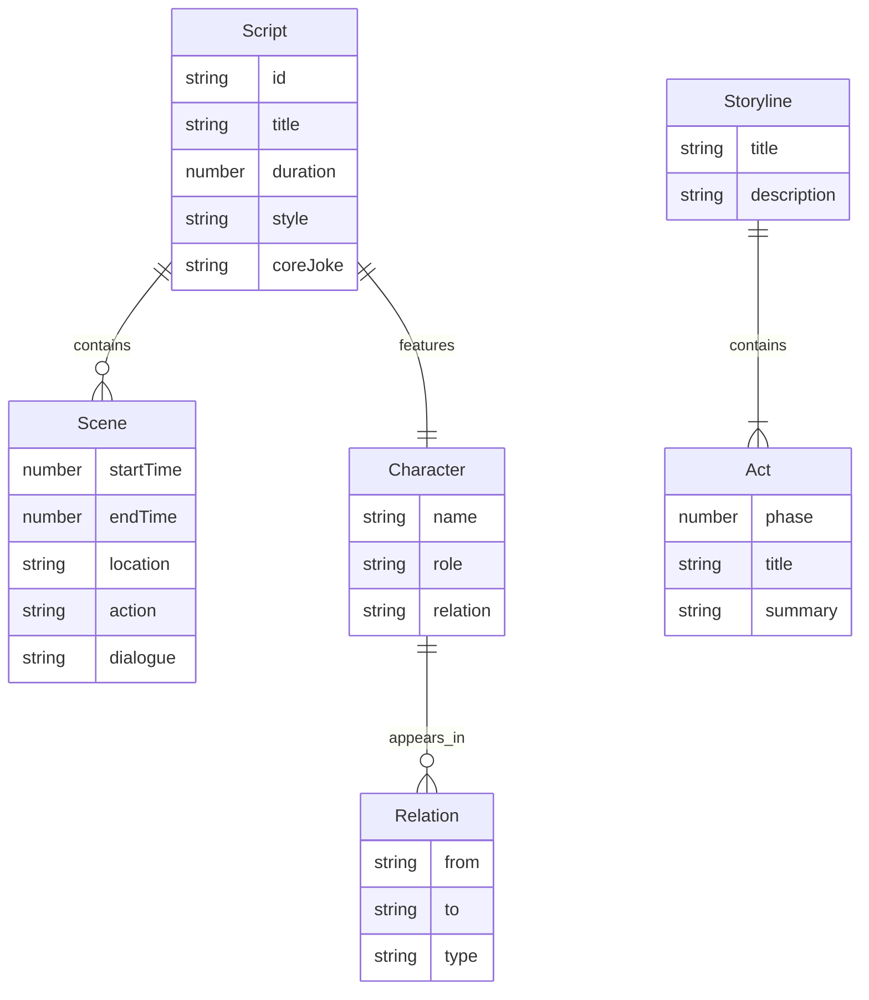

# 技术架构文档

## 1. 架构设计



## 2. 技术描述

- **前端框架**：React@18 + TypeScript
- **构建工具**：Vite@5
- **样式方案**：TailwindCSS@3 + 自定义 CSS 变量（用于龙纹主题色）
- **状态管理**：Zustand@4
- **路由**：react-router-dom@6（单页锚点路由）
- **动画**：CSS + Tailwind animate；不引入 framer-motion 以保持轻量
- **图标**：lucide-react
- **字体**：Google Fonts（ZCOOL KuaiLe / Noto Serif SC / Bebas Neue / Shippori Mincho）
- **后端**：无（纯静态展示）
- **数据库**：无
- **数据来源**：所有内容为前端静态数据（剧本、Slogan、关系网），无外部 API

## 3. 路由定义

| 路由 | 用途 |
|------|------|
| / | 单一展示页（单页应用），通过锚点定位到各章节 |

## 4. API 定义

无后端 API。所有数据为前端静态常量，集中在 `src/data/` 目录下：
- `scripts.ts`：两集短剧剧本数据
- `characters.ts`：角色关系数据
- `storyline.ts`：主干线企划数据
- `slogans.ts`：系列 Slogan

## 5. 数据模型

### 5.1 数据模型定义



### 5.2 数据定义语言

```typescript
// src/data/types.ts
export interface Scene {
  startTime: number;
  endTime: number;
  location: string;
  action: string;
  dialogue: string;
  speaker?: string;
  soundEffect?: string;
}

export interface Script {
  id: string;
  title: string;
  subtitle: string;
  duration: string;
  style: string;
  coreJoke: string;
  scenes: Scene[];
}

export interface Character {
  name: string;
  role: string;
  description: string;
  tags: string[];
}

export interface Relation {
  from: string;
  to: string;
  type: 'protects' | 'frames' | 'targets' | 'observer' | 'mentor';
}

export interface Act {
  phase: number;
  title: string;
  summary: string;
  keyPoints: string[];
}

export interface Storyline {
  title: string;
  overview: string;
  acts: Act[];
  recurringElements: string[];
  slogans: string[];
}
```

## 6. 组件结构

```
src/
├── components/
│   ├── Hero.tsx                  // 首屏主视觉
│   ├── StickyNav.tsx             // 顶部锚点导航
│   ├── CharacterProfile.tsx      // 人物档案
│   ├── RelationGraph.tsx         // 关系网（SVG）
│   ├── ScriptCard.tsx            // 短剧卡片
│   ├── StorylineTimeline.tsx     // 剧情弧时间线
│   ├── SloganWall.tsx            // Slogan展示墙
│   ├── DragonCursor.tsx          // 龙尾鼠标跟随
│   └── Footer.tsx                // 页脚
├── data/
│   ├── scripts.ts
│   ├── characters.ts
│   ├── storyline.ts
│   ├── slogans.ts
│   └── types.ts
├── store/
│   └── useGameStore.ts           // Zustand 全局状态
├── pages/
│   └── HomePage.tsx              // 单页容器
├── App.tsx
├── main.tsx
└── index.css                     // Tailwind + 自定义龙纹主题
```

## 7. 设计令牌（Design Tokens）

```css
/* index.css 中的 CSS 变量 */
:root {
  --color-bg: #0a0a0f;
  --color-bg-elev: #14141c;
  --color-cyan: #00d4ff;      /* 龙息青 */
  --color-crimson: #ff2d4a;   /* 龙焰红 */
  --color-paper: #f5f1e8;     /* 宣纸白 */
  --color-ash: #8a8a8a;       /* 金属灰 */
  --color-line: #2a2a35;      /* 描边灰 */
}
```

## 8. 性能与可访问性

- **首屏加载**：关键 CSS 内联，字体使用 `font-display: swap`
- **图片优化**：使用 SVG 而非位图（龙纹、HUD）
- **动画降级**：尊重 `prefers-reduced-motion`，关闭时禁用复杂动画
- **可访问性**：所有交互元素具备键盘焦点 + ARIA label；色彩对比度满足 WCAG AA
- **SEO**：单页应用设置 `<title>` 与 `<meta description>`

## 9. 部署

- **开发环境**：`pnpm dev` 启动 Vite 开发服务器
- **生产构建**：`pnpm build`，输出到 `dist/`
- **预览**：`pnpm preview`
- **托管**：可部署至任意静态托管（Vercel / Netlify / GitHub Pages）
