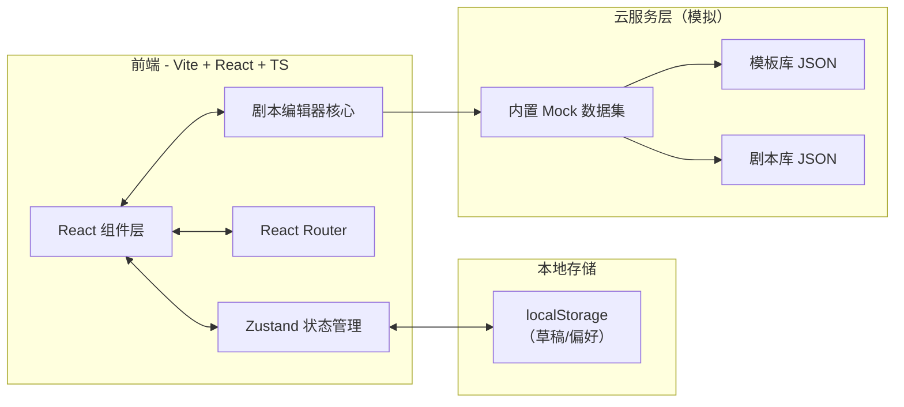
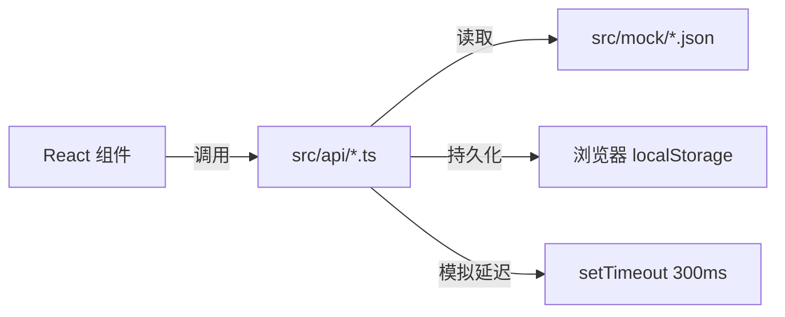
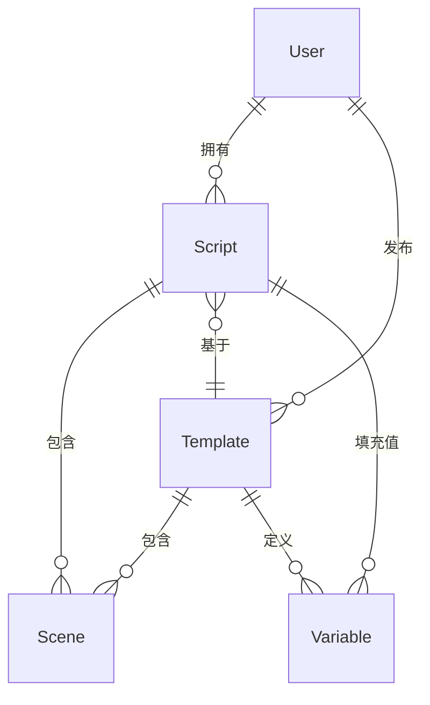

# 云服务AI剧本提示词模板器 - 技术架构文档

## 1. 架构设计



> 本期实现为纯前端单页应用，所有「云服务」能力通过内置 Mock 数据 + localStorage 模拟，确保演示完整、可直接运行。

## 2. 技术栈描述

- **前端框架**：React 18 + TypeScript
- **构建工具**：Vite 5
- **样式方案**：TailwindCSS 3（深色主题 + 自定义 token）
- **路由**：React Router DOM 6
- **状态管理**：Zustand 4
- **图标**：lucide-react
- **Markdown 渲染**：自研轻量解析（高亮 `{{变量}}` 语法）
- **后端**：本期无（前端内置 Mock 数据）
- **数据持久化**：localStorage（草稿/偏好）+ 内置 JSON（模板/示例剧本）
- **包管理**：pnpm（若不可用则回退 npm）

## 3. 路由定义

| 路由 | 用途 |
|------|------|
| `/` | 首页：Hero + 模板分类 + 精选模板 |
| `/templates` | 模板广场：完整列表 + 筛选 |
| `/templates/:id` | 模板详情：预览 + 立即使用 |
| `/editor/:id?` | 剧本编辑器：核心创作区 |
| `/scripts` | 我的剧本库：云端管理 |
| `/settings` | 设置中心：模型/偏好 |
| `*` | 404 重定向到首页 |

## 4. API 定义（Mock 层）

```ts
// 模板数据结构
interface Template {
  id: string;
  title: string;
  category: 'short-video' | 'feature' | 'ad' | 'podcast' | 'game';
  author: string;
  cover: string;        // 渐变占位
  description: string;
  rating: number;
  usageCount: number;
  variables: Variable[];
  scenes: Scene[];
  createdAt: string;
}

interface Variable {
  key: string;          // {{title}}
  label: string;        // "剧本标题"
  defaultValue: string;
  type: 'text' | 'textarea' | 'select';
  options?: string[];
}

interface Scene {
  id: string;
  order: number;
  title: string;
  type: 'opening' | 'conflict' | 'climax' | 'ending' | 'custom';
  prompt: string;       // 可包含 {{变量}}
  duration?: number;    // 预估时长（秒）
}

// 用户剧本
interface Script {
  id: string;
  title: string;
  templateId?: string;
  variables: Record<string, string>;
  scenes: Scene[];
  tags: string[];
  isPublic: boolean;
  updatedAt: string;
  createdAt: string;
}
```

## 5. 服务器架构图

本期无后端服务。所有 Mock 数据通过前端 `src/mock/` 目录提供，对外暴露统一的 `api/*` 模块：



## 6. 数据模型

### 6.1 数据模型定义



### 6.2 数据定义（内置 Mock）

```ts
// 初始数据位于 src/mock/templates.ts，预置 12+ 模板
// src/mock/categories.ts 提供 5 大分类
// src/mock/scripts.ts 提供 4 个示例剧本（仅在首次访问时使用）
```

## 7. 目录结构

```
src/
├── api/                # 模拟 API 层
│   ├── templates.ts
│   ├── scripts.ts
│   └── settings.ts
├── components/         # 通用组件
│   ├── layout/         # Header, Footer, Sidebar
│   ├── ui/             # Button, Card, Input, Modal
│   └── editor/         # SceneNode, VariableChip, PreviewPane
├── pages/              # 页面级组件
│   ├── Home.tsx
│   ├── Templates.tsx
│   ├── TemplateDetail.tsx
│   ├── Editor.tsx
│   ├── Scripts.tsx
│   └── Settings.tsx
├── stores/             # Zustand stores
│   ├── scriptStore.ts
│   ├── settingsStore.ts
│   └── uiStore.ts
├── mock/               # Mock 数据
│   ├── templates.ts
│   ├── categories.ts
│   └── scripts.ts
├── utils/              # 工具函数
│   ├── promptRenderer.ts  # 变量替换 + 高亮
│   ├── id.ts
│   └── format.ts
├── hooks/              # 自定义 hooks
│   └── useAutoSave.ts
├── types/              # 共享类型
│   └── index.ts
├── App.tsx
├── main.tsx
└── index.css
```

## 8. 关键交互技术点

- **变量高亮**：使用正则 `/{{([^}]+)}}/g` 匹配并用 `<span class="variable-chip">` 包裹
- **实时预览**：输入变量时通过 `useMemo` 缓存渲染结果，避免重渲染
- **剧本树拖拽**：使用原生 HTML5 Drag & Drop（不引入额外库）
- **自动保存**：基于 `useDebounce` + `useEffect` 监听变更，3s 后写入 localStorage
- **主题切换**：通过 `data-theme` 属性 + CSS 变量实现深色/浅色
