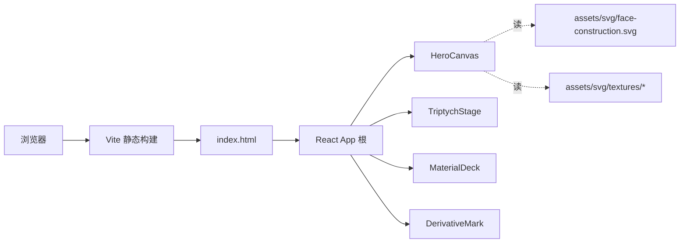

# 角色设计展示页 — 技术架构文档

## 1. 架构设计


## 2. 技术说明
- **前端**:React@18 + TypeScript + Vite@5 + Tailwind CSS@3
- **初始化工具**:`pnpm create vite-init@latest . --template react-ts --force`
- **后端**:无(纯静态展示页)
- **数据库**:无
- **资源**:全部资源内联在 `src/assets`(SVG 风格化角色 + 程序化噪点纹理),不依赖外网 CDN
- **部署**:`pnpm build` 产物为 `dist/`,可直接静态托管

## 3. 路由定义
| 路由 | 用途 |
|------|------|
| `/` | 角色设计展示页(单页) |

## 4. API 定义
无后端 API。所有数据为组件内常量(`src/data/character.ts`)。

## 5. 服务端架构
无后端。

## 6. 数据模型
### 6.1 模型定义
```ts
interface CharacterView {
  id: 'front' | 'side' | 'back';
  label: string;
  split: 'left-color' | 'right-color' | 'full-color';
  pose: 'standing' | 'curious' | 'rest';
}

interface MaterialCard {
  id: string;
  title: string;
  subtitle: string;
  params: { name: string; value: string }[];
  texture: string; // 程序化噪点 / SVG 路径
}

interface CharacterData {
  name: string;
  nationality: string;
  views: CharacterView[];
  materials: MaterialCard[];
  derivativeMark: string;
}
```

### 6.2 数据定义
```ts
export const character: CharacterData = {
  name: 'AE // SUBJECT 014',
  nationality: 'CN',
  views: [
    { id: 'front', label: 'FRONT · 正面', split: 'left-color', pose: 'curious' },
    { id: 'side',  label: 'SIDE  · 侧面', split: 'right-color', pose: 'standing' },
    { id: 'back',  label: 'BACK  · 背面', split: 'full-color',  pose: 'rest' },
  ],
  materials: [
    { id: 'skin',  title: 'SKIN',  subtitle: 'sub-surface scattering', params: [{ name: 'roughness', value: '0.62' }, { name: 'sss', value: '0.18' }], texture: 'noise-01' },
    { id: 'hair',  title: 'HAIR',  subtitle: 'strand subdivision',     params: [{ name: 'strands', value: '14k'  }, { name: 'specular', value: '0.34' }], texture: 'noise-02' },
    { id: 'cloth', title: 'CLOTH', subtitle: 'woven weave',            params: [{ name: 'roughness', value: '0.78' }, { name: 'thickness', value: '0.42mm' }], texture: 'noise-03' },
    { id: 'metal', title: 'METAL', subtitle: 'cold brushed',           params: [{ name: 'roughness', value: '0.31' }, { name: 'ior', value: '1.46' }], texture: 'noise-04' },
  ],
  derivativeMark: 'DERIVATIVE WORK · 二创展示',
};
```

## 7. 关键依赖
| 包 | 用途 |
|----|------|
| `react@18` | UI 框架 |
| `react-dom@18` | DOM 渲染 |
| `tailwindcss@3` | 工具类样式 |
| `lucide-react` | 角标 SVG 图标 |
| `clsx` | 条件 className 组合 |

## 8. 文件结构
```
/
├─ index.html
├─ package.json
├─ tailwind.config.js
├─ postcss.config.js
├─ vite.config.ts
├─ src/
│  ├─ main.tsx
│  ├─ App.tsx
│  ├─ index.css
│  ├─ data/character.ts
│  ├─ components/
│  │  ├─ HeroCanvas.tsx
│  │  ├─ TriptychStage.tsx
│  │  ├─ MaterialDeck.tsx
│  │  └─ DerivativeMark.tsx
│  └─ assets/
│     ├─ FaceSilhouette.tsx
│     └─ NoiseLayer.tsx
```

## 9. 性能与质量
- 首屏仅渲染 HeroCanvas,其余通过 `content-visibility: auto` 延迟渲染
- 全部 SVG 内联,无栅格图,首屏 < 300KB
- 使用 CSS `transform` / `opacity` 做动效,走 GPU 合成层
- 通过 `prefers-reduced-motion` 关闭视差与入场动画
