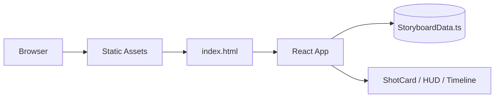
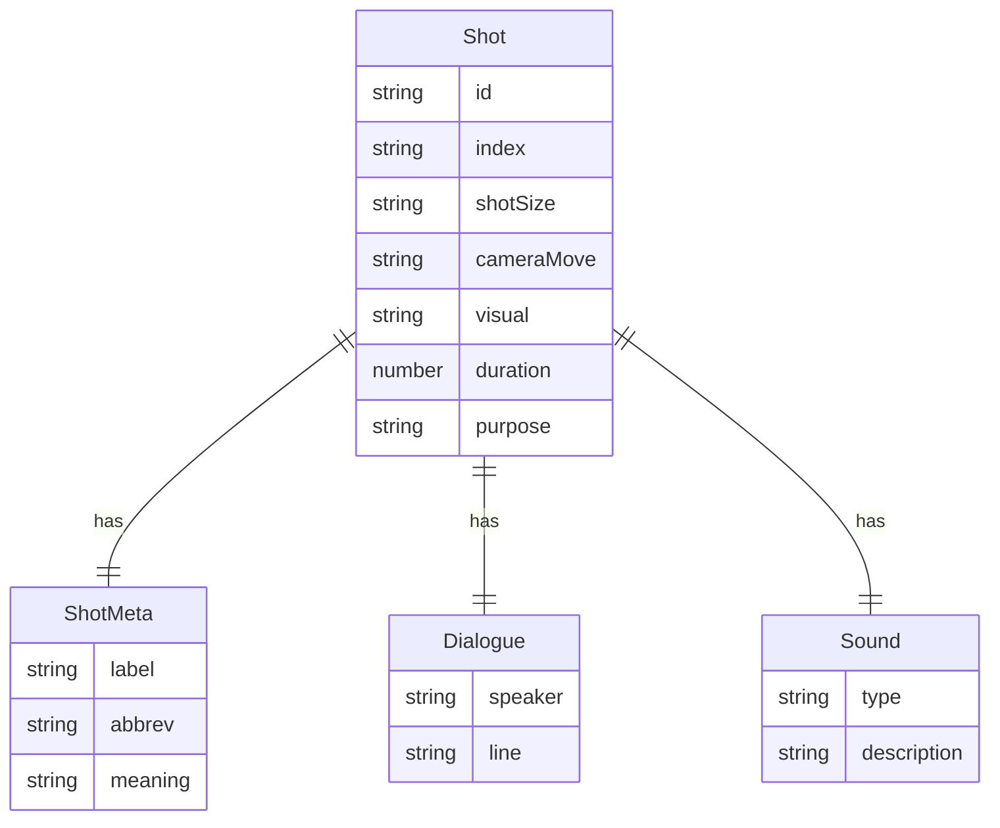

# 分镜剧本 HTML 技术架构文档

## 1. 架构设计
- 纯静态单页应用，无后端服务；通过 Vite 构建并托管预览。
- 渲染策略：构建期将 8 个镜头数据写入 TypeScript 常量，运行时由 React 组件渲染。
- 部署形态：静态 HTML / JS / CSS 资源，可托管在任意静态服务或本地预览。


## 2. 技术描述
- 前端：React@18 + TypeScript + Vite + Tailwind CSS。
- 字体：Google Fonts（Bebas Neue / JetBrains Mono / Noto Sans SC）。
- 状态管理：无需复杂状态，使用 React useState/useRef 控制打印与 hover。
- 路由：单页，无需 react-router。
- 打印：通过 `window.print()` 配合 `@media print` 媒体查询优化版式。
- 后端：无。
- 数据库：无。

## 3. 路由定义
| 路由 | 用途 |
|------|------|
| `/` | 分镜剧本主页：片头、镜头列表、时间轴、图例 |

## 4. API 定义
无后端服务，所有数据在 `src/data/storyboard.ts` 中静态维护。

## 5. 数据模型
### 5.1 数据模型定义


### 5.2 镜头数据
```ts
export const shots: Shot[] = [
  {
    id: 'S05-01', index: '01', shotSize: 'LS', cameraMove: '固定 / 慢摇',
    visual: '云海之上，两架我方战机（代号"鹰1""鹰2"）成编队平飞，阳光从云层缝隙洒下。',
    duration: 3, sound: '引擎低沉的轰鸣声，风声', purpose: '交代环境与态势',
  },
  // ... S05-02 ~ S05-08
];
```

## 6. 性能与可访问性
- 镜头数量固定 8 个，DOM 节点轻量；首屏 CSS 内联关键样式。
- 所有交互元素（景别徽章、对白气泡）使用语义化标签与 `aria-label`。
- 字体使用 `font-display: swap`；动效在 `prefers-reduced-motion: reduce` 时自动降级为淡入。
