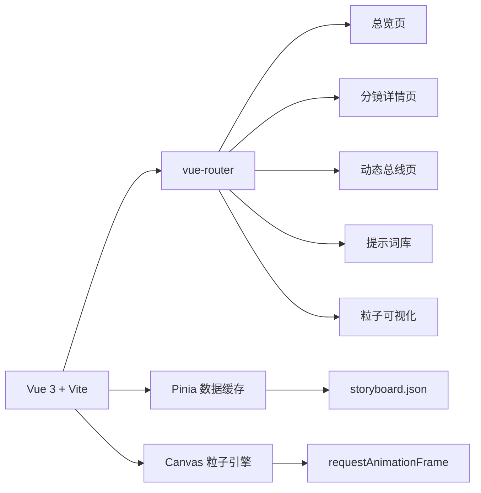

# 技术架构文档

## 1. 架构设计
单页 Vue 3 应用，采用 Vite 构建。路由通过 `vue-router` 管理五个页面（总览、分镜详情、动态总线、提示词库、粒子可视化），数据使用本地 `data/storyboard.json` 静态加载，所有粒子动画通过 Canvas 原生实现，避免引入额外的渲染库依赖。



## 2. 技术选型
- 前端框架：Vue 3（Composition API + `<script setup>`）
- 构建工具：Vite 5
- 路由：vue-router 4
- 状态管理：Pinia（仅缓存分镜数据，避免重复 fetch）
- 样式：原生 CSS + CSS 变量（不使用 Tailwind，便于自定义青铜/血红等非通用色）
- 字体：通过 Google Fonts CDN 引入 Cinzel / Noto Serif SC / Inter / JetBrains Mono
- 后端：无
- 数据源：本地 `src/data/storyboard.json`（4 个分镜 + 节奏卡 + 提示词）
- 动画：CSS transitions + Canvas 2D 粒子循环

## 3. 路由定义
| 路径 | 名称 | 用途 |
|------|------|------|
| `/` | Overview | 总览页：Hero + 时序条 + 节奏卡 |
| `/scene/:id` | SceneDetail | 分镜详情：分镜表 + 运镜图 + 提示词卡 |
| `/motion-bus` | MotionBus | 四镜动态总线对照 + 横向时间线 |
| `/prompts` | Prompts | 提示词库（可折叠） |
| `/particles` | Particles | 6 类粒子 Canvas 可视化 |

参数 `:id` 取值：`one` / `two` / `three` / `four`。

## 4. 数据模型

### 4.1 数据结构
```ts
interface Shot {
  id: 'one' | 'two' | 'three' | 'four'
  title: string                  // "铁链惊蛰"
  range: [number, number]        // [0, 15]
  beatShape: string              // "双波峰" | "波浪形" | "V型反弹" | "螺旋上升"
  motionAxis: string             // "Z轴（纵深）+ Y轴（跃升）"
  visualGuide: string            // "对角线↘"
  particleTrail: string          // "烟尘↑，火星↗，冲击波○"
  bus: string                    // 动态导向总线描述
  rows: ShotRow[]                // 分镜表
  cameraMoves: CameraMove[]      // 运镜图示
  prompt: string                 // 英文 AI 提示词
}

interface ShotRow {
  time: string                   // "0:00-0:02"
  action: string
  camera: string
  visual: string
  content: string
  fx: string
}

interface CameraMove {
  label: string                  // "前冲式推轨"
  icon: 'push' | 'whip' | 'pull' | 'shake' | 'tilt' | 'dolly'
  arrow: string                  // 渲染提示
}
```

### 4.2 初始数据
`src/data/storyboard.json` 内置四镜完整数据，字段与上述一致。

## 5. 关键模块设计

### 5.1 粒子引擎 (`src/composables/useParticle.ts`)
- 通用接口：`createParticle(type: ParticleType, canvas: HTMLCanvasElement)`
- 类型：`smoke` | `spark` | `shockwave` | `blood` | `arrow` | `ash`
- 内部基于 `requestAnimationFrame` + `ctx.fillRect/arc` 绘制
- 暴露 `play() / pause() / reset()` 三个方法
- 帧率限制：使用 `performance.now()` 自适应 24fps

### 5.2 复制按钮 (`src/components/CopyButton.vue`)
- 基于 `navigator.clipboard.writeText()`
- 失败时降级 `document.execCommand('copy')` + 隐藏 textarea
- 复制成功后 1.5s 内显示 ✓

### 5.3 时序条 (`src/components/TimelineBar.vue`)
- 4 段 `<div>` 用 `clip-path: polygon()` 切斜角
- 鼠标 hover/聚焦时 `transform: scale(1.02)` + 金色辉光扫过
- 点击触发 `router.push('/scene/one')` 等

### 5.4 节奏波形 SVG
- 4 张波形卡，手写 SVG 折线（4 段：双波峰 / 波浪形 / V型反弹 / 螺旋上升 → 用折线模拟）
- 在 `src/components/BeatCard.vue` 中实现

## 6. 目录结构
```
/workspace
├── index.html
├── package.json
├── vite.config.js
├── README.md
└── src/
    ├── main.js
    ├── App.vue
    ├── router/index.js
    ├── stores/storyboard.js
    ├── data/storyboard.json
    ├── views/
    │   ├── OverviewView.vue
    │   ├── SceneDetailView.vue
    │   ├── MotionBusView.vue
    │   ├── PromptsView.vue
    │   └── ParticlesView.vue
    ├── components/
    │   ├── Hero.vue
    │   ├── TimelineBar.vue
    │   ├── BeatCard.vue
    │   ├── ShotTable.vue
    │   ├── CameraDiagram.vue
    │   ├── PromptCard.vue
    │   ├── CopyButton.vue
    │   └── ParticleCanvas.vue
    ├── composables/
    │   └── useParticle.js
    └── styles/
        ├── tokens.css         # 颜色/字体/间距变量
        ├── base.css
        └── animations.css
```

## 7. 性能与无障碍
- 所有 Canvas 在视口外时调用 `cancelAnimationFrame` 暂停
- 字体使用 `font-display: swap`
- 全站可键盘 Tab 导航，复制按钮有 `aria-label`
- 全局对比度 ≥ 4.5:1（青铜色文本统一加深为 `#9A7A45`）

## 8. 启动命令
```bash
npm install
npm run dev      # 默认 http://localhost:5173
npm run build
```
