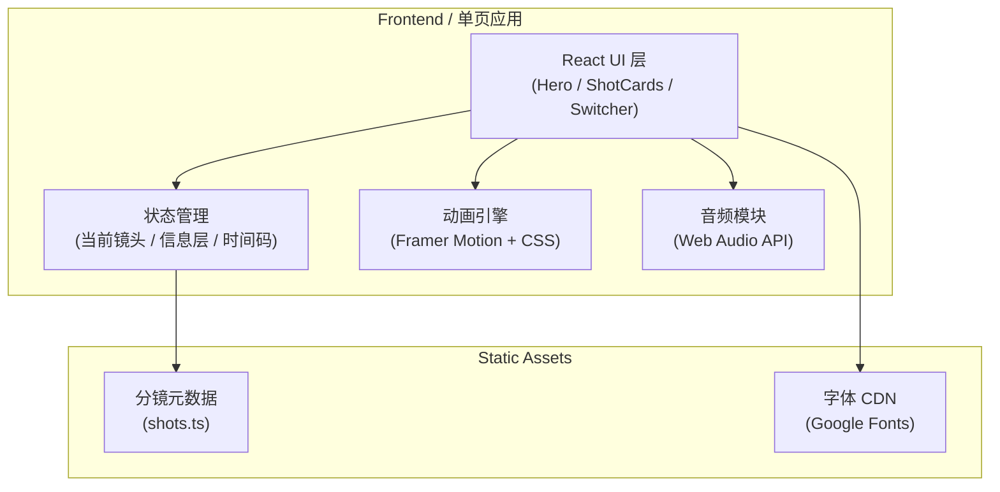
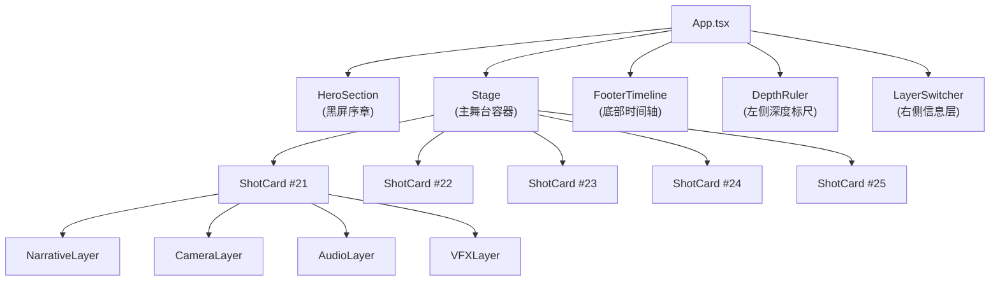

# 分镜架构可视化 — 技术架构文档

## 1. 架构设计



单页 React 应用，无后端。所有分镜数据写死在 `shots.ts` 静态模块中，通过 props 注入组件。

## 2. 技术描述
- **前端框架**：React 18 + Vite 5
- **样式方案**：Tailwind CSS 3（配合 CSS 变量做主题）
- **动画**：Framer Motion（镜头切换、深度指示器）+ CSS @keyframes（焦散、烟尘、夕阳）
- **类型系统**：TypeScript
- **字体**：Google Fonts (Bebas Neue, JetBrains Mono, Noto Serif SC)
- **音频**：Web Audio API（合成环境音，无外部音频文件）
- **后端**：无
- **数据库**：无

## 3. 路由定义
| 路由 | 用途 |
|------|------|
| `/` | 单页长滚动：所有内容在一个路由下 |
| `/#shot-21` | 锚点跳转：直接定位到镜头 21 |
| `/#shot-22` | 锚点跳转：镜头 22 |
| `/#shot-23` | 锚点跳转：镜头 23 |
| `/#shot-24` | 锚点跳转：镜头 24 |
| `/#shot-25` | 锚点跳转：镜头 25 |

## 4. 数据模型

### 4.1 分镜数据结构
```typescript
interface Shot {
  id: 'shot-21' | 'shot-22' | 'shot-23' | 'shot-24' | 'shot-25';
  index: 21 | 22 | 23 | 24 | 25;
  timecode: { start: string; end: string; duration: number };
  title: string;
  location: { name: string; depth: number };
  shot: { type: string; movement: string };
  visual: string[];
  vfx: string[];
  audio: string[];
  imax: string[];
  motionBlur: string;
  cameraNote: string;
  lighting: { from: string; to: string };
  color: { primary: string; accent: string };
}

interface AudioCue {
  shotId: string;
  type: 'wave' | 'thump' | 'silence' | 'white-noise' | 'low-rumble';
  frequency: number; // Hz
  intensity: number; // 0-1
}
```

## 5. 核心组件架构



## 6. 视觉系统规范

### 6.1 颜色变量
```css
--bg-abyss: #050810;     /* 深海黑 */
--bg-deep: #0A1620;      /* 深潜蓝黑 */
--line-cyan: #1A4D6B;    /* 海面光柱蓝 */
--accent-blood: #E63946; /* 机甲橙红 / 血色 */
--accent-sun: #F4A261;   /* 夕阳暖光 */
--text-bone: #E8E8E8;    /* 主体白 */
--text-fog: #7A8B99;     /* 副文字灰 */
```

### 6.2 镜头 → 配色映射
| 镜头 | 主背景 | 强调色 | 文字 |
|------|--------|--------|------|
| 21 | #0F2A3D | #E63946 | #E8E8E8 |
| 22 | #0A1620 | #C9D4DA | #D4D4D4 |
| 23 | #050810 | #6B5B73 | #B0B0B0 |
| 24 | #030608 | #1A1A1A | #888888 |
| 25 | #0A0F1A → #1F0F0A | #F4A261 | #F4A261 |

## 7. 动画规范
- **Hero 入场**：黑屏 → 1.5s 后居中文字 stroke-dashoffset 描边出现
- **镜头切换**：滚动驱动 opacity + translateY（60vh → 0）
- **深度标尺**：相机位置用 Framer Motion `useScroll` 驱动
- **时间轴进度**：横向 scrub bar 跟随滚动更新
- **烟尘扩散**：CSS radial-gradient + scale(0) → scale(1) + opacity 1 → 0
- **焦散光斑**：5 个 box-shadow 错位闪烁，4s 循环
- **夕阳拉远**：最后一段背景从 #050810 渐变到 #1F0F0A
- **黑屏收尾**：全屏 opacity 1 → 0.3s 淡出

## 8. 性能与可访问性
- **性能预算**：首屏 < 1.5s（LCP），交互 < 100ms
- **可访问性**：所有交互元素有键盘 focus 样式；尊重 `prefers-reduced-motion`
- **SEO**：单页应用，无需 SSR
- **浏览器兼容**：Chrome / Safari / Edge 最新两个版本

## 9. 项目结构
```
/workspace
├── index.html
├── package.json
├── vite.config.ts
├── tsconfig.json
├── tailwind.config.js
├── postcss.config.js
└── src/
    ├── main.tsx
    ├── App.tsx
    ├── index.css
    ├── data/
    │   └── shots.ts
    ├── components/
    │   ├── Hero.tsx
    │   ├── Stage.tsx
    │   ├── ShotCard.tsx
    │   ├── DepthRuler.tsx
    │   ├── LayerSwitcher.tsx
    │   ├── FooterTimeline.tsx
    │   └── layers/
    │       ├── NarrativeLayer.tsx
    │       ├── CameraLayer.tsx
    │       ├── AudioLayer.tsx
    │       └── VFXLayer.tsx
    └── lib/
        └── audio.ts
```

## 10. 初始化流程
1. `npm create vite@latest . -- --template react-ts`
2. 安装 `tailwindcss@3 postcss autoprefixer framer-motion`
3. `npx tailwindcss init -p`
4. 引入 Google Fonts
5. 编写 `shots.ts` 数据
6. 按 PRD 顺序实现各组件
7. `npm run dev` 启动，端口 5173
