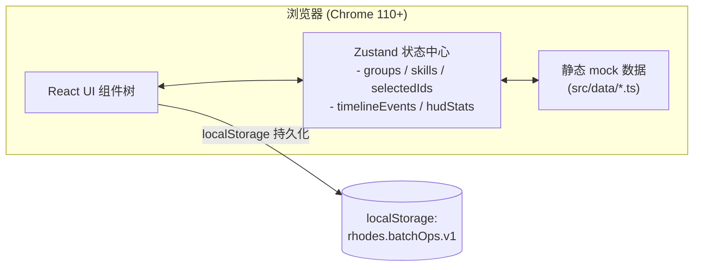

# 批量技能包组 — 技术架构

## 1. 架构设计

本项目是纯前端单页应用，目标是 1 屏 1 体验的"指挥终端"，因此采用 **Vite + React 18 + TypeScript + Tailwind** 的现代轻量栈，所有数据由前端 mock 驱动，避免外部服务依赖。



## 2. 技术描述

- **构建工具**：Vite 5（esbuild + Rollup 双引擎）
- **前端框架**：React 18 + TypeScript 5
- **样式方案**：Tailwind CSS 3 + 少量手写 CSS（处理 clip-path / scanline / 蜂窝 grid）
- **状态管理**：Zustand 4（轻量、零样板）
- **图标**：自绘内联 SVG（线性棱角风）
- **字体**：Google Fonts (Rajdhani / Orbitron / JetBrains Mono / Noto Sans SC)
- **后端**：无（纯静态 mock）
- **数据**：内置 `groups.ts` / `skills.ts` / `events.ts`，`localStorage` 持久化选中态

## 3. 路由定义

| 路由 | 用途 |
|------|------|
| `/` | 主面板 — 批量技能包组管理 |
| `/?mode=observe` | 观察员模式 — 隐藏批量操作按钮 |

## 4. 数据模型

### 4.1 类型定义 (TypeScript)

```ts
type Rarity = 'T1' | 'T2' | 'T3' | 'T4' | 'T5' | 'T6';

interface SkillPack {
  id: string;          // 'SK-001'
  code: string;        // 'HOK-7 "铁誓"'
  name: string;        // 中文名
  rarity: Rarity;
  level: number;       // 1..90
  tags: string[];      // ['物理', '近战', '爆发']
  cost: number;        // 升级消耗
  locked: boolean;
  equipped: boolean;
}

interface SkillGroup {
  id: string;          // 'GROP-A'
  code: string;        // 'GROP A "破晓"'
  capacity: number;    // 总槽位
  packs: SkillPack[];  // 包含的技能包
}

interface TimelineEvent {
  id: string;
  code: string;        // 'EVT-001'
  ts: number;          // 写入时间戳
  level: 'INFO' | 'WARN' | 'CRIT' | 'OK';
  message: string;
}
```

### 4.2 初始数据规模
- 7 个技能包组 (GROP A..G)
- 每组 18~30 个技能包，共 ~180 个
- 时间轴预置 6 条事件用于演示滚动效果

## 5. 组件结构

```
src/
├── App.tsx                 // 顶层布局 (HUD / Sidebar / Main / Inspector / Timeline)
├── main.tsx                // 入口
├── index.css               // Tailwind + 自定义 (scanline / hex / clip-path)
├── store/
│   └── useOpsStore.ts      // Zustand store
├── data/
│   ├── groups.ts
│   └── events.ts
├── components/
│   ├── HudBar.tsx          // 顶部状态栏
│   ├── GroupRoster.tsx     // 左侧组列表
│   ├── SkillMatrix.tsx     // 中央蜂窝矩阵
│   ├── SkillCard.tsx       // 单个技能包卡片
│   ├── ActionConsole.tsx   // 右侧批量操作面板
│   ├── Inspector.tsx       // 详情抽屉
│   ├── Timeline.tsx        // 底部时间轴
│   └── Toast.tsx           // 全局提示
└── lib/
    ├── cn.ts               // className 合并
    └── format.ts           // 数字 / 时间格式化
```

## 6. 关键交互实现要点

| 交互 | 实现 |
|------|------|
| 蜂窝网格 | CSS `clip-path: polygon(...)` + `nth-child` 错位 transform |
| 框选 | 透明 `<div>` 跟随鼠标，命中检测用 `getBoundingClientRect` |
| 全选 | Zustand 一次性 set `selectedIds` |
| 批量升级 | store action `batchUpgrade`，写一条 TimelineEvent |
| 导出 | `Blob` + `URL.createObjectURL` 下载 JSON |
| 持久化 | `zustand/middleware` 的 `persist` 写入 `rhodes.batchOps.v1` |
| 扫描线 | `@keyframes scanline` 8s 线性循环，固定到背景层 |

## 7. 性能与质量

- 180 个卡片使用 `React.memo` 避免无效重渲染
- 选中态存储为 `Set<string>` 保证 O(1) 查询
- 动画优先 `transform / opacity`，不触发布局
- 暗色主题统一使用 CSS 变量，避免运行时计算
- 关键文字 contrast ≥ 4.5:1（已对照 WCAG）

## 8. 运行方式

```bash
npm install
npm run dev     # http://localhost:5173
npm run build   # 输出 dist/
```
