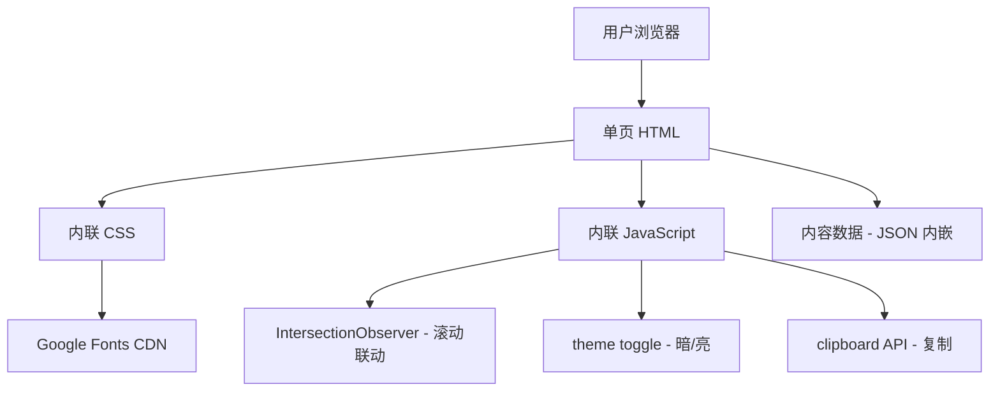

# 技术架构：上线手段全景 HTML 文档

## 1. 架构设计



**采用纯静态单页**：无构建工具、无后端，便于直接 `index.html` 打开。

## 2. 技术选型

- **HTML5** + **CSS3**（CSS Variables / Grid / Flexbox / backdrop-filter）
- **Vanilla JavaScript**（ES2020+，无框架依赖）
- **字体**：Google Fonts 预加载（Space Grotesk + Inter + JetBrains Mono + Fira Code）
- **图标**：内联 SVG（与"发布/部署"主题契合的终端/管道/版本号图标）
- **代码高亮**：Prism.js via CDN（轻量）
- **不引入**：React、Vue、Tailwind、外部图片资源（除占位图）

## 3. 路由 / 章节定义
单页内通过锚点 + 滚动监听实现 SPA 式导航：

| 锚点 ID | 章节 |
|---------|------|
| #hero | 总览 |
| #core | 基础核心策略 |
| #advanced | 进阶优化策略 |
| #fullchain | 全链路灰度 |
| #compare | 策略对比表 |
| #cases | 大厂案例 |
| #monitoring | 监控体系 |
| #roadmap | 落地演进路线 |
| #selection | 选型建议 |

## 4. 数据结构

策略数据以 JSON 形式内嵌到 JS：

```typescript
interface Strategy {
  id: string;
  name: string;
  category: 'core' | 'advanced';
  enName: string;
  icon: string;          // SVG path
  tagline: string;
  principle: string;
  pros: string[];
  cons: string[];
  scenarios: string[];
  color: string;         // 主题强调色
}
```

## 5. 关键交互逻辑
- **TOC 联动**：IntersectionObserver 监听 section，进入视口时高亮对应目录项
- **平滑滚动**：`scroll-behavior: smooth` + JS `scrollIntoView`
- **暗 / 亮切换**：根元素 data-theme 属性 + CSS variables
- **代码复制**：clipboard API + 视觉反馈（toast）

## 6. 部署
- 零依赖，纯静态 `index.html` + `style.css` + `script.js`
- 任意静态服务器（Nginx、CDN、GitHub Pages）即可托管
- 文件大小目标：< 200KB（不含字体）

## 7. 兼容性
- Chrome / Edge / Safari / Firefox 最近 2 个大版本
- 移动端 Safari / Chrome 适配
- 不支持 IE
