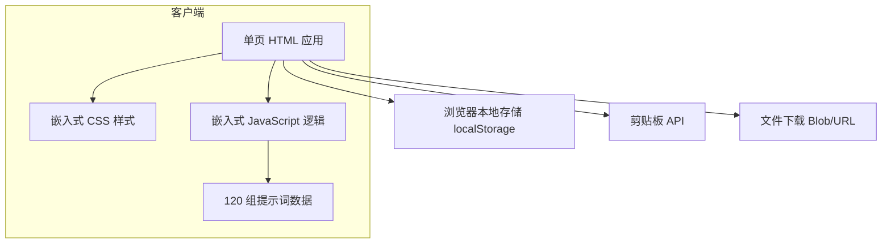

## 1. 架构设计



## 2. 技术描述

- **前端**：单文件 HTML5 + 嵌入式 CSS3 + Vanilla JavaScript (ES6+)。
- **构建工具**：无需构建工具，浏览器直接打开即可运行。
- **后端**：无。
- **数据库**：无，数据以 JavaScript 对象数组内嵌于 HTML 中。
- **存储**：localStorage 用于保存用户主题偏好、已选提示词 ID、最近融合结果。
- **外部服务**：无，不依赖任何 CDN 或第三方 API。

## 3. 路由定义

本项目为单页应用，无路由。

| 路径 | 用途 |
|------|------|
| index.html | 应用唯一入口，包含全部功能 |

## 4. API 定义

无后端 API。使用浏览器原生 API：
- `navigator.clipboard.writeText()`：复制文本。
- `URL.createObjectURL()` + `a.download`：导出文件。
- `localStorage.setItem/getItem`：持久化用户偏好。

## 5. 数据模型

提示词数据结构：

```javascript
const prompts = [
  {
    id: 1,
    theme: "黎明曙光",
    content: "黎明高原，日系二次元3D少女身穿宽松中式白袍...",
    en: "Dawn plateau, Japanese anime-style 3D girl in loose Chinese-style white robe..."
  }
  // ... 共 120 条
];
```

用户偏好数据结构：

```javascript
{
  theme: "dark",        // 或 "light"
  selectedIds: [1, 11, 21],
  lastFusion: "...",
  density: "comfortable", // "compact" | "comfortable"
  bilingual: true       // 是否显示英文翻译
}
```

## 6. 模块划分

| 模块 | 职责 |
|------|------|
| 数据层 | 定义 120 组提示词数组，提供按主题/关键词过滤方法 |
| 渲染层 | 根据过滤结果生成 DOM 卡片，处理主题切换与密度切换 |
| 选择层 | 维护选中状态，更新计数器与融合面板 |
| 融合层 | 将选中提示词去重、按主题排序、拼接为一段完整提示词 |
| 工具层 | 复制、导出、随机抽取、localStorage 读写、Toast 提示 |
