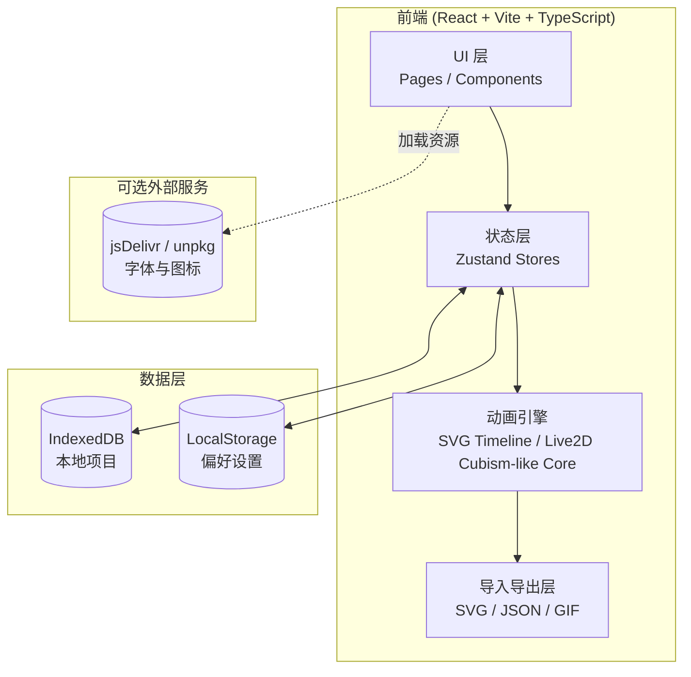
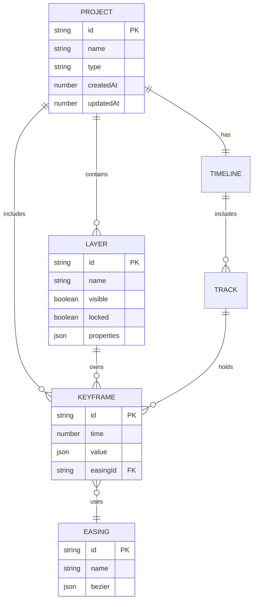

# AniForge — 技术架构文档

## 1. 架构设计



> 本期项目**纯前端**运行,不依赖后端服务;通过 IndexedDB 实现项目持久化,导出文件即云端等价方案。

## 2. 技术栈描述

- **构建工具**:Vite 5 (TypeScript template) — `pnpm create vite@latest . --template react-ts`
- **UI 框架**:React 18 + react-router-dom 6
- **样式**:Tailwind CSS 3 + CSS Variables (主题切换)
- **状态管理**:Zustand (项目 store、UI store、动画引擎 store)
- **动画能力**:
  - SVG 关键帧:自研时间线引擎 (基于 `requestAnimationFrame`),支持缓动函数库 (linear / ease / cubic-bezier 自定义)
  - Live2D 风格:自研 Cubism-like 渲染核心 (Canvas 2D + 网格形变 warp mesh + 部件分层),可导出 Cubism 兼容 JSON
- **辅助库**:
  - `lucide-react` 图标
  - `clsx` / `tailwind-merge` 类名合并
  - `idb-keyval` 简化 IndexedDB 访问
  - `gif.js` (动态导入) 实现 GIF 导出
  - `framer-motion` 用于 UI 微交互
- **代码规范**:ESLint + Prettier,TypeScript 严格模式
- **测试**:Vitest + @testing-library/react
- **包管理**:pnpm

## 3. 路由定义

| 路由 | 用途 |
|------|------|
| `/` | 首页 / 控制台,展示项目、模板入口、Hero |
| `/editor/svg` | SVG 动画编辑器 (新建) |
| `/editor/svg/:projectId` | SVG 动画编辑器 (打开已有项目) |
| `/editor/live2d` | Live2D 工作台 (新建) |
| `/editor/live2d/:projectId` | Live2D 工作台 (打开已有项目) |
| `/templates` | 模板库 |
| `/gallery` | 社区画廊 |
| `/settings` | 设置 |

## 4. API 定义
本期无后端,所有数据由前端模块直接产出。预留的 API 类型如下,便于将来接入:

```ts
// 通用项目结构
export interface Project {
  id: string;
  name: string;
  type: 'svg' | 'live2d';
  createdAt: number;
  updatedAt: number;
  thumbnail?: string; // dataURL
  data: SvgProjectData | Live2DProjectData;
}

export interface SvgProjectData {
  width: number;
  height: number;
  layers: SvgLayer[];
  timeline: SvgTimeline;
}

export interface Live2DProjectData {
  canvas: { width: number; height: number };
  parts: Live2DPart[];
  parameters: Live2DParameter[];
  motions: Live2DMotion[];
}
```

## 5. 服务器架构
本期**不涉及后端**;若未来需要云同步,推荐结构:
```
Controller (Express / Hono) → Service (项目/用户业务) → Repository (Prisma) → PostgreSQL
```

## 6. 数据模型

### 6.1 数据模型定义


### 6.2 IndexedDB Schema (TypeScript 描述)
```ts
db.version(1).stores({
  projects: 'id, type, updatedAt',
  settings: 'key',
});
```

## 7. 模块结构

```
src/
├── pages/
│   ├── Home.tsx
│   ├── SvgEditor.tsx
│   ├── Live2DStudio.tsx
│   ├── Templates.tsx
│   ├── Gallery.tsx
│   └── Settings.tsx
├── components/
│   ├── layout/        顶部栏、侧边栏、状态条
│   ├── svg-editor/    Canvas、LayerPanel、PropertyPanel、Timeline、Toolbar
│   ├── live2d/        Stage、PartPalette、ParameterPanel、MotionList
│   ├── home/          Hero、ProjectGrid、TemplateShowcase
│   └── common/        Button、Modal、Slider、Tabs、ColorPicker
├── engine/
│   ├── svg/           时间线、缓动、插值、渲染
│   └── live2d/        部件、网格形变、参数求值、动作合成
├── store/             Zustand: projectStore, uiStore, engineStore
├── lib/               idb、exporters、utils
├── styles/            tailwind.css、global.css
├── App.tsx
└── main.tsx
```

## 8. 关键实现策略

1. **时间线引擎**:以 `performance.now()` 为时钟,`requestAnimationFrame` 驱动,每帧根据当前时间在关键帧之间插值并写入 SVG attribute / style。
2. **缓动系统**:内置 `linear / easeInOut / easeOutBack / cubic-bezier(x1,y1,x2,y2)`;关键帧记录 easing id + 控制点,曲线面板可视化编辑。
3. **Live2D 核心**:
   - 部件按 z-order 渲染到离屏 Canvas
   - 网格形变采用三阶三角网格 (4×4 默认),通过 GPU 加速的 `setTransform` 模拟 mesh warp
   - 参数求值器支持表达式 (`ParamEyeLOpen = ParamEyeLSmile * 0.5 + 0.5`)
   - 动作由关键帧序列构成,可绑定触发 (Idle 自动循环、Tap 鼠标点击、Flick 滑动)
4. **导出**:
   - SVG:序列化时间线为 `<animate>` / `<animateTransform>` (SMIL) + CSS @keyframes 双版本
   - JSON:Cubism 兼容结构 (`{ version, model, textures, motions, parameters }`)
   - GIF:`gif.js` 在 Worker 中渲染 Canvas 帧序列
5. **持久化**:`idb-keyval` 包装 IndexedDB,项目以 JSON + 缩略图 dataURL 形式存储;导出/导入按钮实现「云等价」。

## 9. 性能预算

- 首屏 JS < 350KB (gzip)
- 关键交互 60fps
- IndexedDB 写入节流 800ms
- 离线可用 (Service Worker 可选,本期不强制)
