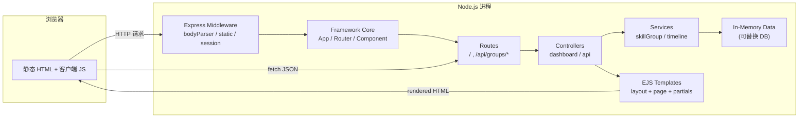

# 批量技能包组 — 技术架构（Node.js 框架版）

## 1. 架构设计

采用自研轻量 **Node.js 模板框架**（基于 Express + EJS），分层清晰、约定优于配置。



## 2. 技术栈

| 类别 | 选型 | 说明 |
|------|------|------|
| 运行时 | Node.js ≥ 20 | LTS |
| 框架核心 | 自研 `App / Router / Component` | 封装 Express |
| Web 框架 | Express 4 | 成熟稳定 |
| 模板引擎 | EJS 3 | `<%= %>` 风格易读 |
| 静态资源 | `express.static` | CSS / JS / img |
| 状态 | In-memory Map | 可平滑替换 Redis / DB |
| 字体 | Google Fonts (CDN) | Rajdhani / Orbitron / Noto Sans SC |
| 图标 | 内联 SVG | 线性棱角风 |

## 3. 目录结构

```
/workspace
├── package.json
├── server.js                       # 入口
├── README.md
├── app/                            # 框架核心
│   ├── App.js                      #   应用类
│   ├── Router.js                   #   路由包装
│   ├── Component.js                #   组件基类
│   ├── render.js                   #   EJS 渲染器
│   └── utils/
│       ├── logger.js
│       └── helpers.js
├── config/
│   └── index.js                    # 端口 / 路径 / 主题
├── src/
│   ├── routes/                     # 路由注册
│   │   └── index.js
│   ├── controllers/                # 业务控制器
│   │   ├── dashboard.controller.js
│   │   └── api.controller.js
│   ├── services/                   # 服务层
│   │   ├── skillGroup.service.js
│   │   └── timeline.service.js
│   ├── data/                       # 种子数据
│   │   ├── groups.seed.js
│   │   └── events.seed.js
│   ├── views/                      # EJS 模板
│   │   ├── layouts/
│   │   │   └── base.ejs
│   │   ├── pages/
│   │   │   └── dashboard.ejs
│   │   └── partials/
│   │       ├── _hud.ejs
│   │       ├── _groupRoster.ejs
│   │       ├── _skillMatrix.ejs
│   │       ├── _skillCard.ejs
│   │       ├── _actionConsole.ejs
│   │       ├── _inspector.ejs
│   │       └── _timeline.ejs
│   └── public/                     # 静态资源
│       ├── css/
│       │   └── app.css
│       ├── js/
│       │   ├── app.js
│       │   ├── matrix.js
│       │   ├── console.js
│       │   └── inspector.js
│       └── favicon.svg
└── .trae/documents/
    ├── PRD.md
    └── Technical-Architecture.md
```

## 4. 框架核心 API

### 4.1 `App` 应用类
```js
const app = new App({ port: 3000, views: 'src/views', static: 'src/public' });
app.use('/api', apiRouter);
app.page('/', dashboardController.index);
app.start();
```

### 4.2 `Component` 组件基类
```js
class HudComponent extends Component {
  template = '_hud.ejs';
  defaultData() { return { operator: 'DR-091' }; }
  // 渲染输出 HTML 字符串
}
const html = HudComponent.render({ operator: 'DR-091' });
```

### 4.3 `render(template, data)`
封装 `ejs.renderFile`，支持 partial include 与全局 helpers。

## 5. 路由定义

| Method | Path | Controller | 说明 |
|--------|------|-----------|------|
| GET | `/` | dashboardController.index | 渲染主面板 |
| GET | `/api/groups` | apiController.listGroups | 返回所有组 |
| GET | `/api/groups/:id` | apiController.getGroup | 返回单组 |
| POST | `/api/groups/:id/batch` | apiController.batchAction | 批量动作 |
| GET | `/api/timeline` | apiController.timeline | 获取时间轴 |
| POST | `/api/inspector/:packId/apply-all` | apiController.applyToAll | 应用至全组 |
| GET | `/api/export/:groupId` | apiController.exportConfig | 下载 JSON |

## 6. 数据模型

```ts
type Rarity = 'T1' | 'T2' | 'T3' | 'T4' | 'T5' | 'T6';

interface SkillPack {
  id: string;          // 'SK-001'
  code: string;        // 'HOK-7 "铁誓"'
  name: string;
  rarity: Rarity;
  level: number;       // 1..90
  tags: string[];
  cost: number;
  locked: boolean;
  equipped: boolean;
  description: string;
}

interface SkillGroup {
  id: string;          // 'GROP-A'
  code: string;        // 'GROP A "破晓"'
  name: string;
  capacity: number;
  packs: SkillPack[];
}

interface TimelineEvent {
  id: string;
  code: string;        // 'EVT-001'
  ts: number;
  level: 'INFO' | 'WARN' | 'CRIT' | 'OK';
  message: string;
}
```

## 7. 关键交互实现要点

| 交互 | 实现 |
|------|------|
| 蜂窝网格 | 服务端按 6 列等宽渲染，CSS `clip-path` 切角 + nth-child 错位 |
| 框选 | 客户端 `mouseup` 计算矩形 → 取所有命中卡片 → 维护 `Set<id>` |
| 全选 | 客户端 `SELECT_ALL` 按钮 → 调 store |
| 批量升级 | `fetch POST /api/groups/:id/batch` body `{action:'upgrade'}` |
| 时间轴 | 事件写入 in-memory array，客户端每 5s 拉取一次 |
| 导出 | 服务端生成 JSON 返回 `Content-Disposition: attachment` |
| 持久化 | v1 版本只 in-memory，v2 可接入 SQLite (`better-sqlite3`) |

## 8. 运行方式

```bash
npm install
npm start             # http://localhost:3000
npm run dev           # nodemon 自动重启
```
