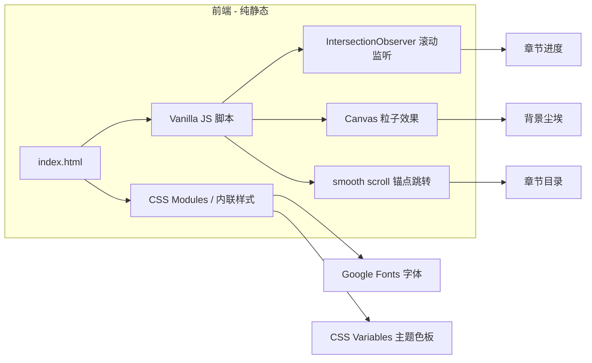

# 《哨兵之桥》电影剧本展示页 — 技术架构

## 1. 架构设计



## 2. 技术选型

- **渲染方式**：纯 HTML + CSS + Vanilla JavaScript（无构建步骤）
- **选型理由**：
  - 剧本展示是单页静态内容，React/Vue 框架带来的复杂度不划算
  - 用户明确要求"制作html"
  - 部署简单（双击 index.html 即可在浏览器打开）
- **字体服务**：Google Fonts（`Noto Serif SC` + `Noto Sans SC` + `JetBrains Mono` + `Cormorant Garamond`）
- **图标**：内联 SVG / Unicode 符号（无外部图标库，保持轻量）
- **图片**：纯 CSS 氛围背景 + SVG 装饰 + 渐变；按 Image Guidelines 在需要时使用 `trae-api-cn` text_to_image

## 3. 路由 / 页面结构

由于是单页应用，无路由。所有内容在同一页面内通过 anchor 跳转：

| 锚点 | 用途 |
|------|------|
| `#cover` | 封面区 |
| `#toc` | 章节目录 |
| `#chapter-prologue` ~ `#chapter-finale` | 各章节区 |
| `#appendix` | 附录区 |
| `#credits` | 结尾字幕 |

## 4. 资源与外部依赖

| 资源 | 用途 | 来源 |
|------|------|------|
| Noto Serif SC | 章节标题、强调 | Google Fonts |
| Noto Sans SC | 正文 | Google Fonts |
| Cormorant Garamond | 英文副标 | Google Fonts |
| JetBrains Mono | 编号、镜头提示 | Google Fonts |

## 5. 数据模型

由于内容是固定的剧本文本，采用 HTML 中直接内嵌结构化数据的方式：

```js
// 章节结构示例
const chapters = [
  {
    id: 'prologue',
    number: '序章',
    title: '裂缝之上',
    subtitle: 'Prologue · Above the Rift',
    mood: 'wasteland-dusk',
    scenes: [
      {
        no: '场景一',
        setting: '废土平原 · 黄昏',
        tags: ['外景', '大远景', '无人机俯冲'],
        body: '...',
        mood: '荒凉，孤独，对峙前奏'
      }
    ]
  }
]
```

每个章节对应的 HTML 结构以 `<section data-chapter="..." data-mood="...">` 包裹，JS 通过 `data-*` 钩子驱动氛围切换与进度计算。

## 6. 关键模块设计

### 6.1 氛围色板切换
- 在 `<body>` 上挂 `data-current-mood` 属性
- CSS 中按 `[data-mood~="wasteland-dusk"]` 等选择器定义背景色变量
- 章节进入视口时通过 IntersectionObserver 切换 mood

### 6.2 场景卡片
- 卡片结构：
  - 顶部条带：场号 + 内外景
  - 镜头语言标签条：景别/调度/运镜
  - 正文（多段）+ 氛围提示（斜体小字）
  - 对白区域（角色名 + 引文）

### 6.3 滚动进度
- 顶部固定一根高 2px 的进度条 `position: fixed; top: 0`
- 监听 `scroll`，计算 `scrollY / (scrollHeight - innerHeight)`
- 进度条宽度同步更新

### 6.4 尘埃粒子
- 使用 `<canvas>` 全屏覆盖，pointer-events: none
- 60 个左右微小粒子，随机方向缓慢漂浮
- 颜色取自 CSS 变量 `--dust-color`

### 6.5 章节锚点跳转
- 左侧固定的垂直目录 (`position: sticky; top: 0`)
- 每项点击 → `element.scrollIntoView({ behavior: 'smooth' })`
- 当前章节高亮（IntersectionObserver）

## 7. 性能与无障碍

- 字体使用 `font-display: swap` 避免阻塞渲染
- 图片用 `loading="lazy"`（如有）
- 所有交互元素提供 `:focus-visible` 描边
- 颜色对比度满足 WCAG AA
- 尊重 `prefers-reduced-motion`，关闭粒子/动效

## 8. 文件结构

```
/workspace
├── index.html              # 主页（含所有章节内容）
├── styles.css              # 全部样式
├── script.js               # 滚动监听、粒子、目录交互
├── .trae/documents/        # PRD 与技术架构
└── README.md
```

## 9. 后续可选增强
- 章节切换时配以低频环境音（Web Audio API + OscillatorNode）
- 段落书签与笔记
- 阅读模式切换（剧本分镜/纯文字）
