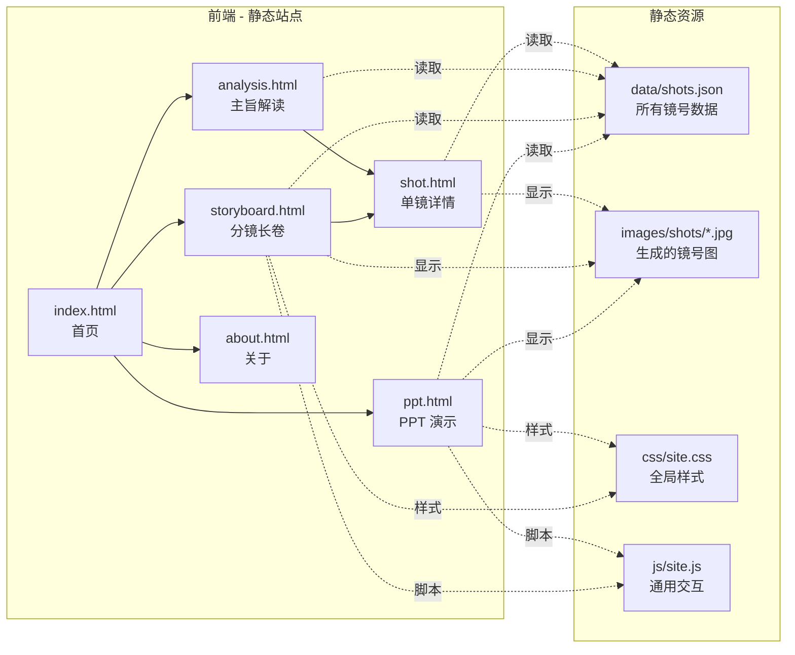

# 哥窑·PPT 与 HTML 展示站点 —— 技术架构文档

## 1. 架构设计

本项目为**纯静态前端**项目，无后端、无数据库，所有内容以 JSON / HTML 内嵌形式存在。图像通过 `text_to_image` 接口按镜号提示词生成并以 `` 引用。



## 2. 技术选型

- **构建方式**：纯 HTML + CSS + 原生 JavaScript，**不引入 React/Vue**（符合"制作大量 HTML"的诉求）
- **样式**：单文件 `css/site.css`（含设计 token、CSS 变量、动画）
- **脚本**：单文件 `js/site.js`（含翻页、滚动显隐、键盘事件）
- **图像**：使用 `https://trae-api-cn.mchost.guru/api/ide/v1/text_to_image` 接口，按镜号生成
- **字体**：Google Fonts（思源宋体 / 思源黑体 / Cormorant Garamond）
- **图标**：内联 SVG（青瓷纹、窑火、印章）
- **运行**：纯静态，可直接通过本地 http server（如 `python -m http.server`）预览

## 3. 路由定义

| 路径 | 用途 |
|------|------|
| `/index.html` | 首页：项目封面 + 三入口 |
| `/ppt.html` | PPT 演示页（键盘 ← → 翻页） |
| `/storyboard.html` | 分镜长卷：所有镜号纵向铺开 |
| `/shot.html?shot=N` | 单镜详情：第 N 镜 |
| `/analysis.html` | 主旨解读：Slide 化 |
| `/about.html` | 关于：人物关系、创作说明 |

## 4. 数据结构

`data/shots.json`：

```ts
type Shot = {
  id: number;              // 镜号
  act: 'prologue'|'act1'|'act2'|'act3';  // 所在幕
  shotSize: string;        // 景别：黑场/特写/中景/...
  visual: string;          // 画面内容
  audio: string;           // 声音/台词
  duration: string;        // 时长，如 "7s"
  prompt: string;          // 用于生图的提示词
  imageSize: 'landscape_16_9'|'landscape_4_3'|...;
};

type Story = {
  project: string;         // 项目名
  characters: Character[]; // 角色表
  shots: Shot[];           // 所有镜号
};
```

`data/characters.json`：

```ts
type Character = {
  name: string;            // 姓名
  role: '哥哥'|'弟弟'|'其他';
  traits: string[];        // 核心特质
  keyLines: { shot: number; line: string }[];  // 关键台词
};
```

## 5. 目录结构

```
/workspace
├── index.html
├── ppt.html
├── storyboard.html
├── shot.html
├── analysis.html
├── about.html
├── css/
│   └── site.css
├── js/
│   ├── data.js          # 暴露 shots / characters 数据
│   ├── ppt.js           # 翻页逻辑
│   ├── storyboard.js    # 长卷渲染
│   └── site.js          # 通用工具
├── data/
│   ├── shots.json
│   └── characters.json
└── images/
    └── shots/
        ├── 001.jpg
        ├── 002.jpg
        └── ...
```

## 6. 设计 Token（CSS 变量）

```css
:root {
  --ink-black: #0e0e10;
  --paper: #f4ecd8;
  --celadon: #6b8e7f;
  --kiln-fire: #d96b27;
  --seal-red: #b53028;
  --ink-gray: #4a4a4a;
  --purple-clay: #8a4a2c;
  --font-serif: 'Noto Serif SC', serif;
  --font-sans: 'Noto Sans SC', sans-serif;
  --font-display: 'Cormorant Garamond', serif;
}
```

## 7. 关键交互

- **PPT 翻页**：`ppt.html` 监听 `keydown` ←/→/Space/PageUp/PageDown；支持点击翻页
- **长卷渲染**：`storyboard.html` 加载 `shots.json` 后按幕分组渲染，使用 IntersectionObserver 实现"滚到即显"
- **单镜跳转**：`shot.html` 读取 `?shot=N`，在数据中查找并渲染
- **键盘快捷键**：
  - `←/→` PPT 翻页
  - `Esc` 退出全屏
  - `Home/End` 跳到首页/末页

## 8. 性能与可达性

- 图片懒加载（`loading="lazy"`）
- 关键内容用语义化标签（`<section>`/`<article>`/`<nav>`）
- 颜色对比度 ≥ 4.5:1（正文）
- 移动端长卷为单列
