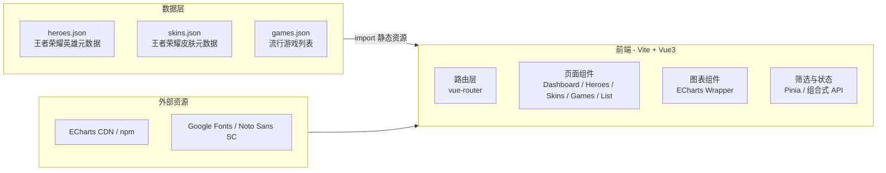

## 1. 架构设计



> 备注:由于不下载任何游戏美术资源,所有"图片位"以几何 SVG / 文字 / 色块代替,数据通过本地 JSON 提供(以"已抓取的公开汇总数据"形式内嵌到 `src/data/` 目录中,使用 WebFetch 在构建/调试阶段准备一次)。

## 2. 技术说明

- **构建工具**:Vite 5
- **前端框架**:Vue 3 (Composition API + `<script setup>`)
- **可视化库**:Apache ECharts 5(按需引入,避免打包体积过大)
- **路由**:vue-router 4
- **状态管理**:Pinia(轻量,用于筛选状态)
- **样式**:原生 CSS + CSS 变量(SCSS 可选,默认 CSS);不使用 Tailwind 以保持设计自由度
- **字体**:Google Fonts 远程加载(Orbitron / Rajdhani / Noto Sans SC / Inter)
- **后端**:无
- **数据库**:无;数据以 JSON 静态文件存放于 `src/data/`

## 3. 路由定义

| 路由 | 用途 |
|------|------|
| `/` | 概览页(总览 KPI + 主图) |
| `/heroes` | 王者荣耀英雄分析(玫瑰图 + 热度图) |
| `/skins` | 王者荣耀皮肤分析(饼图 + Top10 + 趋势) |
| `/games` | 流行游戏总览(平台/类型/评分三视图) |
| `/games/list` | 流行游戏分类列表(可筛选) |

## 4. API 定义

无后端,无 API 端点。所有数据通过 `import` 引入 JSON。

### TypeScript 类型(用于编辑器智能提示)

```ts
export interface Hero {
  id: number
  name: string
  title: string
  role: 'tank' | 'warrior' | 'assassin' | 'mage' | 'marksman' | 'support'
  gender: 'male' | 'female' | 'other'
  faction: string
  releaseYear: number
  skinCount: number
  popularity: number // 0-100
}

export interface Skin {
  id: number
  hero: string
  name: string
  tier: 'common' | 'epic' | 'legend' | 'glory'
  series?: string
  releaseYear: number
}

export interface Game {
  id: number
  name: string
  category: string // MOBA / FPS / RPG / SLG / ...
  platform: 'mobile' | 'pc' | 'console'
  region: 'cn' | 'global' | 'both'
  rating: number // 0-10
  peakCCU?: number // 万人
  releaseYear: number
}
```

## 5. 服务端架构

无后端服务。

## 6. 数据模型

### 6.1 数据模型定义
无持久化数据库,所有数据为 JSON 静态文件,结构如上 TS 类型所示。

### 6.2 数据准备说明
- 在编码阶段,通过 WebFetch 从公开网页(官网/百科)抓取元数据,整理为 JSON
- 由于涉及版权,仅记录:角色名、定位、皮肤数(公开统计值)、系列归属(公开事实)等非创造性事实数据;**不包含**任何原画/截图/音频
- 角色与皮肤"图位"使用 SVG 几何字符头像(首字母 + 定位色)代替

### 数据规模建议
- `heroes.json`:约 100+ 条目(王者荣耀目前英雄数 ~110)
- `skins.json`:约 500+ 条目(累计皮肤数)
- `games.json`:约 50 条目(精选流行游戏,覆盖手游+端游)
