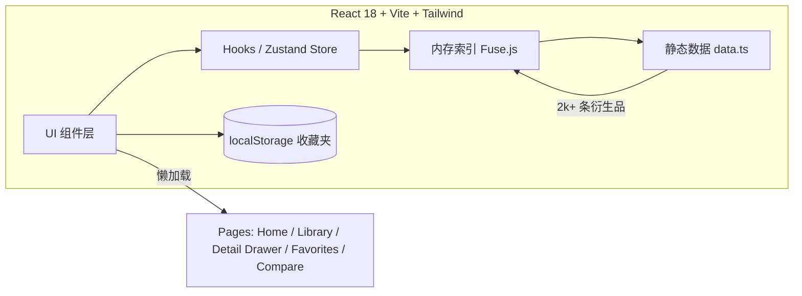

# 游戏IP衍生作品资料库 - 技术架构文档

## 1. 架构设计
纯前端单页应用，零后端、零数据库；数据以 TS 模块形式静态注入。



## 2. 技术选型
- **构建工具**：Vite 5（`vite-init` 模板：`react-ts`）
- **UI 库**：React 18 + TypeScript
- **样式**：Tailwind CSS 3（自定义 `tailwind.config` 注入像素字体 / 主题色）
- **路由**：React Router DOM v6（`/`, `/library`, `/favorites`, `/compare`）
- **状态**：Zustand（`useLibraryStore`: 筛选 / 排序 / 收藏 / 对比）
- **搜索**：Fuse.js（模糊搜索 + 多字段权重）
- **图标**：lucide-react
- **字体**：Google Fonts: `Press Start 2P`, `VT323`, `JetBrains Mono`, `Noto Serif SC`
- **动效**：Framer Motion（卡片入场、抽屉、数字滚动）
- **数据**：本地 `src/data/derivatives.ts`（2000+ 条）

> 不引入后端 / 不引入数据库；所有数据随构建打包。

## 3. 路由定义
| 路径 | 页面 | 说明 |
|------|------|------|
| `/` | Home | Hero、统计、热门 IP |
| `/library` | Library | 主浏览页：搜索 + 筛选 + 卡片网格 |
| `/favorites` | Favorites | 本地收藏夹 |
| `/compare` | Compare | 并排对比页 |

> 详情以**右侧抽屉**形式出现，不占用路由（点击卡片打开），提升浏览连续性。

## 4. 关键模块设计

### 4.1 数据结构
```ts
type Derivative = {
  id: string                  // 'dd-0001'
  title: string               // 中文标题
  originalTitle?: string      // 原名
  ip: string                  // 所属 IP（主键名）
  ipKey: string               // 英文 / 罗马字
  type: DerivativeType        // 12 种形式
  year: number                // 首发年份
  region: 'JP' | 'US' | 'CN' | 'KR' | 'EU' | 'Global'
  creator: string             // 制作方
  director?: string
  cast?: string[]             // 声优 / 演员
  platform?: string           // 来源游戏平台
  releaseDate: string         // ISO 日期
  status: 'released' | 'ongoing' | 'announced' | 'discontinued'
  rating: number              // 0-10
  tags: string[]
  summary: string             // 100-200 字简介
  links?: { label: string; url: string }[]
  coverHue: number            // 0-360，用于占位渐变
}
```

### 4.2 衍生形式枚举
`anime_tv | anime_movie | ova | live_movie | live_drama | manga | novel | ost | stage_play | figure | goods | cafe | theme_park | board_game | card_game | exhibition | radio | music | vtuber | collaboration | artbook | other`

### 4.3 索引与搜索
- 在 App 启动时 `useMemo` 构建 `Fuse` 索引，字段权重：
  - `title` 0.5 / `originalTitle` 0.4 / `ip` 0.3 / `creator` 0.2 / `cast` 0.15 / `tags` 0.1
- 搜索结果与多选筛选条件**取交集**（AND 关系）
- 排序：year / rating / popularity（评分 × log(2026-year+2)）

### 4.4 状态（Zustand）
```ts
useLibraryStore = {
  query: string
  filters: { types: Set, years: [min,max], regions: Set, status: Set, ratingMin: number }
  sort: 'year-desc' | 'year-asc' | 'rating-desc' | 'popularity-desc'
  favorites: string[]            // id 列表
  compareList: string[]          // 最多 3 个
  openDetailId: string | null
  // actions: setQuery, toggleFilter, setSort, toggleFavorite, addToCompare, openDetail, closeDetail
}
```

### 4.5 性能
- 列表分页：每页 60 条，IntersectionObserver 触发下一页
- 卡片用 `React.memo` + 稳定 key
- 抽屉用 `AnimatePresence` 懒挂载内容
- 数据分块懒加载：动态 `import()` 罕见衍生形式

## 5. 目录结构
```
src/
├─ data/
│  ├─ ips.ts              // 80+ IP 元数据
│  └─ derivatives.ts      // 2000+ 衍生品（按 IP 分块）
├─ lib/
│  ├─ search.ts           // Fuse 包装
│  ├─ stats.ts            // 统计计算
│  └─ format.ts           // 日期 / 形式 / 地区格式化
├─ store/
│  └─ useLibraryStore.ts  // Zustand
├─ components/
│  ├─ layout/  (TopBar, Footer)
│  ├─ home/    (Hero, StatBoard, TopIPs, TypeRadar)
│  ├─ library/ (SearchBar, FilterSidebar, CardGrid, SortBar, Pagination)
│  ├─ detail/  (DetailDrawer, FieldRow, RelatedRow)
│  ├─ favorites/ (FavoritesTable)
│  ├─ compare/  (CompareTable)
│  └─ ui/      (PixelButton, Badge, HueCover, Scanline, CountUp)
├─ pages/
│  ├─ Home.tsx
│  ├─ Library.tsx
│  ├─ Favorites.tsx
│  └─ Compare.tsx
├─ App.tsx
├─ main.tsx
└─ index.css
```

## 6. 视觉与动效实现要点
- **CRT 扫描线**：固定 `position:fixed` 的 `linear-gradient` 全屏叠加，pointer-events:none
- **像素字体**：`Press Start 2P` 仅用于 H1 / 数字 / 徽章
- **卡片**：hover 时 `translateY(-4px) + box-shadow: 0 0 24px var(--accent-glow)`
- **抽屉**：`framer-motion` `x: 100%` → `0`，缓动 `[.22,1,.36,1]`
- **数字滚动**：`CountUp` 组件 IntersectionObserver 触发，requestAnimationFrame 缓动

## 7. 验收清单
- [ ] 衍生品数量 ≥ 2000
- [ ] 8 项主要 UI 模块渲染正常
- [ ] 搜索、筛选、排序实时响应
- [ ] 详情抽屉字段完整且可滚动
- [ ] 收藏夹持久化（刷新不丢）
- [ ] 对比页支持 2-3 件
- [ ] 响应式：1024 / 768 / 375 三档无溢出
- [ ] 首屏 < 2s（构建后静态托管）
- [ ] 字体与扫描线视觉生效
- [ ] `npm run build` 通过
