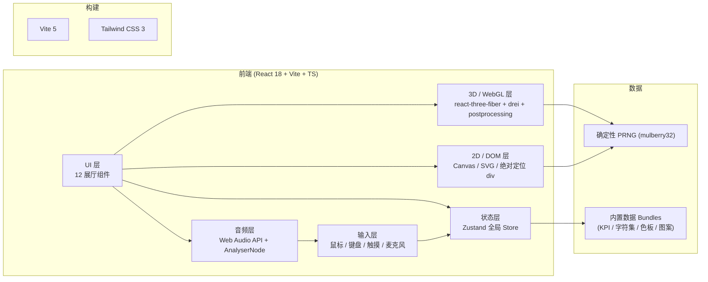
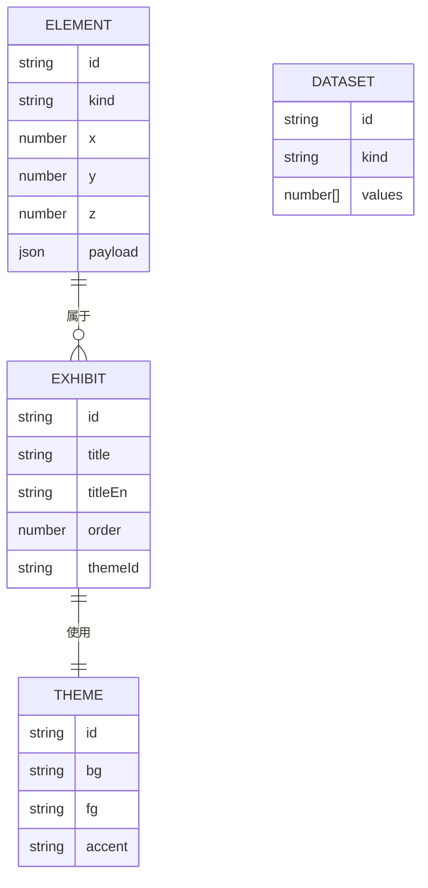

# 万象天文台 · STELLARIS — 技术架构文档

## 1. 架构设计



- 纯前端：单页 React 应用，无后端服务。
- 数据使用 `mulberry32` 确定性伪随机种子，首帧可复现。
- 全局状态：当前展厅编号、画布尺寸、性能档位、麦克风授权状态、参数调节值。

## 2. 技术栈

- 框架：React 18 + TypeScript + Vite 5
- 样式：Tailwind CSS 3（仅工具类）+ CSS Variables（设计 token）
- 3D：three + @react-three/fiber + @react-three/drei + @react-three/postprocessing
- 2D：原生 Canvas 2D + SVG
- 状态：Zustand
- 动效：Framer Motion（章节切换）+ CSS 关键帧（细节）
- 字体：Fraunces / Inter Tight / JetBrains Mono / Noto Serif SC / Noto Sans SC（本地 woff2 + Google Fonts CDN）
- 后端：无
- 数据库：无（使用内置种子数据 + 可选 localStorage 存偏好）

## 3. 路由定义

| 路由 | 用途 |
|------|------|
| `/` | 整站单页，按 hash 切换展厅：`#overture` `#starmap` `#glyphsea` `#crystal` `#pulse` `#specimens` `#echo` `#chroma` `#dataforest` `#sandbox` `#manifesto` `#coda` |
| `/sandbox` | 也可作为独立直达入口 |
| `/manifesto` | 独立直达入口，便于分享 |

## 4. API 定义

无后端 API。可选 localStorage：

```ts
// localStorage key: stellaris.prefs.v1
type Prefs = {
  quality: 'low' | 'medium' | 'high' | 'ultra'
  audioMuted: boolean
  palette: 'mist' | 'flame' | 'aurora' | 'polar-night'
  visited: string[]  // 已访问展厅 id
  codaSeen: number   // 到达尾声次数
}
```

## 5. 服务端架构图

无服务端。

## 6. 数据模型

### 6.1 数据模型定义



### 6.2 数据定义

```ts
// 全局元素清单（运行时生成）
type ElementKind =
  | 'stardot'        // 星图微点
  | 'glyph'          // 字符方块
  | 'crystal'        // 晶柱
  | 'pulsebar'       // 波形条
  | 'specimen'       // UI 缩略
  | 'echotile'       // 镜像瓦片
  | 'chromatile'     // 色谱瓦片
  | 'datatree'       // 数据树
  | 'sandbox'        // 沙盘元素
  | 'manifestoglyph' // 宣言字符
  | 'codastar'       // 尾声光点

type Element = {
  id: string
  kind: ElementKind
  x: number
  y: number
  z: number
  payload: Record<string, unknown>
}

const EXHIBITS: Exhibit[] = [
  { id: 'overture',  title: '序厅',    titleEn: 'Overture',   order: 0,  themeId: 'mist' },
  { id: 'starmap',   title: '星图',    titleEn: 'Stellar Map',order: 1,  themeId: 'polar-night' },
  { id: 'glyphsea',  title: '字海',    titleEn: 'Glyph Sea',  order: 2,  themeId: 'mist' },
  { id: 'crystal',   title: '晶阵',    titleEn: 'Crystal',    order: 3,  themeId: 'aurora' },
  { id: 'pulse',     title: '脉搏',    titleEn: 'Pulse',      order: 4,  themeId: 'flame' },
  { id: 'specimens', title: '样本柜',  titleEn: 'Specimens',  order: 5,  themeId: 'mist' },
  { id: 'echo',      title: '回声廊',  titleEn: 'Echo Hall',  order: 6,  themeId: 'polar-night' },
  { id: 'chroma',    title: '色谱',    titleEn: 'Chroma',     order: 7,  themeId: 'aurora' },
  { id: 'dataforest',title: '数据林',  titleEn: 'Data Forest',order: 8,  themeId: 'mist' },
  { id: 'sandbox',   title: '沙盘',    titleEn: 'Sandbox',    order: 9,  themeId: 'flame' },
  { id: 'manifesto', title: '宣言',    titleEn: 'Manifesto',  order: 10, themeId: 'mist' },
  { id: 'coda',      title: '尾声',    titleEn: 'Coda',       order: 11, themeId: 'polar-night' },
]
```

### 6.3 元素生成策略

- `stardot`：100,000 个，使用 `mulberry32(0xA1B2C3D4)` 种子，在半径 5000 的圆盘内均匀随机分布。
- `glyph`：64×64 = 4,096 个，从 8 个字符集（拉丁、希腊、西里尔、汉字、假名、数学、标点、emoji 文本）随机抽取。
- `crystal`：8,000 根 InstancedMesh，分布在 200×200 网格上，Y 轴高度按距离中心衰减。
- `pulsebar`：12×80 = 960 个条形，绑定 AnalyserNode。
- `specimen`：10,000 个缩略卡，分 10 类，每类 1,000。
- `echotile`：依滚动距离动态生成 200 个。
- `chromatile`：环形布局 1,800 块色板瓦片。
- `datatree`：3,200 棵，按 64×50 网格排布。
- `sandbox`：1,024 个自由元素 + 9 种后期效果自由叠加。
- `manifestoglyph`：12,000 字符，从一篇 1,200 字宣言 × 10 副本展开。
- `codastar`：1,000 个光点，缓动呼吸。

合计：**~141,000 个 UI 微元素**，其中"核心 100,000"由星图独立承担，剩余为展厅增强元素。

### 6.4 性能策略

- 移动端 / 低性能设备自动降级为 20% 元素数。
- 100,000 星图使用 Canvas 2D 批量绘制（不创建 DOM 节点）。
- 8,000 晶柱使用 InstancedMesh 单次 draw call。
- 离开展厅时回收 effect 资源 / 释放 texture。
- 静态数据在 Vite 构建时生成 JSON 注入。
