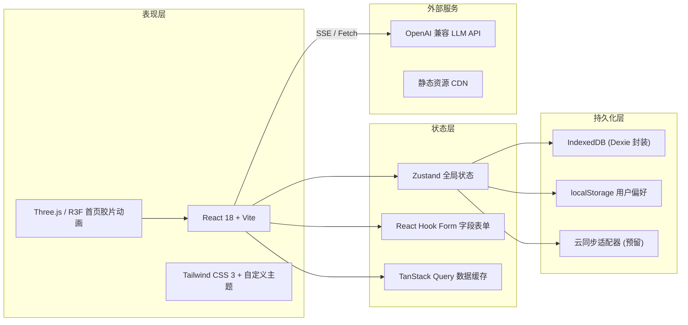

# 技术架构：萤幕（Lumière）

## 1. 架构设计

采用「单前端 + 本地持久化 + 可选云同步」分层架构。前端承担全部交互与状态管理，模板数据默认写入浏览器 IndexedDB（无需后端即可完整使用），预留云同步抽象层以便未来接入 BaaS。



## 2. 技术描述

- **前端框架**：React@18 + TypeScript + Vite@5
- **样式方案**：Tailwind CSS@3 + 自定义 `lumiere` 主题（深夜黑 / 牛皮纸米白 / 琥珀 / 胶片红）
- **路由**：React Router@6
- **状态管理**：Zustand@4（轻量、适合模板 / 工作区状态）
- **表单**：React Hook Form + Zod（字段校验、动态字段数组）
- **数据持久化**：Dexie@4（IndexedDB 封装），用于模板、版本、收藏
- **3D**：three@0.160 + @react-three/fiber + @react-three/drei（首页胶片圆筒）
- **动画**：Framer Motion（场记板入场、镜头光圈收缩）
- **代码高亮 / Markdown**：react-markdown + shiki
- **图标**：lucide-react
- **后端**：无（单前端应用，所有数据本地化；LLM 调用由用户在设置中填入自己的 API Key）
- **数据库**：无服务端数据库（IndexedDB 即本地数据库）
- **LLM 接入**：通过用户填入的 OpenAI 兼容 API Key 直连，支持流式输出（SSE）

## 3. 路由定义

| 路由 | 用途 |
|------|------|
| `/` | 首页 Discover：英雄区 + 分类导航 + 精选模板 + 搜索 |
| `/library` | 公共模板库：体裁、节拍模型、变量数多维筛选 |
| `/library/:id` | 模板详情 Script View：结构化阅读 + 提示词原文 + 调用 |
| `/studio` | Studio 编辑器：从空白或已有模板创建 / 编辑 |
| `/studio/:id` | 编辑指定模板 |
| `/workshop` | 个人工作台：我的模板、收藏、版本历史、协作 |
| `/workshop/favorites` | 收藏夹 |
| `/settings` | 设置：API Key、模型选择、主题、导入 / 导出数据 |
| `/about` | 关于 / 使用指引 |

## 4. API 定义

无后端服务；与外部 LLM 的通信通过 `POST {LLM_BASE_URL}/chat/completions` 完成，使用浏览器原生 `fetch` + `ReadableStream` 解析 SSE。

```ts
// LLM 调用请求
interface LLMChatRequest {
  model: string;            // e.g. "gpt-4o-mini"
  messages: Array<{
    role: "system" | "user" | "assistant";
    content: string;
  }>;
  temperature?: number;     // 0-2
  top_p?: number;           // 0-1
  max_tokens?: number;
  stream: true;
}

// 流式响应（chunk）
interface LLMStreamChunk {
  id: string;
  object: "chat.completion.chunk";
  choices: Array<{
    delta: { content?: string };
    index: number;
    finish_reason: string | null;
  }>;
}
```

## 5. 数据模型

### 5.1 数据模型定义

```mermaid
erDiagram
    TEMPLATE ||--o{ VERSION : "has"
    TEMPLATE }o--|| CATEGORY : "belongs to"
    TEMPLATE }o--o{ TAG : "tagged"
    USER ||--o{ FAVORITE : "favorites"
    USER ||--o{ TEMPLATE : "owns"
    TEMPLATE ||--o{ FIELD : "contains"
    TEMPLATE ||--o{ CALL_LOG : "tracked"

    TEMPLATE {
        string id PK
        string title
        string slug
        string genre           // 电影/短剧/短视频/互动
        string beatModel       // 三幕/英雄之旅/救猫咪/自定义
        string coverUrl
        string authorId FK
        boolean isPublic
        number usageCount
        number version
        datetime createdAt
        datetime updatedAt
    }
    VERSION {
        string id PK
        string templateId FK
        number versionNo
        json snapshot
        string changelog
        datetime createdAt
    }
    FIELD {
        string id PK
        string templateId FK
        string key             // logline / characters / beats ...
        string label
        string type            // text | list | struct | code
        json schema
        number order
    }
    CATEGORY {
        string id PK
        string name
        string slug
        number order
    }
    TAG {
        string id PK
        string name
    }
    FAVORITE {
        string id PK
        string userId FK
        string templateId FK
        datetime createdAt
    }
    CALL_LOG {
        string id PK
        string templateId FK
        string model
        number tokens
        number latencyMs
        datetime createdAt
    }
```

### 5.2 数据定义语言（IndexedDB Dexie Schema）

```ts
// db.ts
import Dexie, { Table } from "dexie";

export interface Template {
  id: string;
  title: string;
  slug: string;
  genre: "movie" | "short" | "video" | "interactive";
  beatModel: string;
  coverUrl?: string;
  authorId: string;
  isPublic: 0 | 1;
  usageCount: number;
  version: number;
  createdAt: number;
  updatedAt: number;
}

export interface Version {
  id: string;
  templateId: string;
  versionNo: number;
  snapshot: any;
  changelog: string;
  createdAt: number;
}

export interface Field {
  id: string;
  templateId: string;
  key: string;
  label: string;
  type: "text" | "list" | "struct" | "code";
  schema: any;
  order: number;
}

export interface Favorite {
  id: string;
  userId: string;
  templateId: string;
  createdAt: number;
}

export class LumiereDB extends Dexie {
  templates!: Table<Template, string>;
  versions!: Table<Version, string>;
  fields!: Table<Field, string>;
  favorites!: Table<Favorite, string>;

  constructor() {
    super("lumiere-db");
    this.version(1).stores({
      templates: "id, slug, genre, beatModel, isPublic, updatedAt",
      versions: "id, templateId, versionNo, createdAt",
      fields: "id, templateId, order",
      favorites: "id, userId, templateId, createdAt",
    });
  }
}

export const db = new LumiereDB();

// 初始化分类与示例模板
await db.templates.bulkPut([
  // ... 6-8 个预置剧本模板
]);
```

## 6. 关键依赖与脚本

```json
{
  "scripts": {
    "dev": "vite",
    "build": "tsc -b && vite build",
    "preview": "vite preview --host 0.0.0.0",
    "lint": "eslint . --ext ts,tsx"
  },
  "dependencies": {
    "react": "^18.3.1",
    "react-dom": "^18.3.1",
    "react-router-dom": "^6.26.0",
    "zustand": "^4.5.4",
    "react-hook-form": "^7.52.1",
    "zod": "^3.23.8",
    "@hookform/resolvers": "^3.9.0",
    "dexie": "^4.0.8",
    "framer-motion": "^11.3.0",
    "lucide-react": "^0.408.0",
    "react-markdown": "^9.0.1",
    "clsx": "^2.1.1",
    "nanoid": "^5.0.7"
  },
  "devDependencies": {
    "@types/react": "^18.3.3",
    "@types/react-dom": "^18.3.0",
    "@vitejs/plugin-react": "^4.3.1",
    "typescript": "^5.5.3",
    "vite": "^5.4.0",
    "tailwindcss": "^3.4.7",
    "autoprefixer": "^10.4.19",
    "postcss": "^8.4.40"
  }
}
```
