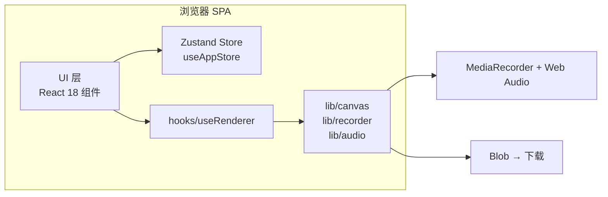
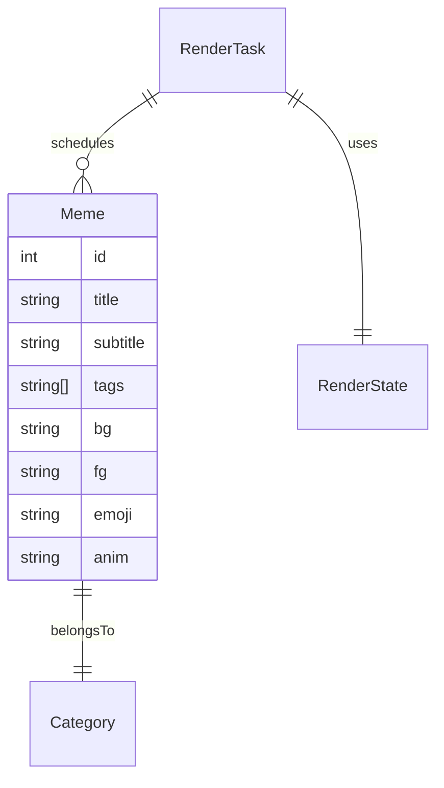

# 技术架构：2025 热梗大爆炸 · React 20 分钟自动出片

## 1. 架构设计
React 18 + Vite + TypeScript 单页应用。状态用 zustand 集中管理；渲染引擎与录制器抽离到纯 `lib`，组件只负责 UI 与事件绑定。



## 2. 技术描述
- **前端**：React@18 + TypeScript + Vite
- **样式**：CSS 变量 + 纯 CSS（不引入 Tailwind 以保持轻量）
- **状态**：zustand@4
- **构建**：Vite
- **后端**：无
- **数据库**：无
- **包管理**：pnpm

## 3. 路由定义
| 路径 | 用途 |
|---|---|
| `/` | 唯一页面，首页（控制台 + 预览 + 统计） |

## 4. API 定义
无后端；前端内部类型定义：

```ts
export type MemeCategory =
  | 'CHAP' | 'CN' | 'INTL' | 'AI' | 'VIS'
  | 'OFF' | 'MOOD' | 'SUB' | 'BOT' | 'TAG';

export interface Meme {
  id: number;
  category: string;
  categoryKey: MemeCategory;
  title: string;
  subtitle: string;
  tags: string[];
  bg: string;
  fg: string;
  emoji: string;
  anim: 'stamp'|'flip'|'glitch'|'typewriter'|'rain'|'shake'|'zoom'|'bounce'|'split';
}

export interface RenderState {
  totalMinutes: 10|20|30|40|60;
  resolution: 720|1080;
  speed: 0.5|1|1.5|2;
  volume: number;
  style: 'brainrot'|'neon'|'newspaper'|'bauhaus'|'magazine'|'pixel';
  watermark: boolean;
  particles: boolean;
  subtitles: boolean;
}
```

## 5. 服务端架构
无。

## 6. 数据模型
- 渲染任务 `RenderTask` 持有 `memes[]`、`startTs`、`fps`、`width`、`height`、`cardDuration`。
- 梗库 `Meme[]` 单一聚合根，下挂 10 大分类。
- 状态 `AppState` 由 zustand 管理。



## 7. 关键实现要点
1. **帧循环**：自定义 hook `useRenderer` 用 `requestAnimationFrame` 驱动；调用 `lib/canvas` 纯函数绘制到 `canvasRef.current`。
2. **MediaRecorder**：`canvas.captureStream(fps)` + `AudioContext.createMediaStreamDestination()` 合并；自动回退 vp9 → vp8 → h264。
3. **时长控制**：`totalMs = totalMinutes * 60 * 1000`；每张卡片 5000ms / speed；引擎按需洗牌填充。
4. **BGM**：用 OscillatorNode 合成 lo-fi 鼓点 + 噪声 + 三角波旋律循环。
5. **下载**：Blob → URL → 触发 `<a download>`。
6. **错误兜底**：MediaRecorder 不可用时给出"请用 Chrome/Edge 桌面版"并降级为预览模式。

## 8. 性能与浏览器兼容
- 目标：Chrome 110+ / Edge 110+ 桌面端；
- 20 分钟（1200 秒 × 30fps = 36000 帧）将占用较多 CPU/GPU；
- `document.hidden` 监听自动暂停 MediaRecorder。
