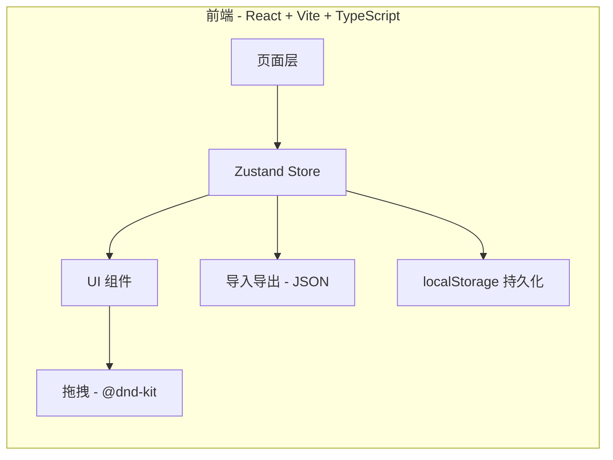
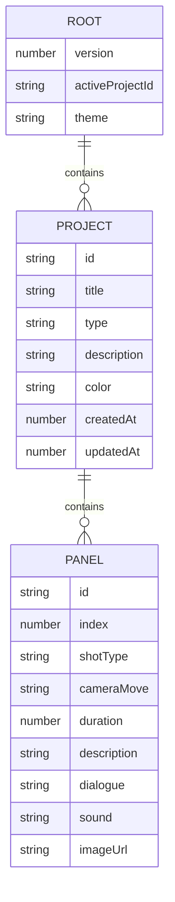

# 项目分镜师 - 技术架构文档

## 1. 架构设计



## 2. 技术选型

- **前端框架**:React@18 + TypeScript@5
- **构建工具**:Vite@6
- **样式方案**:TailwindCSS@3
- **状态管理**:Zustand@5
- **持久化**:Zustand persist 中间件 (localStorage)
- **拖拽**:@dnd-kit/core + @dnd-kit/sortable
- **图标**:lucide-react
- **后端**:无
- **导出**:浏览器原生 `Blob` + `URL.createObjectURL` 实现 JSON 下载
- **图片参考**:支持外部 URL (data URL 与 https),不上传到任何服务器

## 3. 路由定义

| 路由 | 用途 |
|------|------|
| `/` | 项目列表页 |
| `/projects/:projectId` | 分镜工作台 |
| `/projects/:projectId/present` | 演示模式(全屏逐分镜) |

## 4. 数据模型



## 5. 关键模块设计

### 5.1 状态管理 (`src/store/storyboardStore.ts`)
```ts
type Store = {
  // 数据
  projects: Project[];
  activeProjectId: string | null;
  theme: 'cream' | 'midnight';

  // 项目操作
  createProject: (input) => string; // 返回新 id
  updateProject: (id, patch) => void;
  deleteProject: (id) => void;
  duplicateProject: (id) => void;

  // 分镜操作
  addPanel: (projectId) => string;
  updatePanel: (projectId, panelId, patch) => void;
  deletePanel: (projectId, panelId) => void;
  reorderPanels: (projectId, fromIndex, toIndex) => void;

  // 导入导出
  importFromJson: (json) => void;
  exportToJson: (projectId?) => string;

  // 主题
  setTheme: (theme) => void;
};
```

### 5.2 拖拽实现 (`src/components/canvas/PanelCanvas.tsx`)
- 使用 `@dnd-kit/sortable` 的 `SortableContext`
- 拖拽开始时被拖动卡片半透明 + 旋转
- 拖拽悬停时计算目标 index
- 松开时调用 `reorderPanels`

### 5.3 项目色卡 (`src/components/ProjectCard.tsx`)
- 项目类型 → 默认色:
  - short-film → `#7A1F1F` (深红)
  - commercial → `#B8741A` (琥珀)
  - animation → `#1F2D5C` (靛蓝)
  - doc → `#2F4A2D` (墨绿)
  - social → `#5A2A82` (葡萄紫)

### 5.4 演示模式 (`src/pages/Present.tsx`)
- 全屏黑色背景
- 显示当前分镜的描述 + 持续时间倒计时
- 键盘左右切换 / Space 暂停

## 6. 性能预算

- 单项目 < 200 个分镜时无虚拟化
- 超过 200 个分镜时启用 `react-window` 虚拟列表
- 拖拽操作 60 FPS
- 持久化写入节流 500ms

## 7. 文件结构

```
src/
├── components/
│   ├── ProjectCard.tsx
│   ├── ProjectForm.tsx
│   ├── PanelCard.tsx
│   ├── PanelForm.tsx
│   └── canvas/
│       ├── PanelCanvas.tsx
│       └── SortablePanel.tsx
├── pages/
│   ├── Projects.tsx
│   ├── Editor.tsx
│   └── Present.tsx
├── store/
│   └── storyboardStore.ts
├── lib/
│   ├── utils.ts
│   └── theme.ts
├── App.tsx
├── main.tsx
└── index.css
```
