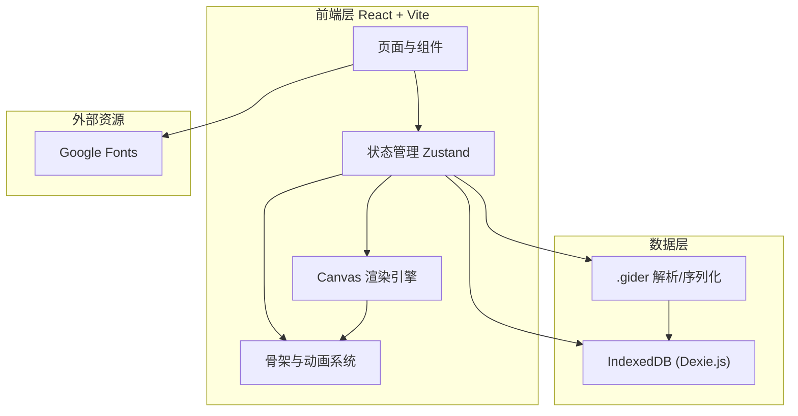
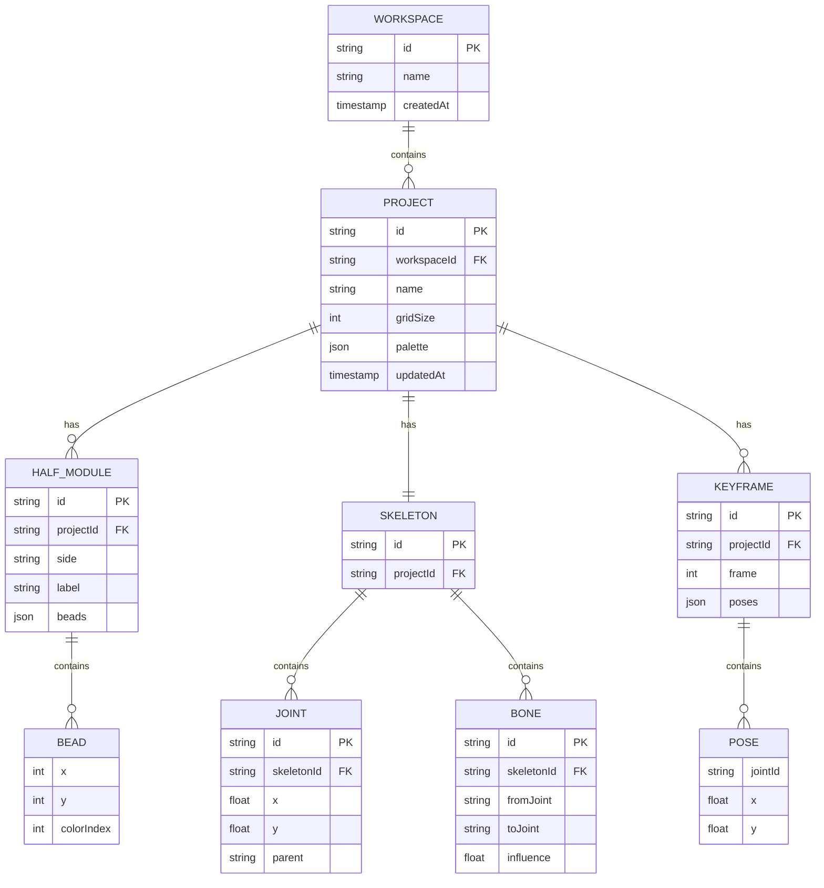

# 拼豆动画工坊 Gider Bead Studio — 技术架构文档

## 1. 架构设计



纯前端架构，无后端服务。所有数据通过 IndexedDB 持久化于浏览器本地。

## 2. 技术说明

- **前端框架**：React@18 + TypeScript
- **构建工具**：Vite@5
- **样式方案**：Tailwind CSS@3 + CSS 变量（实现像素风主题）
- **状态管理**：Zustand（轻量，适合画布状态频繁更新）
- **本地数据库**：Dexie.js（IndexedDB 封装，支持复杂查询）
- **画布渲染**：原生 Canvas 2D API（拼豆网格 + 骨架叠加层）
- **动画系统**：自研关键帧插值引擎（线性/贝塞尔插值）
- **文件导出**：Blob + URL.createObjectURL 下载 `.gider` 文件
- **字体**：Press Start 2P（标题）、JetBrains Mono（正文）、Noto Sans SC（中文）
- **初始化工具**：vite-init（react-ts 模板）

## 3. 路由定义

| 路由 | 用途 |
|------|------|
| `/` | 重定向到 `/studio` |
| `/studio` | 工作台页面，拼豆绘制 + 骨架绑定 + 时间轴 |
| `/library` | 模块库页面，半面模块管理与拼合 |
| `/export` | 导出预览页面，`.gider` 结构 + 蒙版 + 回放 |

使用 React Router@6 实现路由。

## 4. 数据模型

### 4.1 数据模型定义



### 4.2 数据定义语言（Dexie Schema）

```typescript
// db.ts
import Dexie, { Table } from 'dexie';

export interface Project {
  id: string;
  name: string;
  gridSize: number;
  palette: string[];
  updatedAt: number;
}

export interface HalfModule {
  id: string;
  projectId: string;
  side: 'left' | 'right';
  label: string;
  beads: { x: number; y: number; color: number }[];
}

export interface Skeleton {
  id: string;
  projectId: string;
  joints: { id: string; x: number; y: number; parent: string | null }[];
  bones: { from: string; to: string; influence: number }[];
}

export interface Keyframe {
  id: string;
  projectId: string;
  frame: number;
  poses: { joint: string; x: number; y: number }[];
}

export interface Animation {
  id: string;
  projectId: string;
  fps: number;
  loop: boolean;
  length: number;
}

class GiderDB extends Dexie {
  projects!: Table<Project>;
  halfModules!: Table<HalfModule>;
  skeletons!: Table<Skeleton>;
  keyframes!: Table<Keyframe>;
  animations!: Table<Animation>;

  constructor() {
    super('gider-bead-studio');
    this.version(1).stores({
      projects: 'id, name, updatedAt',
      halfModules: 'id, projectId, side',
      skeletons: 'id, projectId',
      keyframes: 'id, projectId, frame',
      animations: 'id, projectId',
    });
  }
}

export const db = new GiderDB();
```

## 5. 核心模块架构

### 5.1 目录结构

```
src/
├── components/
│   ├── layout/              # 布局组件（TopNav, ToolBar, Timeline）
│   ├── studio/              # 工作台组件
│   │   ├── BeadCanvas.tsx   # 拼豆画布
│   │   ├── SkeletonLayer.tsx# 骨架叠加层
│   │   ├── ColorPalette.tsx # 调色板
│   │   └── Timeline.tsx     # 时间轴
│   ├── library/             # 模块库组件
│   └── export/              # 导出预览组件
├── stores/                  # Zustand 状态
│   ├── studioStore.ts
│   ├── libraryStore.ts
│   └── exportStore.ts
├── engine/                  # 核心引擎
│   ├── beadRenderer.ts      # 拼豆渲染
│   ├── skeletonEngine.ts    # 骨架计算
│   ├── animationEngine.ts   # 关键帧插值
│   └── maskUnfolder.ts      # 蒙版展开
├── db/                      # 数据库
│   └── db.ts
├── utils/
│   ├── giderFormat.ts       # .gider 序列化/反序列化
│   └── templates.ts         # 预设模板
├── pages/                   # 路由页面
│   ├── Studio.tsx
│   ├── Library.tsx
│   └── Export.tsx
└── App.tsx
```

### 5.2 关键引擎说明

- **beadRenderer**：将 beads 数组渲染到 Canvas，每颗豆为带高光的圆形（模拟立体拼豆）
- **skeletonEngine**：维护关节树，计算 FK（正向运动学）变换，关节拖拽时更新子关节
- **animationEngine**：在两个关键帧之间按 fps 插值生成中间帧，支持线性与缓动
- **maskUnfolder**：根据骨架 bones 的 influence 字段，将影响区域展开为 2D 热力图
- **giderFormat**：实现 PRD 中定义的 `.gider` JSON 格式的序列化与反序列化

## 6. 性能与体验

- 画布渲染使用 `requestAnimationFrame`，仅在状态变更时重绘
- 关节拖拽使用 pointer events，支持鼠标与触摸
- IndexedDB 读写异步，UI 不阻塞
- 撤销/重做基于状态快照栈（限制 50 步）
- 大网格（64×64）下使用离屏 Canvas 缓存静态拼豆层
