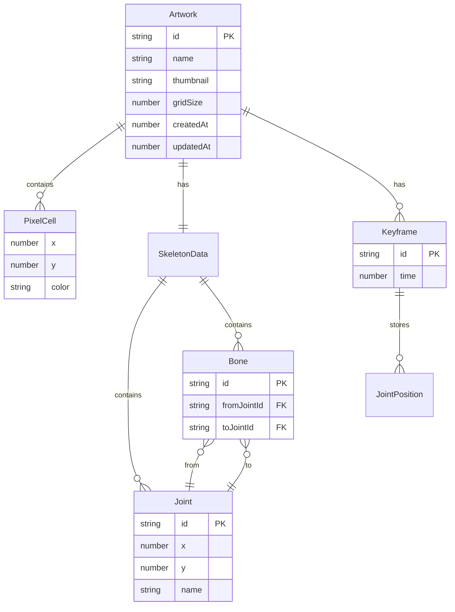

## 1. 架构设计

```mermaid
flowchart TD
    subgraph "前端层 (React + Vite)"
        "UI[页面组件]" --> "Store[Zustand 状态管理]"
        "Store" --> "Engine[创作引擎核心]"
    end
    subgraph "创作引擎层"
        "Engine" --> "Draw[半面绘制模块]"
        "Engine" --> "Grid[拼豆网格模块]"
        "Engine" --> "Rig[骨架绑定模块]"
        "Engine" --> "Anim[动画插值模块]"
    end
    subgraph "数据层"
        "Store" --> "DB[IndexedDB 存储模块]"
        "DB" --> "IDB[(IndexedDB)]"
    end
    subgraph "渲染层"
        "Engine" --> "Canvas[Canvas 2D 渲染器]"
    end
```

## 2. 技术说明

- **前端框架**：React@18 + TypeScript + Vite@5
- **样式方案**：TailwindCSS@3 + CSS Variables（主题色管理）
- **状态管理**：Zustand（轻量、无 boilerplate）
- **渲染方案**：原生 Canvas 2D API（拼豆网格 + 骨架绘制 + 动画帧渲染）
- **数据库**：IndexedDB（通过 `idb` 库封装，支持图案 + 骨架 + 关键帧持久化）
- **初始化工具**：`npm create vite@latest` React + TS 模板
- **后端**：无（纯前端应用，数据全部存浏览器）

## 3. 路由定义

| 路由 | 用途 |
|------|------|
| `/` | 创作工作台（默认进入，含绘制/骨架/动画三模式切换） |
| `/gallery` | 存档管理面板（作品列表、导入导出） |

## 4. API 定义

无后端 API。所有数据通过 IndexedDB 本地存取，封装为 `db` 模块：

```typescript
// 数据库接口定义
interface ArtworkRecord {
  id: string;              // UUID
  name: string;            // 作品名称
  thumbnail: string;       // Base64 缩略图
  gridSize: number;        // 拼豆网格尺寸 (如 32 表示 32×32)
  pixels: PixelCell[];     // 拼豆格子数据 [{x, y, color}]
  skeleton: SkeletonData;  // 骨架数据
  keyframes: Keyframe[];   // 关键帧数组
  createdAt: number;
  updatedAt: number;
}

interface PixelCell {
  x: number;
  y: number;
  color: string;  // hex 格式
}

interface SkeletonData {
  joints: Joint[];      // 关节节点
  bones: Bone[];        // 骨骼连接
}

interface Joint {
  id: string;
  x: number;            // 网格坐标
  y: number;
  name: string;
  parentBoneId?: string;
}

interface Bone {
  id: string;
  fromJointId: string;
  toJointId: string;
  influencedCells: number[]; // 受影响格子索引
}

interface Keyframe {
  id: string;
  time: number;          // 0~1 归一化时间
  jointPositions: Record<string, {x: number; y: number}>;
}
```

## 5. 服务器架构图

无后端服务，跳过。

## 6. 数据模型

### 6.1 数据模型定义



### 6.2 数据定义语言（IndexedDB Schema）

```javascript
// IndexedDB 数据库结构
db = {
  name: "PerlerBeadStudio",
  version: 1,
  stores: {
    artworks: {
      keyPath: "id",
      indexes: [
        { name: "by_updatedAt", keyPath: "updatedAt" },
        { name: "by_name", keyPath: "name" }
      ]
    }
  }
}
```

## 7. 项目目录结构（整理框架）

```
perler-bead-studio/
├── src/
│   ├── components/              # UI 组件层
│   │   ├── Workspace/           # 创作工作台
│   │   │   ├── CanvasPanel.tsx       # 画布主面板
│   │   │   ├── Toolbar.tsx           # 工具栏
│   │   │   ├── Palette.tsx           # 调色板
│   │   │   └── ModeSwitcher.tsx      # 模式切换
│   │   ├── Skeleton/            # 骨架绑定面板
│   │   │   ├── JointEditor.tsx       # 关节编辑器
│   │   │   └── BoneConnector.tsx     # 骨骼连接器
│   │   ├── Animation/           # 动画面板
│   │   │   ├── Timeline.tsx          # 时间轴
│   │   │   └── PlaybackControls.tsx  # 播放控制
│   │   ├── Gallery/             # 存档管理
│   │   │   ├── ArtworkList.tsx       # 作品列表
│   │   │   └── ArtworkCard.tsx       # 作品卡片
│   │   └── common/              # 通用组件
│   ├── engine/                  # 创作引擎核心层
│   │   ├── DrawingEngine.ts     # 半面绘制 + 镜像
│   │   ├── GridEngine.ts        # 拼豆网格化
│   │   ├── SkeletonEngine.ts    # 骨架绑定与变形
│   │   ├── AnimationEngine.ts   # 关键帧插值
│   │   └── Renderer.ts          # Canvas 渲染器
│   ├── store/                   # 状态管理层
│   │   ├── useArtworkStore.ts   # 作品状态
│   │   ├── useToolStore.ts      # 工具状态
│   │   └── useUIStore.ts        # UI 状态
│   ├── db/                      # 数据持久化层
│   │   ├── database.ts          # IndexedDB 初始化
│   │   └── artworkRepo.ts       # 作品 CRUD
│   ├── types/                   # TypeScript 类型
│   │   └── index.ts
│   ├── utils/                   # 工具函数
│   │   ├── colors.ts            # 拼豆色卡
│   │   └── geometry.ts          # 几何计算
│   ├── App.tsx
│   ├── main.tsx
│   └── index.css
├── index.html
├── package.json
├── tsconfig.json
├── vite.config.ts
└── tailwind.config.js
```
